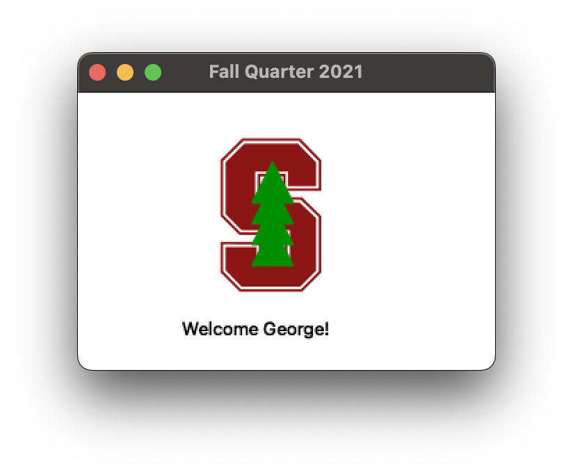

# 前期准备（[Assignment 0](https://web.stanford.edu/class/archive/cs/cs106b/cs106b.1224/assignments/a0/){target=_blank}）

## 下载 Qt Creator

=== ":fontawesome-brands-apple: macOS"

    - 需要先下载 Xcode 命令行工具

        - 已经下载过，但提示我要指定路径

        ```bash
        sudo xcode-select --switch /Applications/Xcode.app
        ```

        如果 Xcode 在 `/Applications` 下就这么做，注意要在 `sudo` 下运行。
    
    !!! info inline end "需至少 10GB 空间"

    - 按课程网站的 Installation Guide 按部就班即可
    - [Qt推荐设置](https://web.stanford.edu/dept/cs_edu/resources/qt/recommended-settings){target=_blank}

## 下载 2021 版本的 CS106B Library

编译运行 `Welcome.pro`，正式赛博入学斯坦福



## NameHash

一大一小两个质数，16908799 和 127.

输入的 ASCII 字符全部转换为小写后，逐个字符作如下计算:

```cpp title="核心逻辑"
hashVal = (kSmallPrime * hashVal + ch) % kLargePrime;
```

!!! warning "输入名字的注意点"
    如果是中文输入法下输入了一个字母，再切换到英文输入法，之后输入的内容会被吃掉...

## 阅读 [Debugger Tutorial](https://web.stanford.edu/class/cs106b/assignments/a0/DebuggerTutorial.pdf){target=_blank}

- Breakpoint
- Call stack
- Step Over/In/Out
- Continue

> 不得不为这份 tutorial 的友好体贴所感动
> 
> 真的是把学生看成是刚接触程序和调试的孩子来引导，感觉就算是看到代码就头晕的人也能学懂...
> 
> 虽然学校的C程课不要求调试，肖老师人也很好，在课上也讲了怎么调试以及调试的重要性，但是这种保姆级教程还是太稀有了...