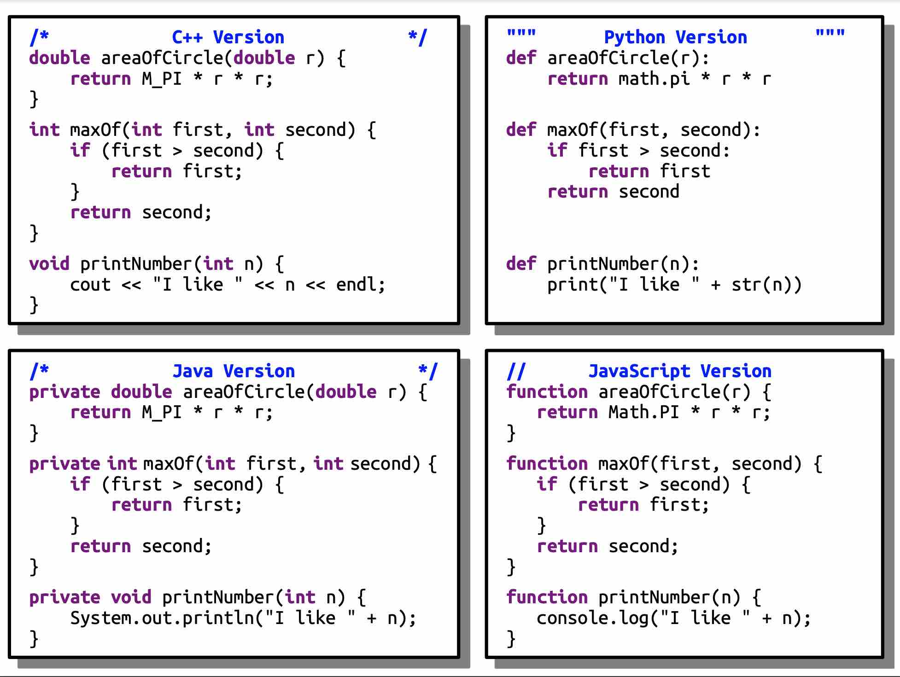
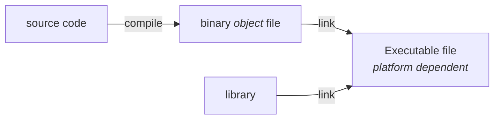

# Introduction to C++

## Basics

- **curly braces** `{}` alone determine nesting（scope 作用域）
- **semicolon** `;` ends a statement
- **stream insertion operator** `<<` to push data to the console
- **comments**:
    - `/* */`
    - `//`：单行注释
- all statements must be inside of a function
- functions are **not** always part of a class (unlike Java)
- `main`: starting point of a program
    - returns `int` exit code (0 for success)

!!! tip "About `void`"
    If a function {++does not return a **value**++}, its return type should be the *cool-but-scary-sounding* `void`.

