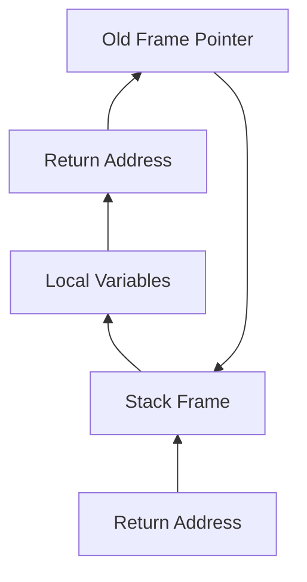

# Lists, Stacks, and Queues

## Abstract Data Types (ADT)

### Definition

**Data Type = { Objects } $\cup$ { Operations }**

***e.g.***

int = { 0, 1, 2, 3, ... } $\cup$ { +, -, *, /, %, ... }

## List ADT

- Objects: { $\mathrm{item}_0, \mathrm{item}_1, \ldots, \mathrm{item}_{N-1}$ }
- Operations:
  - :star: Find the $k$-th item
  - :star: Insert an item {++after++}[^1] the $k$-th item
  - :star: Delete the $k$-th item

[^1]: 插在后面的代码更连贯

### Simple Array Implementation

array[$i$] = $\mathrm{item}_i$ (Sequential Mapping)

- Find: $\mathcal{O}(1)$
- MaxSize has to be estimated
- Insert/Delete: $\mathcal{O}(N)$, and takes time to move elements

### Linked Lists

| Address | Data | Pointer |
| :-----: | :--: | :-----: |
| 0010 | SUN | 1011 |
| 0011 | QIAN | 0010 |
| 0110 | ZHAO | 0011 |
| 1011 | LI | NULL |

Initialize

```c
typedef struct list_node *list_ptr;
typedef struct list_node {
    char data[4];
    list_ptr next;
};
list_ptr ptr;
```

To link 'QIAN' and 'ZHAO'

```c
ptr = (list_ptr) malloc(sizeof(struct list_node));
strcpy(ptr->data, "ZHAO");
ptr->next = QIAN->next;
QIAN->next = ptr;
```

- Insert: $\mathcal{O}(1)$
  1. `temp->next = node->next`
  2. `node->next = temp`（顺序不可颠倒！）

!!! tip ""
    通常将`ptr`指向一个假的头指针（dummy head node）

- Delete: $\mathcal{O}(1)$
  1. `pre->next = node->next`
  2. `free(node)`（释放内存，防止内存泄漏）

### Doubly Linked Circular Lists

找第 $k$ 个元素时，从头到尾找
找第 $k-1$ 个元素时，还是从头到尾：有无优化？

```c
typedef struct node *node_ptr;
typedef struct node {
    node_ptr llink;
    element item;
    node_ptr rlink;
};
```

- 最后一个 node 不是 NULL，而是右指针指向 dummy head node
- dummy head node 的左指针指向最后一个 node

An empty list: 左右指针指向自己的 dummy head node

#### Two Applications

##### The Polynomial ADT

Objects: $P(x) = a_1 x^{e_1} + a_2 x^{e_2} + \ldots + a_n x^{e_n}$; a set of ordered pairs of $\langle e_i, a_i \rangle$ is the 

- Representation 1：数组

```c
typedef struct{
    int CoeffArray[MaxDegree + 1];
    int HighPower;
} *Polynomial;
```

系数数组很稀疏

- Representation 2：链表

We represent each term as a node `| Coeff | Expon | Next | ->`

```c
typedef struct Node *PtrToNode;
typedef PtrToNode Polynomial;
typedef PtrToNode Node;
struct Node {
    int Coeff;
    int Expon;
    PtrToNode Next;
};
```

##### Multilists

40000 个学生，2500 门课

- Representation 1：数组

```c
int Array[40000][2500];
// Array[i][j] = 1: student i takes course j
```

矩阵很稀疏

- Representation 2：十字链表

```c
```

### Cursor Implementation of Linked Lists (no pointer)

- Features of linked lists:
    - Structure contains data and a pointer to the next structure
    - `malloc` and `free` are called to allocate and deallocate memory

初始化二维数组，`Next` 指向下一个元素

malloc:

```c
p = CursorSpace[0].Next;
CursorSpace[0].Next = CursorSpace[p].Next;
```

free(p):

```c
CursorSpace[p].Next = CursorSpace[0].Next;
CursorSpace[0].Next = p;
```

## Stack ADT

Last-In-First-Out (LIFO): insertions and deletions are made at the **top** only

- Objects: A finite ordered list with zero or more elements
- Operations:
  - :star: Push
  - :star: Pop
  - :star: Top
  - CreateStack
  - DisposeStack
  - ...

### Linked List Implementation

#### Push

```c
TempCell->Next = S->Next;
S->Next = TempCell;
```

#### Top

```c
return S->Next->Element;
```

#### Pop

```c
FirstCell = S->Next;
S->Next = S->Next->Next;
free(FirstCell);
```

!!! tip ""
    `malloc` and `free` are expensive!
    Solution: 
    - Allocate a large number of cells at once (like cursor implementation)
    - "recycle bin" (a new stack to store the deleted cells)

### Array Implementation

```c
struct StackRecord {
    int Capacity;
    int TopOfStack; // the top pointer
    /* ++for push, --for pop, -1 for empty stack++ */
    ElementType *Array;
};
```

!!! info "Note"
    - The stack model must be well **encapsulated**.
        - NO part of code should access the stack (`Array`, `TopOfStack`) directly
        - like `private` in Java
    - Error check must be done before Push or Pop (Top)

### Applications

#### Balancing Symbols

Check if parentheses `()`, brackets `[]`, and braces `{}` are balanced.

```c
Algorithm
{
    Make an empty stack S;
    while (read in a character c)
    {
        if (c is an opening symbol) // 左括号，压栈
            Push(c, S);
        else if (c is a closing symbol) // 右括号
            if (S is empty) // 栈空，不匹配
                return ERROR;exit;
            else
            {
                if (Top(S) is a matching opening symbol) // 栈顶元素匹配
                    Pop(S);
                else
                    return ERROR;exit;
            }
    }
    if (S is not empty) // 栈非空，说明左括号多了
        return ERROR;
}
```

- $T(N) = \mathcal{O}(N)$, on-line algorithm

#### Postfix

##### Postfix Evaluation

- Evaluation: $((a + (b \times c)) - (d / e))$
- Infix: $a + b * c - d / e$
- Prefix: $- + a * bc / de$
- **Postfix**: $abc * + de / -$
  - aka. Reverse Polish Notation (RPN)
  - 方便计算机计算：运算符位置越靠前，优先级越高

##### Infix to Postfix Conversion

***e.g.*** $a + b * c - d \to a b c * + d -$

!!! example "Example"
    - Get token `a`, output
    - Get token `+`, push
    - Get token `b`, output
    - Get token `*`
      - `*` > `+`, push
    - Get token `c`, output
    - Get token `-`
      - `*` > `-`, pop `*`, output
      - `+` > `-`, pop `+`, output
    - Get token `d`, output
    - pop `-`

!!! example "Example 2"
    $a * (b + c) / d$

    - Get token `a`, output
    - Get token `*`, push
    - Get token `(`
      - `(` > `*`???
      - `(` < `*`, push
    - Get token `b`, output
    - Get token `+`, push
    - Get token `c`, output
    - Get token `)`???

        !!! tip "Solution"
            1. Never pop a `(` from the stack until a `)` is encountered
            2. `(` has the lowest precedence when in the stack, but the highest precedence when encountered (outside the stack)
    
    - Get token `/`, push

#### System Stack

管理函数调用



- `fp`: frame pointer
- `sp`: stack pointer

`malloc` 在堆（heap）上分配内存

!!! example "A bad use of recursion"
    ```c
    void PrintList( List L )
    {
        if( L != NULL )
        {
            PrintElement( L->Element );
            PrintList( L->Next ); // tail recursion (1)
        }
    }
    ```

    When `L` is large, the system stack may overflow.

    1. **尾递归（tail recursion）都可以转化为循环**

        非递归的函数通常比递归函数更快。所有的递归都可以通过转化去除。但是递归写起来简单！

## Queue ADT

First-In-First-Out (FIFO): insertions are made at the **rear** and deletions are made at the **front**

- Objects: A finite ordered list with zero or more elements
- Operations:
  - :star: Enqueue
  - :star: Dequeue
  - :star: Front
  - IsEmpty
  - CreateQueue
  - DisposeQueue
  - ...

### Linked List Implementation

trivial

### Array Implementation

```c
struct QueueRecord {
    int Capacity;
    int Front; // the front pointer
    int Rear; // the rear pointer
    int Size; // the number of elements, not necessary
    ElementType *Array;
};
```

!!! example "Job Scheduling in OS"
    操作系统的进程调度

    为了避免浪费，使用 **Circular Queue**

    为了区分空队列和满队列，浪费一个空间，即`rear` 和 `front` 之间至少有一个空间（或者通过定义 `Size` 来区分）