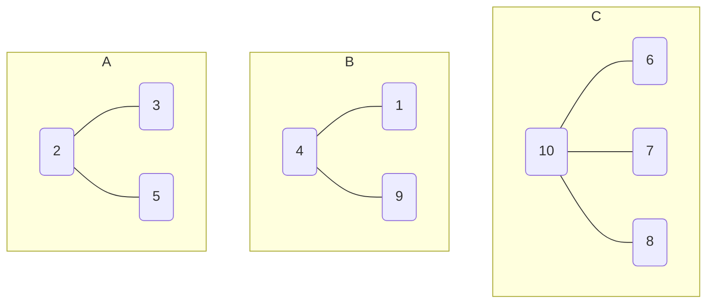
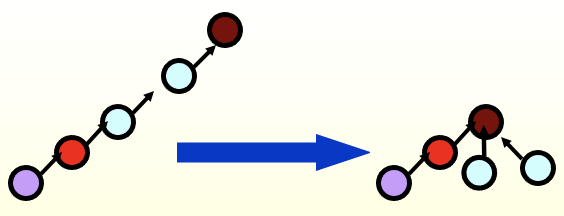

# The Disjoint Set ADT

## Equivalence Relations

在集合 $S$ 上定义的关系 $R$，如果满足以下性质，则称 $R$ 为等价关系：

- 对称性
- 自反性
- 传递性

如果 $x$ 和 $y$ 等价，则称 $x$ 和 $y$ 处于同一等价类中，记为 $x \sim y$。

## The Dynamic Equivalence Problem

!!! example "Example"
    Given $S = \{1, 2, 3, 4, 5, 6, 7, 8, 9, 10, 11, 12\}$, and 9 relations:

    $$
    12 \equiv 4, 3 \equiv 1, 6 \equiv 10, 8 \equiv 9, 7 \equiv 4, 6 \equiv 8, 3 \equiv 5, 2 \equiv 11, 11 \equiv 12
    $$

    Algorithm: 

    ```c
    /* step 1: read in the relations */
    {
        Initialize N disjoint sets;
        while (read in a ~ b) {
            if (Find(a) != Find(b)) {
                Union(a, b);
            }
        }
    }
    /* step 2: check if a ~ b */
    {
        while (read in a ~ b) {
            if (Find(a) == Find(b))
                output(true);
            else
                output(false);
        }
    }
    ```

- Elements: $1, 2, 3, \ldots, N$
- Sets: $S_1, S_2, \ldots, S_k$

不相交：$S_i \cap S_j = \varnothing$ for $i \neq j$

!!! example "Example 2"
    $$
    S_1 = \{6, 9, 10\},
    $$

## Basic Data Structure

### Union

$S_i \cup S_j$：让 $S_j$ 成为 $S_i$ 的子树，反之亦然。也就是将 $S_j$ 根节点的父节点设为 $S_i$ 的根节点。

约定：$\cup$ 右边的树成为左边的子树。

#### Linked List

#### Array

`S[element] = element's parent`

Note: `S[root] = 0`

三个树：



| 元素 | 1 | 2 | 3 | 4 | 5 | 6 | 7 | 8 | 9 | 10 |
|:---:|:---:|:---:|:---:|:---:|:---:|:---:|:---:|:---:|:---:|:---:|
| 指向的元素 | 4 | 0 | 2 | 10 | 2 | 10 | 10 | 10 | 4 | 0 |

$$
S_1 \cup S_2 
$$

```c
void SetUnion
```

### Find

```c
SetType Find(ElementType X, DisjSet S)
{
    for (; S[X])
}
```

### Analysis

通常来说，并集和查找都是成对出现！考虑**并查对（Union-Find）**

```c
{ Init S_i = {i}
    for (k = 1; k <= 9; k++) {
        if (Find(a) != Find(b))
            SetUnion(Find(a), Find(b));
    }
}
```

- $k\mathcal{O}(d)$
    - $k$ 个关系
    - 查找：$\mathcal{O}(d)$

!!! question "Worst case"
    让树非常斜：

    ```
    Union(2, 1), Find(1);
    Union(3, 2), Find(1);
    ...
    Union(N, N-1), Find(1);
    ```

    $$
    T = \Theta(N^2)
    $$

## Smart Union Algorithm

减小树的深度 $d$

- **Union-by-Size**: Always **change the smaller tree**!

子节点指向父节点，这种树不好遍历！

`S[root] = -size`

!!! note "Lemma"
    Let $T$ be a tree created by union-by-size with $N$ nodes. Then

    $$
    \text{height}(T) \leq \lfloor \log_2 N \rfloor + 1
    $$

    最坏情况是完全二叉树，最好情况是压扁的 $N-1$ 叉树。

    - $N$ 次 Union，$M$ 次 Find：$\mathcal{O}(N + M \log_2 N)$

- Union-by-Height: Always **change the shallow tree**!

合并后的树能否更矮？

## Path Compression

```c
SetType Find(ElementType X, DisjSet S)
{
    if (S[X] < 0)
        return X;
    else
        return S[X] = Find(S[X], S);
}
```



通过赋值操作，每次 `Find` 将路径上的每个节点都指向根节点

```c
SetType Find(ElementType X, DisjSet S)
{
    ElementType root, trail, lead;
    for (root = X; S[root] > 0; root = S[root])
        ; // find root
    for (trail = X; trail != root; trail = lead) {
        lead = S[trail];
        S[trail] = root;
    } // path compression
    return root;
}
```

路径压缩改变树的高度，与 Union-by-Height 不兼容

Union-by-Size 和 Union-by-Height 统称为 **Union-by-Rank**。

## Worst Case for Union-by-Rank and Path Compression

!!! tip "Ackermann Function"
    $$
    A(i, j) =
    \begin{cases}
        2^j & i = 1 \quad \text{and} \quad j \geq 1 \\
        A(i-1,2) & i \geq 2 \quad \text{and} \quad j = 1 \\
        A(i-1, A(i, j-1)) & i \geq 2 \quad \text{and} \quad j \geq 2
    \end{cases}
    $$

    例：$A(4, 2) = 2^{2^{2^{2^2}}} = 2^{65536}$

    $\alpha(M,N)$ 

!!! note "Lemma (Tarjan)"
    Let $T(M,N)$ be the maximum time required to process an intermixed sequence of $M \geq N$ finds and $N-1$ unions. Then

    $$
    k_1 M \, \alpha(M, N) \leq T(M, N) \leq k_2 M \, \alpha(M, N)
    $$

    for some positive constants $k_1$ and $k_2$.

