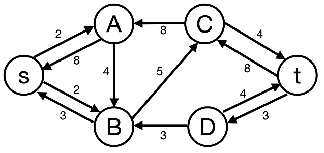
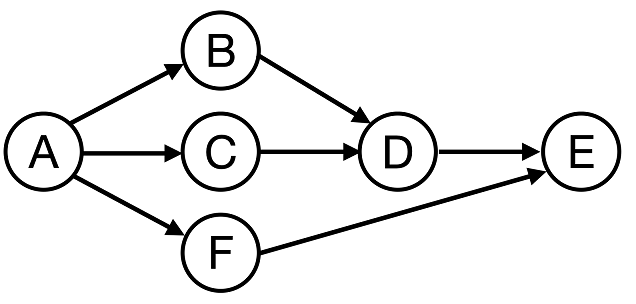
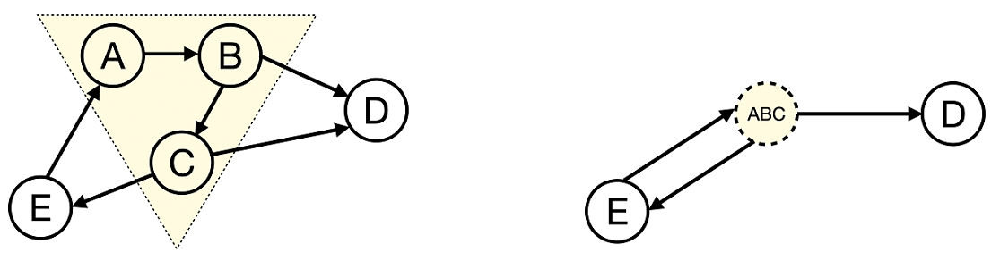
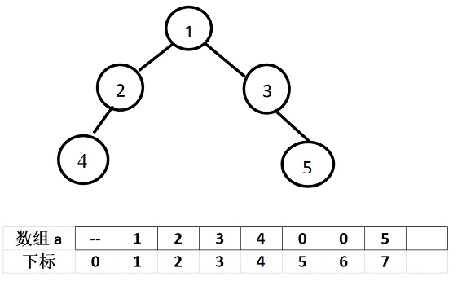

# 期末考

!!! warning "警告"
    考试试题仅供学习使用，请勿随意传播。如有侵权请联系[邮箱](mailto:georgecao@zju.edu.cn)删除。

## 判断题

> $2' \times 10 = 20'$

<div class="grid cards" markdown>

-   **R1-1**
    
    To find a minimum spanning tree in a dense graph, Prim's algorithm is more suitable than Kruskal's.

    ---

    - [x] T
    - [ ] F
</div>

<div class="grid cards" markdown>

-   **R1-2**
    
    In an undirected graph, a vertex $v$ is an articulation point iff there exists a pair of vertices $u$ and $w$ (both different from $v$) so that every path between $u$ and $w$ passes through $v$.

    ---

    - [x] T
    - [ ] F
</div>

<div class="grid cards" markdown>

-   **R1-3**
    
    Given a min-heap with unique keys, if $i < j$, then the element $p$ in level $i$ must be smaller than $q$ in level $j$.

    ---

    - [ ] T
    - [x] F
</div>

<div class="grid cards" markdown>

-   **R1-4**
    
    Suppose that each single node in a disjoint set initially has height 0, the height of the resulting disjoint-set tree formed by performing union-by-height on $n$ nodes will not exceed $\lfloor \log_2 n \rfloor$. 

    ---

    - [x] T
    - [ ] F
</div>

<div class="grid cards" markdown>

-   **R1-5**
    
    If quadratic probing is used in hashing, then a new element can always be inserted if the hash table is at least half empty.

    ---

    - [ ] T
    - [x] F
</div>

<div class="grid cards" markdown>

-   **R1-6**
    
    After performing one pass of radix sort on {11, 56, 25, 61, 79, 27, 51}, the result could be {11, 25, 27, 51, 56, 61, 79}.

    ---

    - [ ] T
    - [x] F
</div>

<div class="grid cards" markdown>

-   **R1-7**
    
    During the quicksort process, the order of magnitude of the number of comparisons is independent of the initial state of the sequence.

    ---

    - [ ] T
    - [x] F
</div>

<div class="grid cards" markdown>

-   **R1-8**
    
    $114514^N = \mathcal{O}(N!)$

    ---

    - [x] T
    - [ ] F

    > 好臭的题啊（恼）
</div>

<div class="grid cards" markdown>

-   **R1-9**
    
    If a complete binary tree has exactly $n$ nodes in each of its last two levels, then the total number of nodes in the tree must be $3n-1$.

    ---

    - [x] T
    - [ ] F
</div>

<div class="grid cards" markdown>

-   **R1-10**
    
    If the five integers {1,2,3,4,5} are inserted into an initially empty binary search tree in any order starting with 3, the resulting trees will all have the same height.

    ---

    - [x] T
    - [ ] F
</div>

## 单选题

> $3' \times 20 = 60'$

<div class="grid cards" markdown>

-   **R2-1**
    
    Given a tree of degree 3, if there are 49 nodes of degree 2, and 25 nodes of degree 3, then how many leaf nodes are there?

    ---

    - [ ] A. 101
    - [x] B. 100
    - [ ] C. 150
    - [ ] D. 50
</div>

<div class="grid cards" markdown>

-   **R2-2**
    
    Which of the following statements is correct regarding a binary search tree storing unique integers?

    ---

    - [ ] A. The integers 12 and 13 may be at the same level.
    - [ ] B. If 12 and 14 are at the same level, then 13 must be their parent node.
    - [ ] C. If 12 and 14 are at the same level, then 13 must not be their parent node.
    - [x] D. None.
</div>

<div class="grid cards" markdown>

-   **R2-3**
    
    For a binary tree, if its post-order travel sequence is { 11, 13, 12, 16, 15, 17, 14 }, and its in-order travel sequence is { 11, 12, 13, 14, 15, 16, 17 }, then which of the following statement is TRUE?

    ---

    - [ ] A. 16 is the parent of 15.
    - [ ] B. 11 is the parent of 12.
    - [ ] C. This is a complete binary tree.
    - [x] D. This is a binary search tree.
</div>

<div class="grid cards" markdown>

-   **R2-4**
    
    In a doubly linked circular list, how many pointers must be updated to insert $q$ after $p$?

    ---

    - [ ] A. 1
    - [ ] B. 2
    - [ ] C. 3
    - [x] D. 4
</div>

<div class="grid cards" markdown>

-   **R2-5**
    
    Design an algorithm to determine whether the parentheses `()` in an expression are properly matched. Which data structure is the most suitable for this task?

    ---

    - [ ] A. Sequentially stored linear list
    - [ ] B. Queue
    - [x] C. Stack
    - [ ] D. Heap
</div>

<div class="grid cards" markdown>

-   **R2-6**
    
    Suppose that the level-order traversal sequence of a min-heap is { 5, 18, 29, 23, 64, 47, 36}. After calling DeleteMin twice, what will be the pre-order traversal of the resulting heap after it has been adjusted?

    ---

    - [ ] A. 23, 36, 29, 47, 64
    - [ ] B. 23, 47, 36, 64, 29
    - [ ] C. 23, 47, 64, 36, 29
    - [x] D. 23, 36, 47, 64, 29
</div>

<div class="grid cards" markdown>

-   **R2-7**
    
    It is known that a 3-heap is a heap whose nodes have 3 children. In a min-3-heap with 2025 elements, which one of the following indices is NOT a possible position for the maximum key?

    ---

    - [x] A. 675
    - [ ] B. 676
    - [ ] C. 1012
    - [ ] D. 1013

    ??? tip "Hint"
        这题可以用一些“应试技巧”（考试的时候从头到尾全部推出来才发现只看选项就能选）

        同一层越靠左边（索引越小）越有可能是有孩子的。
</div>

<div class="grid cards" markdown>

-   **R2-8**
    
    For an in-order threaded binary tree, if the post-order and in-order traversal sequences are FDEBGCA and FDBEACG, respectively. Which pair of nodes' left links are both threads?

    ---

    - [x] A. E and G.
    - [ ] B. B and G.
    - [ ] C. C and D.
    - [ ] D. D and E.
</div>

<div class="grid cards" markdown>

-   **R2-9**
    
    Consider the following operations performed on an initially empty Binary Search Tree (BST):

    - Insert: 50, 30, 70, 20, 40, 60, 80
    - Delete: 50 (replaced with its in-order successor)
    - Insert: 55
    
    After these operations, which node will be the in-order predecessor of 60 in the final BST?

    ---

    - [ ] A. 30.
    - [ ] B. 40.
    - [x] C. 55.
    - [ ] D. The in-order predecessor does not exist for 60.
</div>

<div class="grid cards" markdown>

-   **R2-10**
    
    The array representation of the disjoint sets is given by { 3, 3, 4, 7, 4, -3, -6, 6, 8, -2, 10 }. Keep in mind that the elements are numbered from 1 to 11, and the depth of the root is 0. After invoking `Union(Find(9), Find(11))`, `Union(Find(11), Find(3))` with union-by-size and path compression, what is the maximum depth of all the nodes?

    ---

    - [ ] A. 1
    - [x] B. 2
    - [ ] C. 3
    - [ ] D. 4
</div>

<div class="grid cards" markdown>

-   **R2-11**
    
    Which of the following statements about hashing is incorrect?

    ---

    - [ ] A. In hashing with quadratic probing to resolve collisions, a new element can definitely be inserted if the table size is 14 and 7 cells are occupied.
    - [ ] B. If an insertion into the hash table fails, rehashing is necessary, and the new table size is about twice the original size.
    - [x] C. If in double hashing $\mathrm{Hash}_2(k) = k^2$​, then double hashing effectively becomes quadratic probing.
    - [ ] D. The expected number of probes for insertions is equal to unsuccessful searches in linear probing method.
</div>

<div class="grid cards" markdown>

-   **R2-12**
    
    Insert {16,29,10,24,27,11,31} one by one into an initially empty hash table of size 11 with the hash function $H(Key)=Key\%11$, and linear probing is used to resolve collisions. After insertion, what is the expected number of probes for an unsuccessful search?

    ---

    - [ ] A. $\frac{20}{11}$
    - [ ] B. $\frac{24}{11}$
    - [ ] C. $\frac{22}{11}$
    - [ ] D. $\frac{23}{11}$
</div>

<div class="grid cards" markdown>

-   **R2-13**
    
    To compute the shortest path in a weighted graph, Dijkstra's algorithm using a min-priority queue is a popular choice. For this algorithm, what is the total time spent on running the step "find the unvisited vertex with the smallest distance"?

    ---

    - [ ] A. $\mathcal{O}(|V|^2)$
    - [ ] B. $\mathcal{O}(|V| * |E|)$
    - [x] C. $\mathcal{O}(|V| * \log |V|)$
    - [ ] D. $\mathcal{O}(|E| * \log |V|)$
</div>

<div class="grid cards" markdown>

-   **R2-14**
    
    We are executing an algorithm to find the maximum flow of a given network. Currently, we have found several augmenting paths to send $11$ flow from `s` to `t`, and we show the updated residual graph in the following figure.

    

    So what is the maximum flow we can send from `s` to `t`?

    ---

    - [ ] A. 11
    - [ ] B. 13
    - [x] C. 15
    - [ ] D. 19
</div>

<div class="grid cards" markdown>

-   **R2-15**
    
    Given a weakly-connected *directed* graph, what condition ensures that an Eulerian Path (with different start/end) exists?

    ---

    - [ ] A. All vertices have equal in-degree and out-degree.
    - [x] B. Exactly one vertex has out-degree = in-degree + 1, one vertex has in-degree = out-degree + 1, and all the rest vertices have equal in-degree and out-degree.
    - [ ] C. Exactly two vertices have odd total-degree, and all the rest vertices have even total-degree.
    - [ ] D. All vertices have even total-degree.
</div>

<div class="grid cards" markdown>

-   **R2-16**
    
    How many valid topological sorts does the following graph have?

    

    ---

    - [ ] A. 7
    - [x] B. 8
    - [ ] C. 9
    - [ ] D. 10
</div>

<div class="grid cards" markdown>

-   **R2-17**
    
    The following figure illustrates how to contract a subgraph (shown in dashed line) into a vertex.

    

    Now given a directed graph with many *strongly connected components*, if we contract each component into a single vertex, which property does the resulting graph MUST have?

    ---

    - [ ] A. a complete graph
    - [x] B. a directed acyclic graph
    - [ ] C. a disconnected graph
    - [ ] D. a binary tree
</div>

<div class="grid cards" markdown>

-   **R2-18**
    
    Using the direct insertion sort algorithm to sort the following four lists in ascending order, the one with the fewest number of comparisons is:

    ---

    - [ ] A. {134, 26, 40, 110, 80, 54, 12, 62}
    - [x] B. {12, 26, 54, 40, 80, 62, 110, 134}
    - [ ] C. {26, 40, 12, 54, 62, 134, 110, 80}
    - [ ] D. {110, 62, 80, 54, 12, 26, 134, 40}
</div>

<div class="grid cards" markdown>

-   **R2-19**
    
    Given that the key sequence {7, 9, 14, 19, 25, 20, 16, 21} is a min-heap, after inserting the key 2 and adjusting accordingly, the resulting min-heap is:

    ---

    - [ ] A. {2,14,7,9,25,20,16,21,19}
    - [ ] B. {2,7,14,19,20,16,21,9,25}
    - [ ] C. {2,9,14,7,20,16,21,25,19}
    - [x] D. {2,7,14,9,25,20,16,21,19}
</div>

<div class="grid cards" markdown>

-   **R2-20**
    
    Which of the following options is not a possible result after the second pass of quicksort?

    ---

    - [ ] A. 6,8,22,9,25,26,29
    - [ ] B. 6,26,22,25,9,8,29
    - [ ] C. 8,6,22,9,26,25,29
    - [ ] D. 9,6,8,22,26,25,29
</div>

## 程序填空题

> $3' \times 4 = 12'$，每题两个空
>
> 点击填空处右侧的注释按钮展开答案

<div class="grid cards" markdown>

-   **R5-1**
    
    Given the head of a singly linked list, swap every two adjacent nodes if the value of the first node is less than the value of the second node and the value of the first node is odd. If the number of nodes is odd, the last node remains unchanged. Complete the two blanks in the code below.

    ```c
    #include <stdio.h>
    #include <stdlib.h>

    struct ListNode {
        int val;
        struct ListNode *next;
    };
    struct ListNode* swapIfLessAndOdd(struct ListNode* head) {
        struct ListNode dummy;
        dummy.next = head;
        struct ListNode *prev = &dummy;
        
        while (prev->next != NULL && prev->next->next != NULL) {
            struct ListNode *first = prev->next;
            struct ListNode *second = first->next;
            
            if (/* _______________________________________ */) { //(1)
                first->next = /* ____________ */; //(2)
                second->next = first;
                
                prev->next = second;
                prev = first;
            } else {
                prev = second;
            }
        }
        return dummy.next;
    }
    struct ListNode* createNode(int val) {
    // helper function
    }
    ```

    1. !!! success "正确答案"
           ```c
           (first->val < second->val) && (first->val % 2 == 1)
           ```
    2. !!! success "正确答案"
           ```c
           second->next
           ```
</div>

<div class="grid cards" markdown>

-   **R5-2** Find the first node with a right child
    
    In a binary tree represented as a complete binary tree, find the first node with a right child encountered during an in-order traversal. If no such node exists, return -1; otherwise, return that node's value.
    
    For example: a binary tree stored in this format (as illustrated in the figure) has its root node at array index 1, with missing nodes represented by 0 in the array.
    
    Please complete the function `int FirstHaveRight(int a[], int n)`, where parameter n is the index of the last element in array `a` (e.g., `n` = 7 in the provided example). All elements after the last element of array `a` are initialized to 0. The algorithm in this function is similar to iterative implementation of in-order traversal.

    

    ```c
    int FirstHaveRight(int a[],int n)
    {  int stack[MAXSIZE];
    int top=-1, tree=1,treeRight;
    
    for ( ; ; ) {
        for ( ; tree<=n; tree = /* _________________ */){ //(1)
            if (a[tree]!=0) stack[++top]=tree;
            else break;
        }
        if (top==-1) return -1;
        else tree = stack[top--];
        treeRight=2*tree+1;
        if (/* ___________________ */) break; //(2)
        else tree = treeRight;   
    }
    return a[tree];
    }
    ```

    1. !!! success "正确答案"
           ```c
           tree*2
           ```
    2. !!! success "正确答案"
           ```c
           a[treeRight] != 0
           ```
</div>


## 函数题

> $8'$

<div class="grid cards" markdown>

-   **<center>R6-1 Finding Independent Set</center>**

    Given a simple undirected graph $G=(V,E)$. An **independent set** of $G$ is a set $S \subseteq V$ such that no two members of $S$ are connected by an edge in $E$. Finding the maximum independent set of $G$ is an NP-hard problem. Here you are supposed to implement a greedy heuristic to find a near-maximum independent set.

    The algorithm works in the following way:

    1. Collect any one unvisited vertex $v$ into $S$.
    2. Delete all the vertices (and all the edges incident on them) that are adjacent to $v$ from $G$.
    3. Repeat steps 1 and 2 until there is no unvisited vertex left in $G$.

    In order to obtain the unique solution, when there are many options in step 1, you must always choose the vertex with the smallest index.

    **Format of functions:**

    ```c
    int Independent_Set( MGraph G, int S[] );
    Here MGraph is defined as the following:

    typedef struct GNode *PtrToGNode;
    struct GNode{
        int Nv;  /* number of vertices */
        int Ne;  /* number of edges */
        int G[MaxVertexNum][MaxVertexNum]; /* adjacency matrix */
    };
    typedef PtrToGNode MGraph;
    ```

    where `MaxVertexNum` is a constant defined by the judge.

    The indices of the vertices in the resulting independent set is stored in the array `int S[]`. Note that the vertices are indexed from 1 to the number of vertices `Nv`. However, the indices of the adjacency matrix `G` starts from 0.

    The function `Independent_Set `is supposed to follow the above algorithm to produce an independent set, save the results in `S`, and return the number of vertices in `S`.

    **Sample program of judge:**

    ```c
    #include <stdio.h>
    #include <stdlib.h>

    #define MaxVertexNum 1000

    typedef struct GNode *PtrToGNode;
    struct GNode{
        int Nv;  /* number of vertices */
        int Ne;  /* number of edges */
        int G[MaxVertexNum][MaxVertexNum]; /* adjacency matrix */
    };
    typedef PtrToGNode MGraph;

    MGraph Build_Graph(); /* implemented by judge */
    int Independent_Set( MGraph G, int S[] );

    int main()
    {
        int i, n, S[MaxVertexNum];
        MGraph G;
        
        G = Build_Graph();
        n = Independent_Set(G, S);
        printf("%d", S[0]);
        for (i=1; i<n; i++) printf(" %d", S[i]);

        return 0;
    }
    /* Your function(s) will be put here */
    ```

    **Sample Input:**

    ```
    8 7
    1 5
    5 4
    4 2
    2 3
    3 6
    6 1
    6 2
    ```

    **Sample Output:**

    ```
    1 2 7 8
    ```

    **Note:**

    This method can help us find an independent set, but not necessarily a maximum independent set. For example, the maximum solution of the sample graph is {1, 3, 4, 7, 8}.

</div>