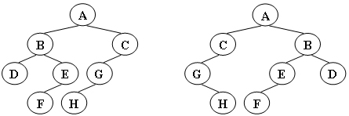

# Tree

## 单选题

<div class="grid cards" markdown>

-   **2-3**

    Given the shape of a binary tree shown by the figure below. If its inorder traversal sequence is { E, A, D, B, F, H, C, G }, then the node on the same level of C must be:

    

    ---

    - [x] A. D and G
    - [ ] B. E
    - [ ] C. B
    - [ ] D. A and H

    ??? success "Solution 2-3"
        
</div>

<div class="grid cards" markdown>

-   **2-4**

    Among the following threaded binary trees (the threads are represented by dotted curves), which one is the postorder threaded tree?

    ---

    - [ ] A. {.top-img}
    - [ ] B. {.top-img}
    - [ ] C. {.top-img}
    - [x] D. {.top-img}

    ??? success "Solution 2-4"
        线索二叉树的链接规则是：

        1. 如果 `Tree->Left` 为空，则指向**中序遍历序列**的**前驱**；
        2. 如果 `Tree->Right` 为空，则指向**中序遍历序列**的**后继**。

        图中所示二叉树的中序遍历为 `a b d c`.

        - A 选项。`c` 的左指针应指向 `d`，而不是 `b`，错误。
        - B 选项。`b` 的左指针应指向 `a`，而不是 `d`，错误。
        - C 选项。错误同 B。
        - D 选项。正确。
</div>

## 函数题

<div class="grid cards" markdown>

-   **<center>6-1 Isomorphic</center>**

    Two trees, `T1` and `T2`, are isomorphic if `T1` can be transformed into `T2` by swapping left and right children of (some of the) nodes in `T1`. For instance, the two trees in Figure 1 are isomorphic because they are the same if the children of A, B, and G, but not the other nodes, are swapped.

    Give a polynomial time algorithm to decide if two trees are isomorphic.

    <center>
    

    *Figure 1*
    </center>

    **Format of functions:**

    ```c
    int Isomorphic( Tree T1, Tree T2 );
    ```

    where `Tree` is defined as the following:

    ```c
    typedef struct TreeNode *Tree;
    struct TreeNode {
        ElementType Element;
        Tree  Left;
        Tree  Right;
    };
    ```

    The function is supposed to return `1` if `T1` and `T2` are indeed isomorphic, or `0` if not.

    **Sample program of judge:**

    ```c
    #include <stdio.h>
    #include <stdlib.h>

    typedef char ElementType;

    typedef struct TreeNode *Tree;
    struct TreeNode {
        ElementType Element;
        Tree  Left;
        Tree  Right;
    };

    Tree BuildTree(); /* details omitted */

    int Isomorphic( Tree T1, Tree T2 );

    int main()
    {
        Tree T1, T2;
        T1 = BuildTree();
        T2 = BuildTree();
        printf(“%d\n”, Isomorphic(T1, T2));
        return 0;
    }

    /* Your function will be put here */
    ```

    **Sample Output 1 (for the trees shown in Figure 1):**

    ```
    1
    ```

    **Sample Output 2 (for the trees shown in Figure 2):**

    ```
    0
    ```

    <center>
    

    *Figure 2*
    </center>

    ??? success "Solution 6-1"
        ```c
        int Isomorphic( Tree T1, Tree T2 )
        {
            if (T1 == NULL && T2 == NULL)
                return 1;

            if (T1 == NULL || T2 == NULL)
                return 0;

            if (T1->Element != T2->Element)
                return 0;

            if ( Isomorphic(T1->Left, T2->Left) && Isomorphic(T1->Right, T2->Right) )
                return 1;

            if ( Isomorphic(T1->Left, T2->Right) && Isomorphic(T1->Right, T2->Left) )
                return 1;

            return 0;
        }
        ```
</div>

## 编程题

<div class="grid cards" markdown>

-   **<center>7-1 ZigZagging on a Tree</center>**

    Suppose that all the keys in a binary tree are distinct positive integers. A unique binary tree can be determined by a given pair of postorder and inorder traversal sequences. And it is a simple standard routine to print the numbers in level-order. However, if you think the problem is too simple, then you are too naive. This time you are supposed to print the numbers in "zigzagging order" -- that is, starting from the root, print the numbers level-by-level, alternating between left to right and right to left. For example, for the following tree you must output: `1 11 5 8 17 12 20 15`.

    

    **Input Specification:**

    Each input file contains one test case. For each case, the first line gives a positive integer `N` ($\leq 30$), the total number of nodes in the binary tree. The second line gives the inorder sequence and the third line gives the postorder sequence. All the numbers in a line are separated by a space.

    **Output Specification:**

    For each test case, print the zigzagging sequence of the tree in a line. All the numbers in a line must be separated by exactly one space, and there must be no extra space at the end of the line.

    **Sample Input:**

    ```
    8
    12 11 20 17 1 15 8 5
    12 20 17 11 15 8 5 1
    ```
    
    **Sample Output:**

    ```
    1 11 5 8 17 12 20 15
    ```

    ??? success "Solution 7-1"
        ```c
        #include <stdio.h>
        #include <stdlib.h>
        #include <stdbool.h>

        typedef struct TreeNode {
            int val;
            struct TreeNode* left;
            struct TreeNode* right;
        } TreeNode;

        // 创建新节点
        TreeNode* newNode(int val) {
            TreeNode* node = (TreeNode*)malloc(sizeof(TreeNode));
            node->val = val;
            node->left = NULL;
            node->right = NULL;
            return node;
        }

        // 在 inorder[start..end] 中查找数值 val 的下标
        int findIndex(int arr[], int start, int end, int val) {
            for (int i = start; i <= end; i++) {
                if (arr[i] == val) {
                    return i;
                }
            }
            return -1;
        }

        // 递归函数：根据中序和后序子序列构建二叉树
        TreeNode* buildTreeHelper(int inorder[], int postorder[],
                                int inStart, int inEnd,
                                int postStart, int postEnd) {
            if (inStart > inEnd || postStart > postEnd) {
                return NULL;
            }
            // 后序序列的最后一个元素即为当前子树根节点
            int rootVal = postorder[postEnd];
            TreeNode* root = newNode(rootVal);

            // 在中序序列中找到根节点位置
            int rootIndex = findIndex(inorder, inStart, inEnd, rootVal);

            // 左子树的节点数量
            int leftCount = rootIndex - inStart;

            // 递归构造左子树
            root->left = buildTreeHelper(inorder, postorder,
                                        inStart, rootIndex - 1,
                                        postStart, postStart + leftCount - 1);

            // 递归构造右子树
            root->right = buildTreeHelper(inorder, postorder,
                                        rootIndex + 1, inEnd,
                                        postStart + leftCount, postEnd - 1);

            return root;
        }

        // 构造整棵树
        TreeNode* buildTree(int inorder[], int postorder[], int n) {
            return buildTreeHelper(inorder, postorder, 0, n - 1, 0, n - 1);
        }

        void zigzagTraversal(TreeNode* root) {
            if (!root) return;

            // 用一个简单的数组队列实现 BFS（N ≤ 30，这里数组大小可适当放大）
            TreeNode* queue[100];
            int front = 0, rear = 0;
            queue[rear++] = root;

            // 用 level 来记录当前层，从 0 开始
            int level = 0;

            // 控制输出时避免行末多余空格
            bool firstPrint = true;

            while (front < rear) {
                int size = rear - front;   // 当前层节点数
                int levelValues[100];      // 暂存本层所有节点的值

                // 先把本层节点都出队，同时将下一层的节点入队
                for (int i = 0; i < size; i++) {
                    TreeNode* node = queue[front++];
                    levelValues[i] = node->val;
                    if (node->left) {
                        queue[rear++] = node->left;
                    }
                    if (node->right) {
                        queue[rear++] = node->right;
                    }
                }

                if (level < 2) {
                    // 前两层都从左到右
                    for (int i = 0; i < size; i++) {
                        if (!firstPrint) printf(" ");
                        printf("%d", levelValues[i]);
                        firstPrint = false;
                    }
                } else {
                    
                    if (level % 2 == 0) {
                        // 偶数层(2,4,6...)：右到左
                        for (int i = size - 1; i >= 0; i--) {
                            if (!firstPrint) printf(" ");
                            printf("%d", levelValues[i]);
                            firstPrint = false;
                        }
                    } else {
                        // 奇数层(3,5,7...)：左到右
                        for (int i = 0; i < size; i++) {
                            if (!firstPrint) printf(" ");
                            printf("%d", levelValues[i]);
                            firstPrint = false;
                        }
                    }
                }

                level++;
            }
            printf("\n");
        }

        int main() {
            int N;
            scanf("%d", &N);

            int inorder[40], postorder[40];
            for (int i = 0; i < N; i++) {
                scanf("%d", &inorder[i]);
            }
            for (int i = 0; i < N; i++) {
                scanf("%d", &postorder[i]);
            }

            TreeNode* root = buildTree(inorder, postorder, N);
            zigzagTraversal(root);

            return 0;
        }
        ```
</div>