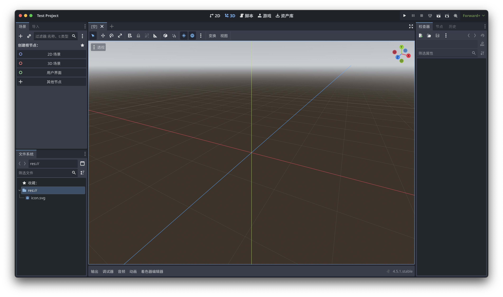
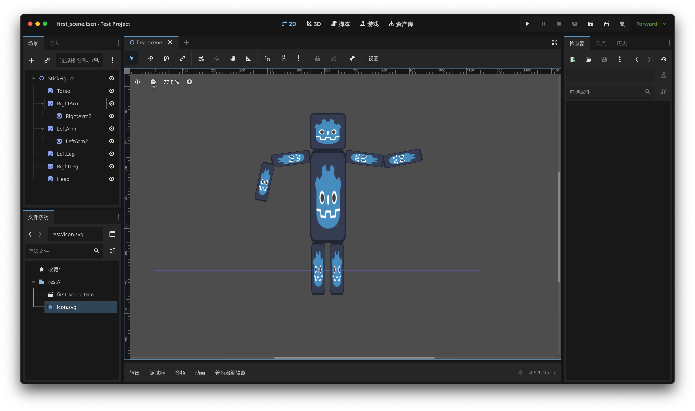
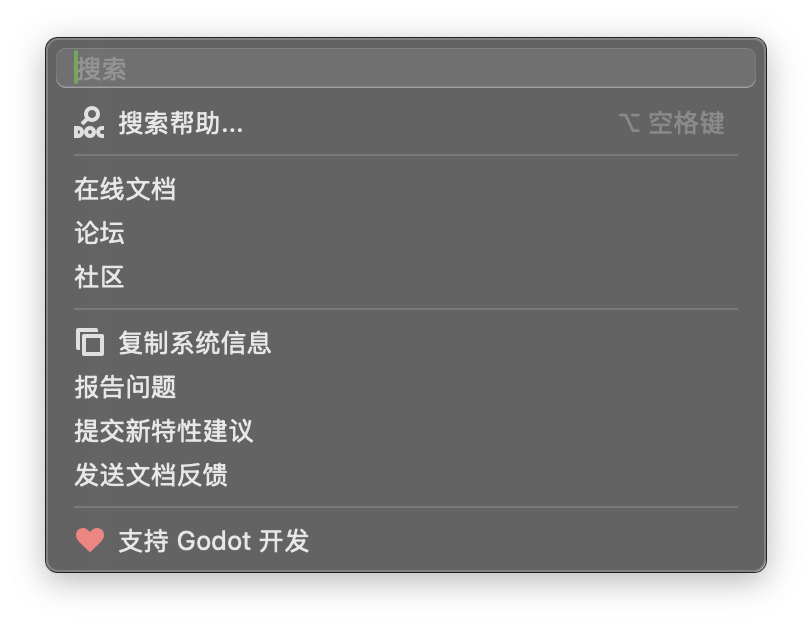

# Godot Basics

新建项目



Editor setting

### UI

-  中间：Viewport
-  顶上：Modes
   -  2D, 3D, Script, Game, AssetLib
-  左下角：FileSystem
-  左边：Scene Panel
   -  场景树
   -  Nodes（很重要） 
      -  Node2D
-  右边：Inspector
   -  属性编辑

## Scenes and Nodes

### Nodes

Nodes are the building blocks for creating a game in Godot.

- Images
- timers
- sounds
- 3D objects

### Scenes

1. Container for nodes.
2. A scene manages what is displayed.

### 实例



-  根节点：2D Scene，保存（类型为 Node2D）
-  添加精灵节点（最简单）：Sprite2D
   - 不可见，因为没有纹理（texture）
- 父节点会影响子节点，但子节点不会影响父节点和同级节点
- Instantiate a Scene as a Node in another Scene：将其他场景的实例作为节点添加到当前场景中

!!! warning "注意"
    1. 所有内容要在蓝紫色框框内
    2. $y$ 轴向下为正

运行：主场景（Main Scene）

## Intro to Coding

-  Attach a script to a node
-  Organize code via functions

创建函数：

```gdscript
func _ready():
    print(123)
```

- `_ready()`：在场景就绪后，Godot 内部会自动调用，所以创建后不用传参
- `print()`：内置函数，只需要传参调用
    - 字符串要用引号括起来：`print("Hello, Godot!")`

### Logic and Variables

!!! info "Documentation"
    

    - 应用内置帮助文档
    - 在线文档：[Godot Docs](https://docs.godotengine.org/en/4.5/)
    - [GDScript Reference](https://docs.godotengine.org/en/4.5/tutorials/scripting/gdscript/gdscript_basics.html)

#### 创建变量

```gdscript
var side_a = 10
var side_b = 20
```

#### 命名规则

-  不能：
   -  以数字开头
   -  使用空格
   -  使用特殊字符（`$`, `&`）
-  `snake_case` convention：小写 + 下划线

#### 常见数据类型

-  Text $\rightarrow$ "Strings"
-  Numbers $\rightarrow$ int, float
-  True/False $\rightarrow$ boolean (`True`, `False`)
-  Lists $\rightarrow$ [Arrays], {Dictionaries}, Vectors

:point_right: **可以强制变量类型，但默认是动态类型**

```gdscript
# 强制变量类型为 String
var test: String = "Some test string"
# 简写
var test := 123  # 自动指定为 int
```

### Properties and Methods

{++Properties++} and {++methods++} are variables and functions **that belong to an object**.

```gdscript
Sprite2D.position  # Property
Sprite2D.look_at()  # Method
```

`Sprite2D` 是一个**对象的实例**（an instance of an object，就是可以在游戏中使用的对象）。

将创建的 `Sprite2D` 节点拖到脚本编辑器中，发现在节点名字前自动加了一个美元符号：`$Sprite2D`。这样就获取了一个对象。在后面加一个点 `.` 就可以获取所有属性 "`.P`" 和方法 "`.f()`"。

```gdscript
func _ready():
    $Sprite2D.rotation = 20  # 更改属性，就像更改变量一样
    $Sprite2D.rotate(10)  # 调用方法，就像调用函数一样
```

以 `_process()` 为例（这个函数每一帧都会自动调用）：

```gdscript
func _process(delta: float):
   $Sprite2D.rotate(0.1)  # 每一帧旋转 0.1 弧度
   $Sprite2D.position.x += 1  # 每一帧 x 轴位置加 1
```

更改本身包含脚本的节点的属性时，可以直接调用；子节点需要用 `$` 定位。

```gdscript
func _ready():
    position.x = 600  # 初始就将整个节点向右移动 600
```

### Booleans and Logic Flow

-  Create booleans via logical expressions: `<`, `>`, `==`, `<=`, `>=`, `!=`
   -  组合：`and`, `or`, `not`
-  `if`, `elif`, `else`
-  `while`（不太常用）

!!! example "例：碰到边缘反弹"
    ```gdscript
    extends Node2D
    
    var speed := 15
    var direction := 1
    
    func _process(delta: float):
        $Sprite2D.position.x += speed * direction
        if $Sprite2D.position.x >= 1152:  # 碰到右边缘
            direction = -1  # 反向
        elif $Sprite2D.position.x <= 0:  # 碰到左边缘
            direction = 1  # 反向
    ```

### Data

#### Vectors

-  `Vector2`：二维向量，包含 `Vector2.x`, `Vector2.y`（类型为 float）
   -  `Vector2i`：整数二维向量
-  `Vector3`：三维向量

#### Arrays

-  可存储不同类型的数据
-  索引从 0 开始（类似 Python）
-  `for i in []`

#### Dictionaries

A list with key-value pairs.

> `for i in dict` 默认是遍历 key。可指定 `for key in dict.keys()` 或 `for value in dict.values()`。

### Functions, Scopes and & Return

#### 函数

创建函数：

```gdscript
func function_name(parameters):
    # code
```

调用函数：

```gdscript
function_name(arguments)
```

The {++parameters++} are variables defined in the function definition, while {++arguments++} are the actual values passed to the function when it is called.

指定参数类型：

```gdscript
func test_func(param1: String, param2: int):
    # code
```

设置默认参数值：`param = default_value`

:warning: 参数的位置是有顺序的

#### 作用域

全局变量和局部变量：是否在函数内部创建

:bulb: Functions should be self-contained. $\implies$ Modular logic.

#### 返回值

在创建函数时指定返回值类型：

```gdscript
func add(a: int, b: int) -> int:
    return a + b
```

> Default style guide: 函数之间两行空行