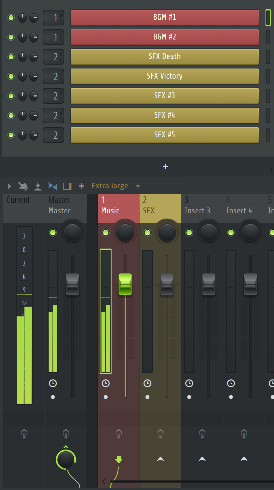

# 声音系统

## 1 概述

这一节简要介绍 Godot 中与音频有关的东西，以及一些基本的音频处理知识。

### 1.1 节点

音频播放节点：`AudioStreamPlayer`

> `AudioStreamPlayer2D` 在2D空间中播放与位置相关的声音，但教程里没有介绍

该节点的一个重要属性是 `Bus`，其概念解释详见 1.2 节。

### 1.2 线路控制

为方便理解，下图是在编曲软件（并非 Godot 的界面）中关于音乐和音效的线路控制示意。上面带颜色的每一项可以认为是一个 `AudioStreamPlayer` 节点，下面的混音台可以对节点的音量进行控制，也可以添加效果插件。



可以在混音台看到三条**总线（Bus）**：Master, Music, SFX. 总线相当于创建了一个群组，可以把多个发声节点放在总线里，从而实现分类控制。Master（总控）是最终的音频输出，也就是从音频设备听到的所有声音的最后一站都要经过这里。Music 和 SFX 分别是背景音乐和声音特效（Sound Effects），接收来自相应节点的声音，输出给 Master。

当然，可以有更细致的 Bus 设置。比如在 Minecraft 中，玩家可以单独调节天气、方块、友好生物、敌对生物等音效的音量大小。是否要进一步细分还有待讨论。

### 1.3 文件结构

```
res://
├── Assets
│   └── Audio
│       ├── Music
│       │   ├── BattleTheme.ogg
│       │   ├── MapTheme.ogg
│       │   └── MenuTheme.ogg
│       └── SFX
│           ├── ButtonClick.wav
│           ├── DrawCard.wav
│           ├── PlaceCard.wav
│           └── Shuffle.wav
├── Autoloads
│   └── AudioManager.gd
└── default_bus_layout.tres
```

- `default_bus_layout.tres` 是 Godot 默认的音频总线布局，可以在场景窗口的下方编辑总线
- `AudioManager.gd` 是自动挂载的管理音频的脚本
    - 初始化 `AudioStreamPlayer` 节点的数量，设置它们的总线
    - 使用代码调用节点，实现脚本控制播放音频
    - `AudioManager` 自动挂载到根节点，需要在`项目设置 -> 全局 -> 自动加载`中添加

## 2 音频管理脚本

下面详细介绍 `AudioManager.gd` 的实现。

### 2.1 总线设置

```gdscript
extends Node

# 创建枚举值（Bus 名称），命名风格建议是全大写
enum Bus {
    MASTER,
    MUSIC,
    SFX
}

# 创建常量字符串，对应 Bus 的实际名称（有别于上面的）
const MUSIC_BUS = "Music"
const SFX_BUS = "SFX"
```

### 2.2 配置

```gdscript
# Config
## 音乐播放器的个数
var music_audio_player_count: int = 2 # 预留两个播放器是为了实现音乐渐变
### 当前播放音乐的播放器的序号，默认是0
var current_music_player_index: int = 0
### 音乐播放器存放的数组，方便调用
var music_players: Array[AudioStreamPlayer]
### 音乐渐变时长
var music_fade_duration:float = 1.0
## 音效播放器的个数
var sfx_audio_player_count: int = 6
### 音效播放器存放的数组，方便调用
var sfx_players: Array[AudioStreamPlayer]
```

### 2.3 设置总线音量

分贝（dB）和线性音量条的值 $v \in [0, 1]$ 之间的转换公式如下：

$$
\text{dB} = 20 \cdot \log_{10}(v)
$$

可以发现，线性音量条 $v$ 两个端点对应的分贝值分别是 $-\infty$ 和 $0$，这是因为在音频处理中，分贝是一个相对值，$0$ dB 代表最大音量，而 -inf 代表静音.

`linear_to_db()` 是 Godot 内置的用于将线性音量转换为分贝的函数.

```gdscript
## 设置总线的音量
func set_volume(bus_index:Bus, v:float) -> void:
	var db := linear_to_db(v)
	AudioServer.set_bus_volume_db(bus_index, db)
```

### 2.4 播放音频

#### 2.4.1 音乐

```gdscript
# 启动初始化
func _ready() -> void:
    init_music_audio_manager()
    init_sfx_audio_manager()

## 初始化音乐播放器
func init_music_audio_manager() -> void:
	for i in music_audio_player_count:
		var audio_player := AudioStreamPlayer.new()
		audio_player.process_mode = Node.PROCESS_MODE_ALWAYS # 游戏暂停时也继续播放
		audio_player.bus = MUSIC_BUS # 将播放器节点添加到 Music 总线
		add_child(audio_player) # 将生成的播放器节点挂载到 AudioManager 节点下
		music_players.append(audio_player) # 方便调用

## 播放指定音乐
func play_music(_audio: AudioStream) -> void:
	var current_audio_player := music_players[current_music_player_index] # 获取正在播放音乐的播放器
	if current_audio_player.stream == _audio:
		return
	var empty_audio_player_index = 0 if current_music_player_index == 1 else 1
	var empty_audio_player := music_players[empty_audio_player_index]
	# 渐入
	empty_audio_player.stream = _audio
	play_and_fade_in(empty_audio_player)
	# 渐出
	fade_out_and_stop(current_audio_player)
	current_music_player_index = empty_audio_player_index

## 渐入
func play_and_fade_in(_audio_player: AudioStreamPlayer) -> void:
	_audio_player.play()
	var tween:Tween = create_tween()
	tween.tween_property(_audio_player, "volume_db", 0, music_fade_duration)

## 渐出
func fade_out_and_stop(_audio_player: AudioStreamPlayer) -> void:
	var tween:Tween = create_tween()
	tween.tween_property(_audio_player, "volume_db", -40, music_fade_duration) 
	await tween.finished
	_audio_player.stop()
	_audio_player.stream = null
```

#### 2.4.2 音效

```gdscript
## 初始化音效播放器
func init_sfx_audio_manager() -> void:
	for i in sfx_audio_player_count:
		var audio_player := AudioStreamPlayer.new()
		audio_player.bus = SFX_BUS
		add_child(audio_player)
		sfx_players.append(audio_player)

## 播放指定音效
func play_sfx(_audio: AudioStream, _is_random_pitch:bool = false) -> void:
	var pitch := 1.0
	if _is_random_pitch:
		pitch = randf_range(0.9, 1.1)
	for i in sfx_audio_player_count:
		var sfx_audio_player := sfx_players[i]
		if not sfx_audio_player.playing:
			sfx_audio_player.stream = _audio
			sfx_audio_player.pitch_scale = pitch
			sfx_audio_player.play()
			break
```