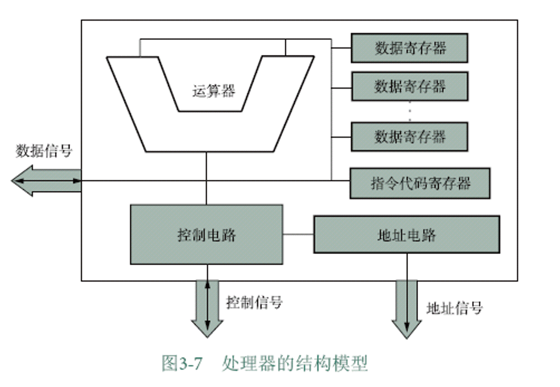

# 超算概述

!!! abstract "概述"
    跑得对、跑得快、功耗分配合理

## 计算系统概述

- 高性能计算（High Performance Computing, HPC）
    - 并行计算
    - 分布式计算
    - 集群计算
    - 云计算
- HPC 发展
    - 向量机（PVP）
    - 对称多处理机（Symmetric Multi-Processor, SMP, 1990s）
    - 大规模并行处理器（Massively Parallel Processor, MPP）
    - :star: 集群计算机（cluster）

### 并行计算

Parallel computing

多机、多CPU

### 分布式计算

各自独立的计算机组成的网络

### 集群计算

基于并行系统和网络的，作为并行计算和网络技术在高性能计算机体系结构中最为成功的集成和运用，一种性价比最好的系统。

### 云计算

一种网络应用，提供计算服务

## 计算机和计算

- 计算机系统
    - 硬件系统
        - 处理器系统
        - 存储器系统
        - 外部设备
    - 软件系统
        - 系统软件
        - 应用软件

## 计算机运行

通电后，CPU执行启动程序BIOS（Basic Input Output System），操作系统调入内存。

## 计算机中数的表示

- 原码
    - 解决乘法
- 反码
- 补码
    - 解决加法

### 浮点数

32位浮点数

### 编码和文本

- ASCII
- Unicode

#### 汉字编码

输出汉字：

1. 矢量化
   - 轮廓字体（TrueType）
2. 点阵图形

### 图形

- 位图
    - 又称光栅图（Raster Graphics）
    - 由像素组成
    - RGB、RGBA
- 矢量图

### 音频

- 采样
- 量化
- 编码

### 视频

- 帧
- 压缩存储、播放时解压
- MPEG、H.264、H.265

## 计算机系统组成

### 主板

- “北桥”：管理、控制机内的总线
- “南桥”：外设接口

!!! info "NUMA"

    

    不同 CPU 之间的数据调度

### 处理器

- 功能上，CPU 是**运算器**和**控制器**的集合。
- 逻辑上，包括
    - 运算器
    - 控制电路
    - 地址电路
    - 数据寄存器
    - 指令代码寄存器

处理器干的事：

- 取指令
- 分析指令
- 执行指令

!!! info "处理器的性能指标"
    - 主频
        - MIPS（Million Instructions Per Second）
        - GHz
    - 集成度（晶体管数目）
    - 字长（一次能处理的最大二进制数的位数）
        - 32位、64位
    - 协处理器

!!! info "CISC vs. RISC"
    - CISC（Complex Instruction Set Computer）
        - 指令集复杂（300条以上）
        - 指令长度不定
        - 典型代表：x86
    - RISC（Reduced Instruction Set Computer）
        - 指令集简单（100条以内）
        - 指令长度固定
        - 典型代表：ARM

### 存储器

存储单位

| 单位 | 实际字节数 | 近似表示 |
| :---: | :---: | :---: |
| B (Byte) | $1$ | $1$ |
| KB (Kilobyte) | $2^{10}$ | $10^3$ |
| MB (Megabyte) | $2^{20}$ | $10^6$ |
| GB (Gigabyte) | $2^{30}$ | $10^9$ |
| TB (Terabyte) | $2^{40}$ | $10^{12}$ |
| PB (Petabyte) | $2^{50}$ | $10^{15}$ |

#### 内存

- RAM（Random Access Memory）
    - DRAM（Dynamic RAM）
    - SRAM（Static RAM）
- ROM（Read Only Memory）
    - PROM（Programmable ROM）
        - 一旦数据被写入，就不能再修改
    - EPROM（Erasable Programmable ROM）
        - 需要用紫外线照射才能擦除
    - EEPROM（Electrically Erasable Programmable ROM）
        - 可以对部分单元进行重新写入

#### 存储系统层次

#### 外存

##### 固态存储器

- EEPROM
- 主机直接供电
- 半导体材料
- 断电保存数据、可擦除重写

SD卡、U盘、SSD...

#### 存储器系统的主辅结构

#### PC机的存储器

- CPU 执行程序时
    - 将**磁盘**中的数据映射存放到**虚拟内存**中
    - 需要时再从映射的虚拟内存中重新取出 $\Longrightarrow$ **物理内存**
- 虚拟内存与内存地址是{++对应++}的，存取速度比一般磁盘操作快

> 上学，书放在寝室就是硬盘，书包就是缓存

### 输入输出系统

- 外设：人机交互设备
- 端口：连接输入/输出设备的物理插接件
    - 并行（一次传输8位数据，字节模式）
    - 串行（一次传输1位数据，位模式）

#### 输入设备

- 键盘
    - 熟悉快捷键！
- 鼠标
- 触控板
- mic
- 摄像头

#### 输出设备

- 显示器
    - 分辨率
    - 刷新率
- 打印机
- 扬声器

其它接口卡：声卡、网卡

#### 系统总线标准

!!! info inline end ""
    

外部设备通过一组（束）导线的**接插件**端口与主机连接

- PCI（Peripheral Component Interconnect）总线
- PCIe（PCI Express）总线
- PCMCIA

#### 接口

解决高速主机和低速外设之间的矛盾，使速度匹配

## 操作系统概述

### 定义

计算机硬件与其他软件的接口，对计算机软件、硬件资源进行管理和使用。

### 分类

- 单用户单任务系统
    - DOS
- 单用户多任务系统
    - Windows
    - macOS
    - 分时处理技术：将CPU执行时间划分为若干时间片，一个时间片里干一个事，轮着干
- 多用户多任务系统
    - UNIX
- 并行系统
    - :warning: “负载平衡”（Load Balancing）问题
- 分布式系统
    - 通过网络将物理上分散的独立计算机互联起来

### 结构

- 内核（Kernel）
    - 操控计算机各种资源的**基本模块、设备驱动、内存管理**
    - Kernel 的调度程序决定哪一个任务被执行，控制程序为这些任务分配时间片
- 外壳（Shell）
    - Shell 负责接收用户和应用程序的操作命令，并将这个命令**解释**后交给 Kernel 执行，也称命令解释器
    - Shell 命令
        - 会话式输入
        - 命令文件方式

### 功能

#### 进程管理

进程（Process）：正在运行的程序

##### 死锁

多个进程同时{++占有对方需要的资源++}而同时{++请求对方的资源++}，而它们在得到请求之前不会释放所占有的资源。

会导致无效等待状态（程序无响应）

##### 线程

进程概念的延伸。

- 程序只有一个进程就可以处理所有的任务：**单一线程**
- 如果程序可以被分解为多个进程，共同完成程序的任务，那么被分解的不同进程就叫做**线程（Thread）**，也叫轻量级进程（Lightweight Process）。

#### 存储器管理

存储器管理器（Memory Manage Unit, MMU）负责调度内存、监控内存运行状态，以及内存、外存之间的数据交换。

##### 内存管理

内存资源的合理分配和使用。

> 解决“内存不足”问题，也就是爆内存！

##### 虚拟内存

在硬盘上开辟一个比内存要大的空间（一般为1.5倍），把被执行的程序装载到这个区域中，按照内存的结构进行组织。

#### 设备管理

- 块设备
    - 信息存放在固定长度块中
    - 磁盘、激光打印机
- 字符设备
    - 以字符为单位发送或接收字符流
    - 键盘、鼠标

##### 设备驱动程序

OS**不直接操纵**设备，而是通过管理设备的驱动程序操作设备。

#### 文件管理

命名、扩展名、**通配符**

- `*`：所在位置为任意个任意字符
- `?`：所在位置为一个任意字符

文件存取、索引文件、哈希文件

##### 文件存储结构

- 簇（Cluster）：磁盘上几个相邻的磁道和扇区组成的扇区组
- 一个扇区/一个簇：一个存储单位
- 扇区一般在512B到几KB之间

## 计算机网络

### TCP/IP

- Transmission Control Protocol / Internet Protocol
- 传输控制协议/网络互连协议
- TCP：数据打包、编号，在接收端将数据按原格式组合
- IP：为每个数据包加上接收机地址后在网络信道中传输

### IP 地址

- 每台入网的计算机都必须有一个唯一的网络地址，即 IP 地址
- Host
    - 拥有 IP 地址的机器叫主机（Host）
    - 路由根据 IP 地址来传输数据包

#### 专用地址范围

- `10.0.0.0` - `10.255.255.255`（A类）
- `172.16.0.0` - `172.31.255.255`（B类）
- `192.168.0.0` - `192.168.255.255`（C类）

这些地址只能用于一个机构的内部通信，而不能用于互联网通信。

专用地址只能用作本地地址。在 Internet 中所有路由器对目的地址是专用地址的数据包一律不进行转发。

#### 子网和子网掩码

- 把一个较大的网络划分为若干个较小的网络，并通过路由器连接。
- 如何划分子网？$\Longrightarrow$ 子网掩码

- A类：`255.0.0.0`
- B类：`255.255.0.0`
- C类：`255.255.255.0`

子网掩码和通信方的 IP 地址进行逻辑“与”运算。与之通信主机的 IP 地址网络部分相同，则在同一子网内。