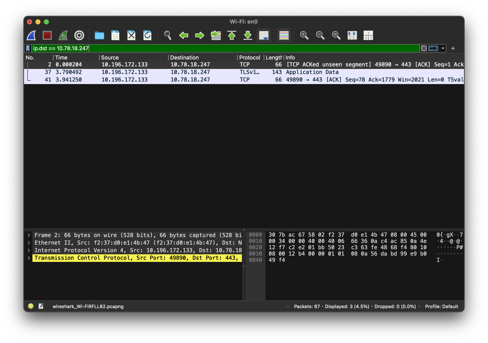
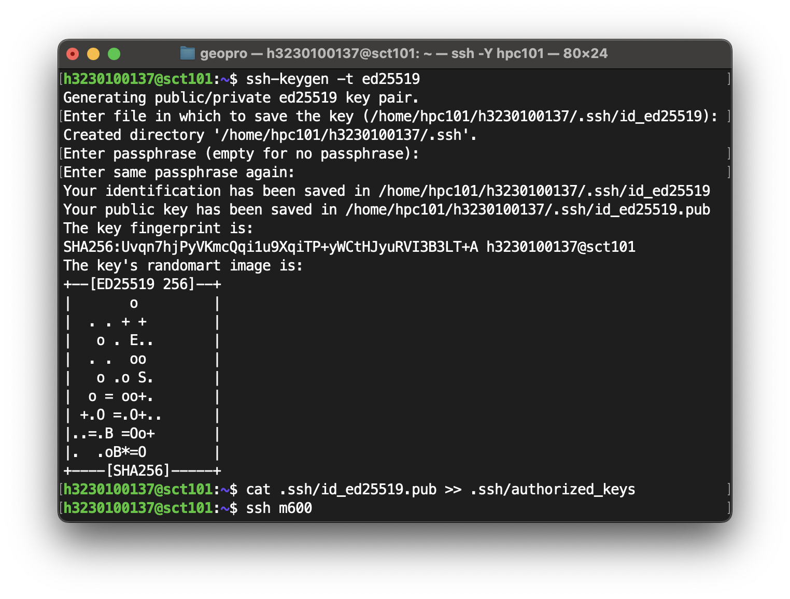

# 集群软硬件及运维基础

!!! abstract "摘要"
    - 计算机网络
    - Linux 基本知识
    - HPC 中的软件
    - HPC 中的硬件
    - 功耗控制与运维

## 计算机网络

!!! example "连接两台电脑"
    1. 给两台计算机装上网卡
       - 网卡实际上为数模转换器
    2. 用物理介质把两个网卡连起来
    3. 操作系统识别并兼容网卡

以太网帧

大部分网络都不是直连的，需要设计网络拓扑

交换机：把数据包发送给指定的设备

- MAC 地址（用以区分同一局域网下的设备）
- IP 地址（更高层的封装，用于标识**跨越多个局域网**的主机

解决丢包：TCP（Transmission Control Protocol）

!!! example "实践 1：简单抓包"
    访问 [http://clusters.zju.edu.cn](http://clusters.zju.edu.cn) 网站，用 WireShark 抓包

    

    `http` 访问是明文传输，很不安全！！

### 非对称加密

!!! question "如何在不可靠的信道中实现安全通信？"

- 公钥加密，私钥解密：加密数据传输
- 私钥签名，公钥验证：通过私钥验证身份

#### RSA 加密算法

$p,q$ 是两个大素数，$n = pq$，

### RDMA 高性能网络

省去了层层封装，性能提高

## Linux 基本知识

集群使用中心化的用户认证：LDAP

所有东西都是文件

### Linux 文件系统层次

- `/`：根目录
    - `/bin/`：essential user command binaries
    - `/dev/`：设备文件
    - `/etc/`：配置文件
    - `/home/`：用户家目录
    - `/lib/`：库文件（动态链接库、静态链接库）
    - `/mnt/`：挂载
    - `/opt/`：可选的（optional）应用程序软件包
    - `/sbin/`：system binaries
        - poweroff
        - reboot
        - 一般用户的 PATH 中没有 `sbin`
    - `/tmp/`：临时文件
    - `/usr/`：:star: 几乎所有的软件都装这
        - `local`
    - `/var/`
    - `/proc/`
    - `/root/`

### Linux 文件权限

- 读
- 写
- 执行

- owner
- group
- all
- others

444,555,777

| Binary | Octal | Permission | Representation |
|:------:|:-----:|:----------:|:--------------:|
| 000 | 0 | No permissions | --- |
| 001 | 1 | Execute | --x |
| 010 | 2 | Write | -w- |
| 011 | 3 | Write + Execute | -wx |
| 100 | 4 | Read | r-- |
| 101 | 5 | Read + Execute | r-x |
| 110 | 6 | Read + Write | rw- |
| 111 | 7 | Read + Write + Execute | rwx |


权限位 与 `sudo`

更高的权限：

ACL（Access Control List）

### Linux Shell

- bash
- zsh

#### Linux Shell Script

第一行 Shebang：

```bash
#!/usr/bin/env bash
```

!!! example "实践 2：编写一个简单的 Shell 脚本"
    给目录里所有文件添加前缀 `data-`

    ```bash
    #!/usr/bin/env bash
    for file in *; do
    # 只处理常规文件，跳过目录、链接等
    if [[ -f "$file" ]]; then
        # 如果文件名已经以 data- 开头，则跳过
        if [[ "$file" == data-* ]]; then
        continue
        fi
        # 重命名
        mv -- "$file" "data-$file"
    fi
    done
    ```

### Linux Kernel

- 用户空间
- 内核空间

硬件层面上 CPU 指令分级

extended Berkeley Packet Filter (eBPF)

!!! example "实践 3：实现多机互联"
    通过 SSH 连接到 `M600` 和 `M700` 节点

    ```bash
    ssh-keygen -t ed25519
    cat .ssh/id_ed25519.pub >> .ssh/authorized_keys
    ```

    之后直接用 `ssh` 连接即可。

    

## HPC 软件栈

### PXE

Preboot eXecution Environment

- 通过网络引导操作系统

### NFS Rootfs

### OverlayFS

Docker, OpenWrt 中常见

上层文件系统（Upper）和下层文件系统（Lower）

### Spack

Spack 是一个包管理器，专门用于 HPC 环境。

!!! example "实践 4：使用 Spack 安装软件"
    1. 安装 Spack
       ```bash
       git clone -c feature.manyFiles=true --depth=2 https://git.zju.edu.cn/zjusct/spack
       cd ~/spack
       ```
    2. 安装 vtune
       ```bash
       spack install intel-oneapi-vtune
       spack load intel-oneapi-vtune
       ```

    3. 安装 Intel MPI
       ```bash
       spack install intel-oneapi-mpi
       ```
    4. 安装 mkl 库
       ```bash
       spack install intel-oneapi-mkl
       ```
    5. 安装 hpl
       ```bash
       spack install hpl ^intel-oneapi-mpi ^intel-oneapi-mkl
       ```

        - `^` 符号表示依赖关系

## HPC 硬件

- CPU: Platinum 8358
    - 32 核
    - 64 线程
    - GFLOPS = CPU 频率 × FP 运算数目 x 核心数 x CPU 数量 $\approx$ 2.7 TFLOPS
- GPU: NVIDIA A100 80GB PCIe
    - A100 FP64 Tensor Core 高达 19.5 TFLOPS，远大于 CPU
    - 不是所有程序都适合移植到 GPU 上
- 网络设备
    - Infiniband
        - 极高的吞吐量和极低的延迟
        - 100 Gbps
    - NVLink 服务器
    - IPMI
        - Intelligent Platform Management Interface
        - 远程管理服务器

## 功耗控制

组装的时候算好功耗

控制 Core Clock, Uncore Clock，类似于 PWM

## 运维

什么都会 :thumbsup: