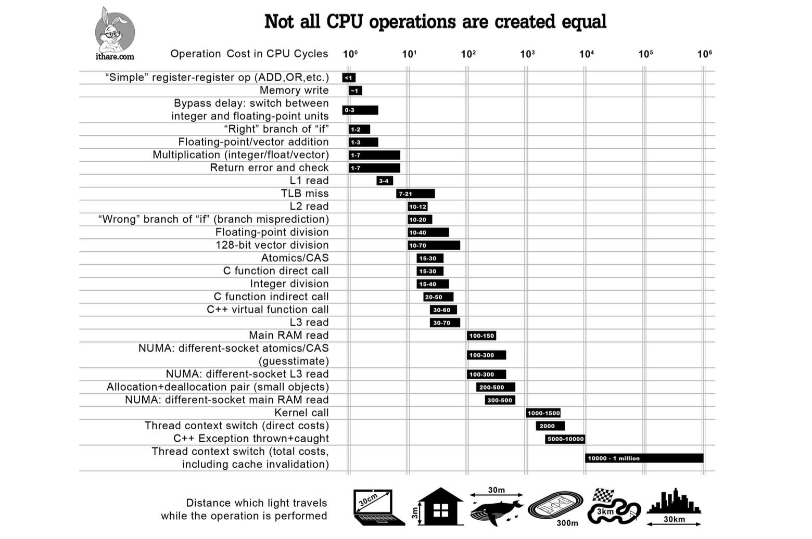

# HPC 中的计算机系统

## Introduction

重要概念：**抽象**

- Problem
- Algorithm (Code)
- Program (Executable)
- Runtime System
- ISA (Instruction Set Architecture)
- Microarchitecture
- Logic
- Circuits

> *Turing Complete* on Steam

## Operating System Basics

### Abstraction of CPU


- Program counter (PC)
- Register: stores data processed by the CPU（寄存器）

#### Memory Hierarchy

> 
> 
> Not all CPU operations are created equal

CPU 执行的不同指令，耗时差异很大！


#### What is an OS?

:star: Operating System is a **resource abstractor** and **resource allocator**.

- Event 事件
- Handler 处理器（根据事件的类型选择）

### OS Events

#### Traps

- Interrupts（中断）: 外部异步事件
    - Hardware-generated
    - e.g. 鼠标点击、硬盘拔出
- Exceptions（异常）: unusual condition occurring at instruction run time
    - Software-generated
    - e.g. division by zero

#### Trapped Control Flow


表面上是执行了不同位置的程序，实际上改变了 program counter (PC) 的值

!!! question "如何分开用户空间和内核空间？"
    用户程序不能轻易篡改内核空间的内容！

    - Add a **Mode Bit** to keep track of the current **privilege level**

    

#### System Calls

When a user program needs to do something privileged, it calls a **system call**. A system call is a special kind of trap.

!!! example "例"
    执行 `hello` 程序时，通过 `strace` 列出所有的系统调用：

    ```bash
    strace ./hello
    ```


#### Timers

> 一上来就一个 `while True` 的死循环，别的程序不就都没法运行了！？

- The OS must keep control of the CPU
    - Programs cannot get stuck in an infinite loop and lock up the computer
    - Programs cannot gain an unfair share of the computer
- One way in which {++the kernel retrieves control++} is when {++an interrupt occurs++}.
- To make sure that an interrupt will occur reasonably often, the OS uses a **timer**.

定期制造中断：定时器

## Process

:star: A process is **a program in execution, a unit of resource allocation and protection**.

一个进程不能越权访问其他进程的内存！

```bash
$ file hello
hello: ELF 64-bit LSB executable, x86-64, version 1 (SYSV), dynamically linked, interpreter /lib64/ld-linux-x86-64.so.2, ...
```

ELF: Executable and Linkable Format, 被分成一个个 section

### Process Address Space

!!! info inline end ""
    

- **In Memory (Unique Address Space)**
    - **Code**: Text section, initially stored on disk
    - **Data Section:**
        - BSS: uninitialized data 全局变量，未初始化
        - Data: initialized data 全局变量，已初始化
    - **Stack:** Function frames, local variables, etc, grows downwards
    - **Heap:** Dynamically allocated memory, grows upwards
- **Context**
    - **Program Counter:** Points to the next instruction to execute (i.e. an address in the code)
    - Content of the process's **registers**

#### Stack Frame

存放函数调用的参数、局部变量、返回地址等

- `sp` (stack pointer) 指向栈顶
- `fp` (frame pointer) 指向当前函数的栈帧底部

在 HPC 的 profiling 中，`perf` 工具通过分析栈帧来提供函数调用的性能数据。

!!! example "Memory Layout of a C Program"

    Match the variables to the correct memory location:

    !!! info inline end ""
        
    
    ```c
    #include <stdio.h>
    #include <stdlib.h>
    int x;
    int y = 15;
    int main(int argc, char *argv[]) {
        int *values;
        int i;
        values = (int *)malloc(sizeof(int) * 5);
        for (i = 0; i < 5; i++) {
            values[i] = i;
        }
        return 0;
    }
    ```

    ??? success "Answer"
        
    
### Process Schedule

- Non-preemptive: 非抢占式调度
- Preemptive: 抢占式调度，the OS can interrupt a running process to schedule another one.
    - Round Robin: 时间片轮转
    - Priority-based: 优先级调度
- :star: Also **decide which process to run on which core.** (Control by **Core Affinity**, 绑核)

#### Process Switch

- Save the context of the current process 保存上下文


### Inter-Process Communication (IPC)

- **Message Passing:** We use **MPI** to send / receive messages.
- Shared Memory, Signals, Pipes, Sockets, etc. 都有缺点！

Disadvantages of IPC: It's too heavy!

## Thread

- :star: A thread is a **basic unit of execution** within a process.
    - Thread ID
    - Program counter
    - Register set
    - Stack
- Shares the following with other threads within the same process:
    - Code section
    - Data section
    - Heap (dynamically allocated memory)
    - Open files and signals
- **Concurrency**: A multi-threaded process can do multiple things at once.


## Virtual Memory

Virtual memory is another abstraction layer between process and physical memory.

!!! bug "Mac版QQ的内存泄漏"
    

### Paging

- **Page and Frame**
    - Physical memory is split into fixed-size **frames**.
    - Virtual memory is split into fixed-size **pages**.
- **Memory Mapping**
    - Hardware support: **MMU** (Memory Management Unit)
    - Function: Translate **virtual page** to **physical frame**
    - Data structure: **Page Table**
- **Page Fault**
    - If a page is not in physical memory, a page fault occurs.
    - The OS will load the page from disk to physical memory, and update the page table.

```bash
cat /proc/self/maps
```

!!! summary "Takeaways"
    - Operating System: a resource abstractor and allocator.
    - Process: a unit of resource allocation and protection.
    - Thread: basic unit of execution within a process. 真正的执行单元。
    - Others: Memory hierarchy, Stack frame, etc.