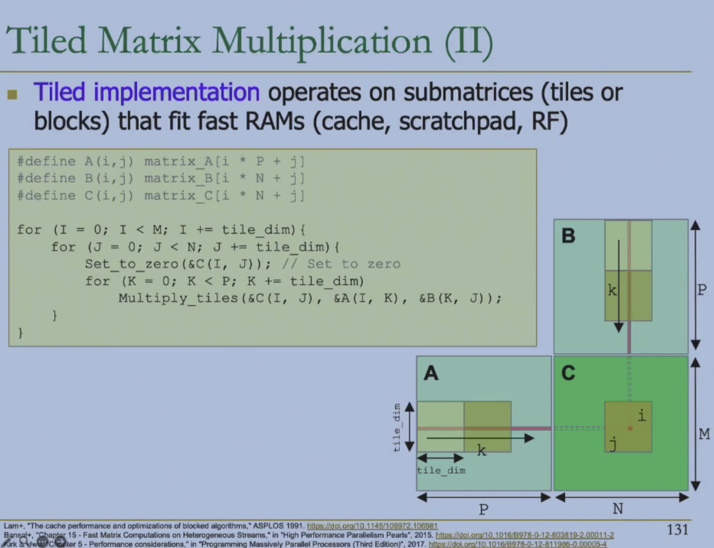

# CUDA C 基础


- SISD: Single Instruction Single Data
- SIMD: Single Instruction Multiple Data
- SPMD: Single Program Multiple Data
    - rather a program 


optimize global memory access

- Multithread
- Memory Coalescing
    - 让同一个 warp 访问连续的地址
- Shared Memory
    - N-way bank conflict


Naive matrix multiplication

- Poor access locality
- Consecutive accesses to $B$ are far from each other. 跳变访问，很慢

Tiled matrix multiplication

- Achieve better on-chip RAM locality by computing smaller tiles or blocks that fit in the RAMs.



```c
#define A(i,j) matrix_A[i * P + j]
#define B(i,j) matrix_B[i * N + j]
#define C(i,j) matrix_C[i * N + j]

```


## Limitations of GPU

计算量增加（Multi-pass）
同步的开销

---

