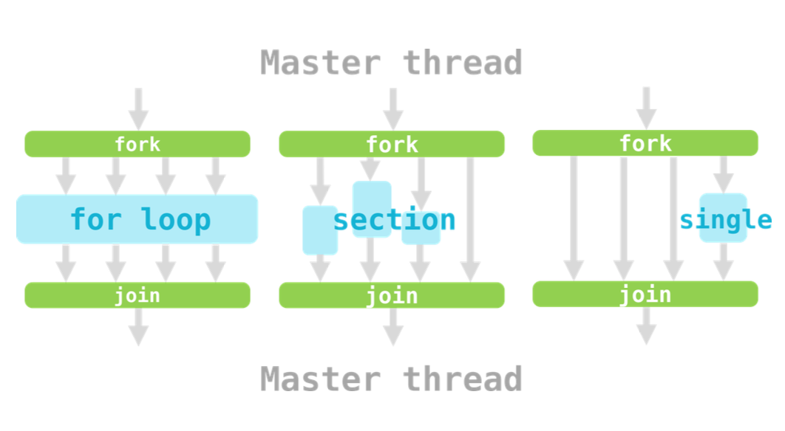

# CPU Parallel Programming Framework

## OpenMP

> Example codes directory: `/river/hpc101/2025/openmp-examples`

!!! example "Hello OpenMP"
    ```c
    #include <stdio.h>
    #include <omp.h>
    int main() {
    printf("Welcome to OpenMP!\n");
    #pragma omp parallel
    {
    int ID = omp_get_thread_num();
    printf("hello(%d)", ID);
    printf("world(%d)\n", ID);
    }
    printf("Bye!");
    return 0;
    }
    ```

    compile:

    ```bash
    gcc 1_hello_openmp.c -o 1_hello_openmp -fopenmp
    ```

    - `fopenmp` 告诉编译器并行

### Fork-Join Model

### OpenMP directives and constructs

An OpenMP construct is a formation for which the directive is executable.

```c
#pragma omp parallel // <--\--- Directive
{                    //    |
printf("Do sth.");   //    | Construct
}                    // ---/
```

#### Work-distribution constructs



- single
- section
- for

!!! warning "Overhead"
    any combination of {++excess or indirect++} computation time, memory, bandwidth, or other resources that are required to perform a specific task.

#### Loop Schedule

- 静态调度 `schedule(static)`
    - 提前规定好，OpenMP 就不管了
    - 但是会导致任务不均衡
- 动态调度 `schedule(dynamic, 1)`
    - 让 CPU 空闲时间减少，执行完立马领下一个任务
    - OpenMP 维护的 overhead 增加
    - `1` 代表粒度，单个任务

#### Nested `for` Loop

```c
# pragma omp parallel for collapse
for (int i = 0; i < n; i++) {
    for (int j = 0; j < n; j++) {
        c[i][j] = a[i][j] + b[i][j];
    }
}
```

- `collapse(2)`: 让 OpenMP 知道有两层循环

### Shared Data and Data Hazards

!!! example "Data Hazards in Summation"
    ```c
    #include <stdio.h>
    #include "omp.h"
    int main() {
        int a[100];
        int sum = 0;
        // initialize
        for (int i = 0; i < 100; i++) a[i] = i + 1;
        // Sum up from 1 to 100
        #pragma omp parallel for
        for (int i = 0; i < 100; i++) {
            sum += a[i];
        }
        printf("Sum = %d\n", sum);
    }
    ```

    每次输出的结果不确定！且不是 5050！

不同线程同时访问变量

#### Scope and Data Hazard

- Data hazards happen when operating *shared data*

把 `sum` 变量设置为 `private` 解决

#### Resolve Data Hazard

##### Critical Section

- 同一时间只能有一个线程进入临界区
- 一个临界区可以有多个 statements
- `#pragma omp critical`

比较慢

##### Atomic Operation

- Atomic operation cannot be separated
- 只能作用于一个操作
- 操作类型很有限（加减乘除，位操作）

##### Reduction

最常用到的方法

```c
#pragma omp parallel for reduction(+:sum)
    for (int i = 0; i < 100; i++) {
        sum += a[i];
    }
    printf("Sum = %d\n", sum);
```

!!! tip "Comparison"
    - Critical Region: based on locking
    - Atomic Operation: based on hardware atomic operations
    - Reduction: only synchronize in the end

!!! example "Example: GEMM"
    General Matrix Multiplication (GEMM)

    ```c
    // General Matrix Multiplication (GEMM)
    for (int i = 0; i < N; i++) {
        for (int j = 0; j < N; j++) {
            c[i][j] = 0;
            for (int k = 0; k < N; k++) {
                c[i][j] += a[i][k] * b[k][j];
            }
        }
    }
    ```

    加上

    ```c
    #pragma omp parallel for collapse(3) reduction(+ : c)
    ```

### Pitfalls & Fallacies

#### False Sharing

CPU 1 修改 Cache 后，CPU 2 再访问同一个 cache 区间的数据就失效了；反之亦然

MESI

!!! summary "Takeaway"
    1. **Where**: Profiling
    2. **Why**: Analyze data dependency
    3. **How**: Analysis and Skills
       - Sub-task Distribution
       - Scheduling Strategy
       - Cache and Locality 注意 cacheline 的长度
       - Hardware Environment
    4. Get Down to Work: Testing

    !!! tip "Tips"
        1. Ensure correctness while parallelizing
        2. Be aware of overhead
        3. Check more details in official documents

## MPI

把系统里调用的 message passing 封装好

MPI 有很多实现

- OpenMPI
- Intel-MPI
- MPICH
- HPMI (Hyper-MPI, Huawei)
- ...

!!! example "Hello MPI World"
    ```c
    #include <mpi.h>
    #include <stdio.h>
    int main(int argc, char** argv) {
        MPI_Init(&argc, &argv);
        int world_size;
        MPI_Comm_size(MPI_COMM_WORLD, &world_size);
        int world_rank;
        MPI_Comm_rank(MPI_COMM_WORLD, &world_rank);
        char processor_name[MPI_MAX_PROCESSOR_NAME];
        int name_len;
        MPI_Get_processor_name(processor_name, &name_len);
        printf("Hello world from processor %s, rank %d out of %d processors\n"
        , processor_name, world_rank, world_size);
        MPI_Finalize();
        return 0;
    }
    ```
    记住 `Init` 和 `Finalize`

### Basic Concepts

#### Communicator

- `MPI_COMM_WORLD`：所有进程
- `MPI_COMM_SPLIT`：划分成小的域，类似地图划分成国家

#### Blocking vs. Non-blocking

- 阻塞型：干完了才能干下一个
- 非阻塞型：好好好知道了

#### Order

Messages are non-overtaking.

顺序是保证的

#### Fairness

MPI 不保证通讯公平性。可能导致 starvation.

### P2P Communication

- `MPI_Send`
- `MPI_Recv`

常见错误：死锁

`MPI_Ssend` 阻塞型

- `MPI_Sendrecv`
- `MPI_Isend`

#### Synchronization

- `MPI_TEST`
- `MPI_WAIT`

### Collective Communication

#### Broadcast

- `MPI_Bcast`
- `MPI_Barrier`