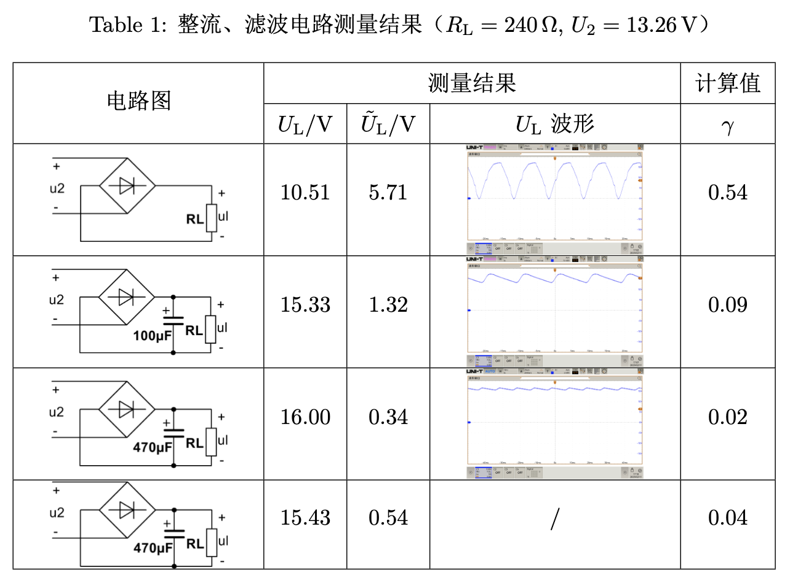
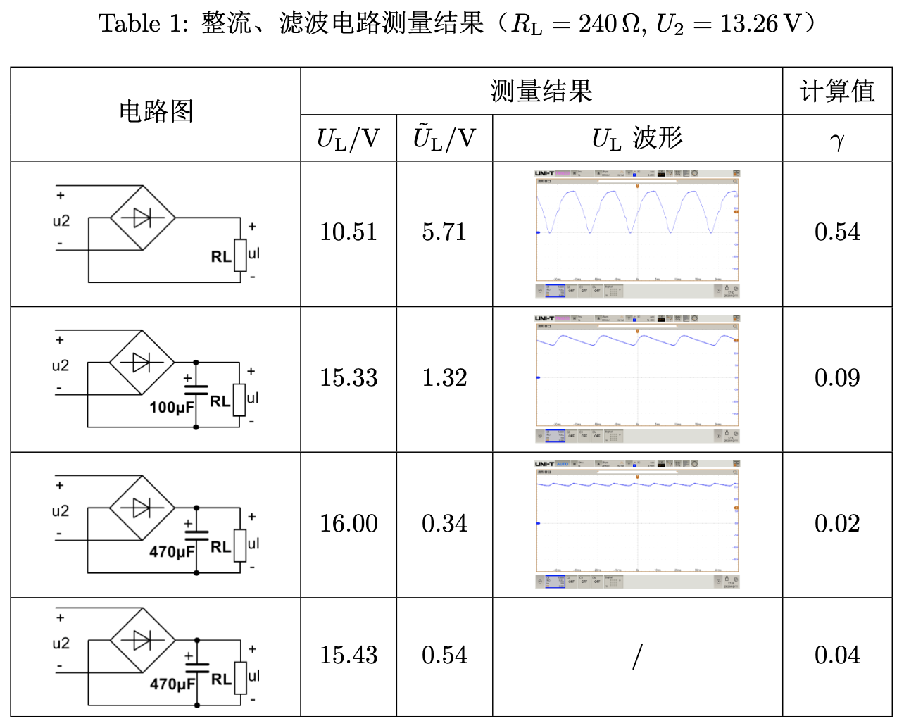

# 表格

## 表格中插入图片

!!! quote "网上的做法[^1]"

    [^1]: [latex如何在长表格的某个单元格中插入图片？](https://www.zhihu.com/question/385526984){target="_blank"}

    1. 直接在单元格写 `\includegraphics`（需导入 `graphicx` 包）。进一步地，也可以用 `minipage` 环境包裹
    2. 为了使其它单元格内容居中，使用 `\raisebox{-.5\height}{...}` 强制将文本抬高

    ```latex
    \begin{table}[!h]
        \renewcommand{\arraystretch}{1.5}
        \centering
        \caption{整流、滤波电路测量结果（$R_{\mathrm{L}} = 240 \,\Omega,\, U_2 = 13.26 \,\mathrm{V}$）}
        \begin{tabular}{|c|c|c|c|c|}
            \hline
            \multirow{2}{*}{电路图} & \multicolumn{3}{c|}{\makecell[c]{测量结果}} & 计算值 \\ \cline{2-5}
            ~ & $U_{\mathrm{L}}$/V & $\tilde{U}_{\mathrm{L}}$/V & $U_{\mathrm{L}}$ 波形 & $\gamma$ \\ \hline
            \begin{minipage}[b]{0.2\columnwidth}
            \centering
            \raisebox{-.5\height}{\includegraphics[width=0.8\linewidth]{figures/电路1.png}}
            \end{minipage} & 10.51 & 5.71 & \begin{minipage}[b]{0.2\columnwidth}
            \centering
            \raisebox{-.5\height}{\includegraphics[width=0.8\linewidth]{figures/out1.png}}
            \end{minipage} & 0.54 \\ \hline
            \begin{minipage}[b]{0.2\columnwidth}
            \centering
            \raisebox{-.5\height}{\includegraphics[width=0.8\linewidth]{figures/电路2.png}}
            \end{minipage} & 15.33 & 1.32 & \begin{minipage}[b]{0.2\columnwidth}
            \centering
            \raisebox{-.5\height}{\includegraphics[width=0.8\linewidth]{figures/out2.png}}
            \end{minipage} & 0.09 \\ \hline
            \begin{minipage}[b]{0.2\columnwidth}
            \centering
            \raisebox{-.5\height}{\includegraphics[width=0.8\linewidth]{figures/电路3.png}}
            \end{minipage} & 16.00 & 0.34 & \begin{minipage}[b]{0.2\columnwidth}
            \centering
            \raisebox{-.5\height}{\includegraphics[width=0.8\linewidth]{figures/out3.png}}
            \end{minipage} & 0.02 \\ \hline
            \begin{minipage}[b]{0.2\columnwidth}
            \centering
            \raisebox{-.5\height}{\includegraphics[width=0.8\linewidth]{figures/电路4.png}}
            \end{minipage} & 15.43 & 0.54 & / & 0.04 \\ \hline
        \end{tabular}
        \label{tab:out1}
    \end{table}
    ```

    效果：

    

!!! warning "问题"
    图片的高度和单元格高度完全一致（顶格了），没有留出空隙。

!!! success "解决方案"
    不使用 `\raisebox`，而是使用 `\adjustbox` 包的 `valign=c` 选项来垂直对齐图片，同时通过 `margin` 选项来调整图片的上下边距。

完整代码：

```latex
\begin{table}[!h]
    \renewcommand{\arraystretch}{1.5}
    \centering
    \caption{整流、滤波电路测量结果（$R_{\mathrm{L}} = 240 \,\Omega,\, U_2 = 13.26 \,\mathrm{V}$）}
    \begin{tabular}{|c|c|c|c|c|}
        \hline
        \multirow{2}{*}{电路图} & \multicolumn{3}{c|}{\makecell[c]{测量结果}} & 计算值 \\ \cline{2-5}
        ~ & $U_{\mathrm{L}}$/V & $\tilde{U}_{\mathrm{L}}$/V & $U_{\mathrm{L}}$ 波形 & $\gamma$ \\ \hline
        \begin{minipage}[b]{0.2\columnwidth}
        \centering
        \adjustbox{margin={0pt \smallskipamount}, valign=c}{\includegraphics[width=0.8\linewidth]{figures/电路1.png}}
        \end{minipage} & 10.51 & 5.71 & \begin{minipage}[b]{0.2\columnwidth}
        \centering
        \adjustbox{margin={0pt \smallskipamount}, valign=c}{\includegraphics[width=0.8\linewidth]{figures/out1.png}}
        \end{minipage} & 0.54 \\ \hline
        \begin{minipage}[b]{0.2\columnwidth}
        \centering
        \adjustbox{margin={0pt \smallskipamount}, valign=c}{\includegraphics[width=0.8\linewidth]{figures/电路2.png}}
        \end{minipage} & 15.33 & 1.32 & \begin{minipage}[b]{0.2\columnwidth}
        \centering
        \adjustbox{margin={0pt \smallskipamount}, valign=c}{\includegraphics[width=0.8\linewidth]{figures/out2.png}}
        \end{minipage} & 0.09 \\ \hline
        \begin{minipage}[b]{0.2\columnwidth}
        \centering
        \adjustbox{margin={0pt \smallskipamount}, valign=c}{\includegraphics[width=0.8\linewidth]{figures/电路3.png}}
        \end{minipage} & 16.00 & 0.34 & \begin{minipage}[b]{0.2\columnwidth}
        \centering
        \adjustbox{margin={0pt \smallskipamount}, valign=c}{\includegraphics[width=0.8\linewidth]{figures/out3.png}}
        \end{minipage} & 0.02 \\ \hline
        \begin{minipage}[b]{0.2\columnwidth}
        \centering
        \adjustbox{margin={0pt \smallskipamount}, valign=c}{\includegraphics[width=0.8\linewidth]{figures/电路4.png}}
        \end{minipage} & 15.43 & 0.54 & / & 0.04 \\ \hline
    \end{tabular}
    \label{tab:out1}
\end{table}
```

效果：



> 强迫症表示终于爽咧 