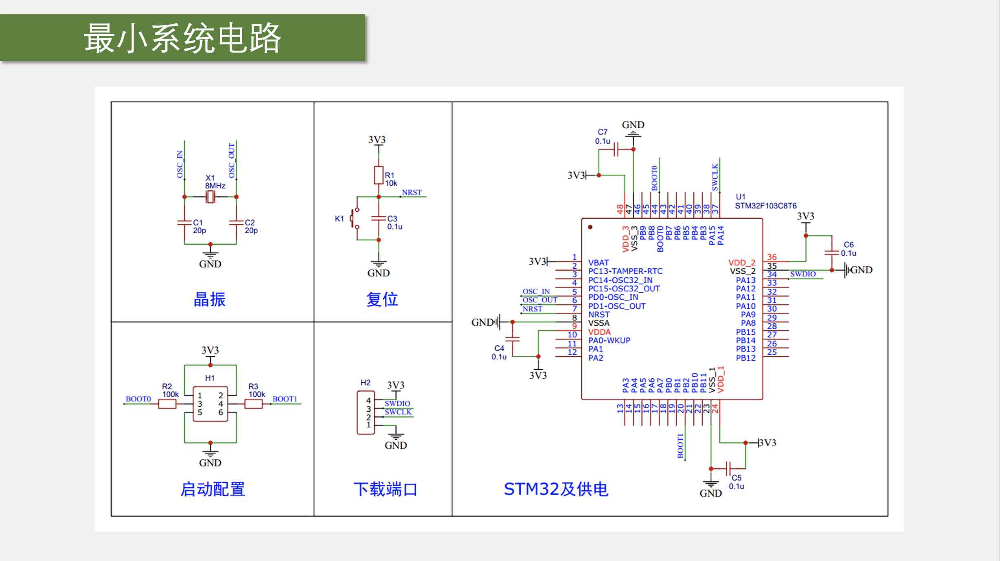

# STM32简介

## STM32F103C8T6

### 命名规则

- STM32: ST公司基于 ARM Cortex-M 内核开发的32位微控制器
- F: 通用系列
- 103: 增强型
- C: 48引脚
- 8: 64KB Flash
- T: LQFP封装
- 6: 温度范围，-40ºC~85ºC

### 基本参数

- 内核: ARM Cortex-M3
- 主频: 72MHz
- RAM: 20KB（SRAM）
- ROM: 64KB（Flash）
- 供电：2.0 V ~ 3.6 V（标准电压 **3.3 V**）
- 封装: LQFP48

## 外设

以数据手册为准.

| 英文缩写 | 名称 | 英文缩写 | 名称 |
| :---: | :---: | :---: | :---: |
| **NVIC**[^1] | Nested Vectored Interrupt Controller  嵌套向量中断控制器 | CAN | Controller Area Network  控制器局域网通信 |
| **SysTick** | System Tick Timer  系统滴答定时器 | USB | Universal Serial Bus  通用串行总线 |
| RCC | Reset and Clock Control  复位和时钟控制 | RTC | Real-Time Clock  实时时钟 |
| GPIO | General Purpose Input/Output  通用输入输出 | CRC | Cyclic Redundancy Check  循环冗余校验 |
| AFIO | Alternate Function I/O  复用功能输入输出 | PWR | Power Control  电源控制 |
| EXTI | External Interrupt  外部中断 | BKP | Backup Registers  备份寄存器 |
| TIM | Timer  定时器 | IWDG | Independent Watchdog  独立看门狗 |
| ADC | Analog-to-Digital Converter  模数转换器 | WWDG | Window Watchdog  窗口看门狗 |
| DMA | Direct Memory Access  直接存储器访问 | ~~DAC~~[^2] | Digital-to-Analog Converter  数模转换器 |
| USART | Universal Synchronous/Asynchronous Receiver/Transmitter  通用同步/异步串口通信 | ~~SDIO~~ | SD卡接口 |
| I2C | Inter-Integrated Circuit  I2C通信 | ~~FSMC~~ | Flexible Static Memory Controller  可变静态存储器控制器 |
| SPI | Serial Peripheral Interface  SPI通信 | ~~USB OTG~~ | USB On-The-Go  USB主机接口 |

[^1]: 加粗的外设是位于 Cortex-M3 内核里面的外设
[^2]: 划去的外设是本型号没有的

## 引脚定义

复用功能重映射

## 启动配置

| BOOT1 | BOOT0 | 启动模式 | 说明 |
| :---: | :---: | :---: | :---: |
| X | 0 | 主闪存存储器 | 最常用 |
| 0 | 1 | 系统存储器 | 可用于串口下载程序 |
| 1 | 1 | 内置SRAM | 用于调试 |

## 最小系统电路

- 供电引脚有滤波电容，保持供电电压稳定
- 晶振：8MHz
    - 两个 20 pF 的电容：起振电容
    - RTC 32.768kHz 晶振：用于实时时钟，接在 3,4 号引脚

    !!! tip ""
        $32768 = 2^{15}$, 时钟分频后可生成 1s 的时间信号
    
- 复位
    - 电容充电，NRST 引脚保持低电平
    - 电容充满，NRST 引脚变为高电平
    - 手动复位按键：按下时 NRST 引脚接地，电容放电，复位
- 启动配置
    - 跳线帽
- 下载端口
    - GND
    - SWCLK
    - SWDIO
    - 3.3V
