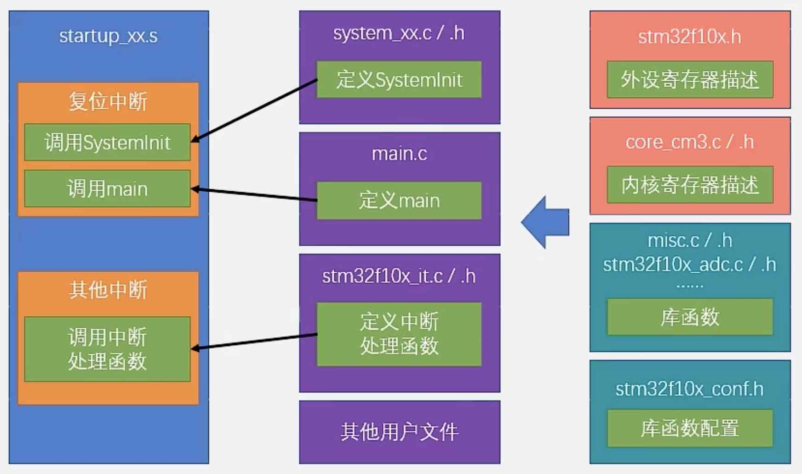

# 第一个 STM32 工程

!!! tip "STM32 开发方式"
    - 基于寄存器
        - 最底层、最直接
    - 基于**标准库**
        - 主要学习内容
    - 基于 HAL 库
        - 图形化界面

## 搭建工程结构

- 新建文件夹，新建工程文件
- 选择器件型号 `STM32F103C8`
- 添加必要文件（*可在工程文件夹中新建 `Start`文件夹*）
    - 启动文件 startup
    - 外设寄存器描述文件 `stm32f10x.h`, system 文件
    - 内核寄存器描述文件 `core_cm3.h`, `core_cm3.c`
    - Keil 软件中新建组，"Add existing files to group" 添加：
        - `startup_stm32f10x_md.s`
        - 所有 `.h` 和 `.c` 文件
- 添加头文件路径
    - “魔术棒”按钮 - Options for Target - C/C++ - Include Paths

## 添加 `main.c`

*可在工程文件夹中新建 `User`文件夹*

!!! note "添加头文件"
    右键 -> Insert '#include file' -> `stm32f10x.h`

```c
#include "stm32f10x.h"  // Device header

int main(void)
{
    while(1)
    {

    }
}
// (1)!
```

1. mkdocs自动把空行省略了...

!!! warning "注意"
    **{==最后一行必须是空行！==}**

- “编译并建立工程”，没报错就成功了！
- “扳手”按钮 - Configuration 调整编辑器风格

## 通过配置寄存器点灯

### 硬件准备

- STM32 最小系统板
- ST-LINK
- 四根母对母杜邦线
    - 连接好 3.3V、GND、SWDIO、SWCLK

!!! warning "注意"
    ST-LINK 有两排插脚，没插对可能会烧坏板子的

### Keil 软件设置

- “魔术棒”按钮 - Options for Target - Debug
    - Use: ST-LINK Debugger
    - Settings 勾选 `Reset and Run`
- "LOAD" 按钮下载程序到板子上

### 程序

> 寄存器配置了解即可，后续会使用标准库
>
> 点灯需要配置三个寄存器
>
> 第一个：使能 GPIOC 时钟
> 
> - 查STM32的手册：APB2外设时钟使能寄存器（RCC_APB2ENR）
> 
> - 位4 的 IOPCEN：使能 GPIOC 时钟（`1` 开启）
>
> - 16进制：`0x00000010`
>
> 第二个：配置 PC13 口的模式
>
> - 端口配置高寄存器 GPIOx_CRH, x: A, B, C, D, E
>
> - CNF13[1:0] 和 MODE13[1:0] 配置 13 号口
>
>   - CNF: 通用推挽输出模式, 为 `0b00`
>   - MODE: 输出模式, 最大速度50MHz, 为 `0b11`
>
> - 16进制：`0x00300000`
>
> 第三个：给 PC13 口输出数据
>
> - 端口输出数据寄存器 GPIOx_ODR, x: A, B, C, D, E
>
> - ODR13（`1` 给13号口输出高电平，`0` 给13号口输出低电平）
>
> - 16进制：`0x00002000`（高电平）

```c
#include "stm32f10x.h"  // Device header

int main(void)
{
    RCC->APB2ENR = 0x00000010;  // 使能 GPIOC 时钟
    GPIOC->CRH = 0x00300000;  // 配置 PC13 为推挽输出
    GPIOC->ODR = 0x00002000;  // PC13 输出高电平，低电平灯亮，此为灯灭；全0为灯亮
    while(1)
    {
        
    }
}

```

- 需要不断地查手册，很麻烦
- 把除了 PC13 之外的位都设成了 0，会影响其他端口的原有配置，还需要 `&=` 和 `|=` 来保留原有配置

## 使用标准库

### 搭建工程结构

*可在工程文件夹中新建 `Library`文件夹*

- 固件库文件夹 Libraries - STM32F10x_StdPeriph_Driver - src（库函数源文件）
    - `misc.c`：内核的库函数[^1]
    - 其余文件：外设的库函数
- 固件库文件夹 Libraries - STM32F10x_StdPeriph_Driver - inc（库函数头文件）
- 固件库文件夹 Project - STM32F10x_StdPeriph_Template
    - `stm32f10x_conf.h`：配置库函数头文件包含关系
    - `stm32f10x_it`：中断处理函数
    - 放在工程文件夹的 `User` 文件夹中

### Keil 软件设置

- `main.c` 开头添加的 `stm32f10x.h` 有个条件编译语句，必须先定义 `USE_STDPERIPH_DRIVER`  这个字符串才能使用 `stm32f10x_conf.h`。

    ```c
    #ifdef USE_STDPERIPH_DRIVER
        #include "stm32f10x_conf.h"
    #endif
    ```

- 工程选项（Options for Target）- C/C++ - Preprocessor Symbols
    - "Define" 一栏添加 `USE_STDPERIPH_DRIVER`
    - "Include Paths" 一栏添加 `Start`, `Library`, `User` 这些手动拷贝过一堆文件的文件夹路径

编译，没报错就成功了！

## 通过标准库点灯

### 程序

> 右键函数可以转到函数定义，方便查看函数的参数和返回值，非常有用！
>
> 没法右键跳转时也可直接 ++ctrl+f++ 配合 "Find Next" 搜索

```c
#include "stm32f10x.h"  // Device header

int main(void)
{
    RCC_APB2PeriphClockCmd(RCC_APB2Periph_GPIOC, ENABLE);  // 使能 GPIOC 时钟
    GPIO_InitTypeDef GPIO_InitStructure;  // 定义结构体
    /* 填写结构体的参数 */
    GPIO_InitStructure.GPIO_Mode = GPIO_Mode_Out_PP;  // 推挽输出
    GPIO_InitStructure.GPIO_Pin = GPIO_Pin_13;  // 13号口
    GPIO_InitStructure.GPIO_Speed = GPIO_Speed_50MHz;  // 50MHz
    GPIO_Init(GPIOC, &GPIO_InitStructure); // GPIO 模式配置完成！
    GPIO_SetBits(GPIOC, GPIO_Pin_13);  // PC13 输出高电平，灯灭
    
    /*
    GPIO_ResetBits(GPIOC, GPIO_Pin_13);  // PC13 输出低电平，灯亮
    */

    while(1)
    {
        
    }
}

```

## 总结：工程架构



[^1]: 算不算 ST 公司对 ARM 公司的嘲讽