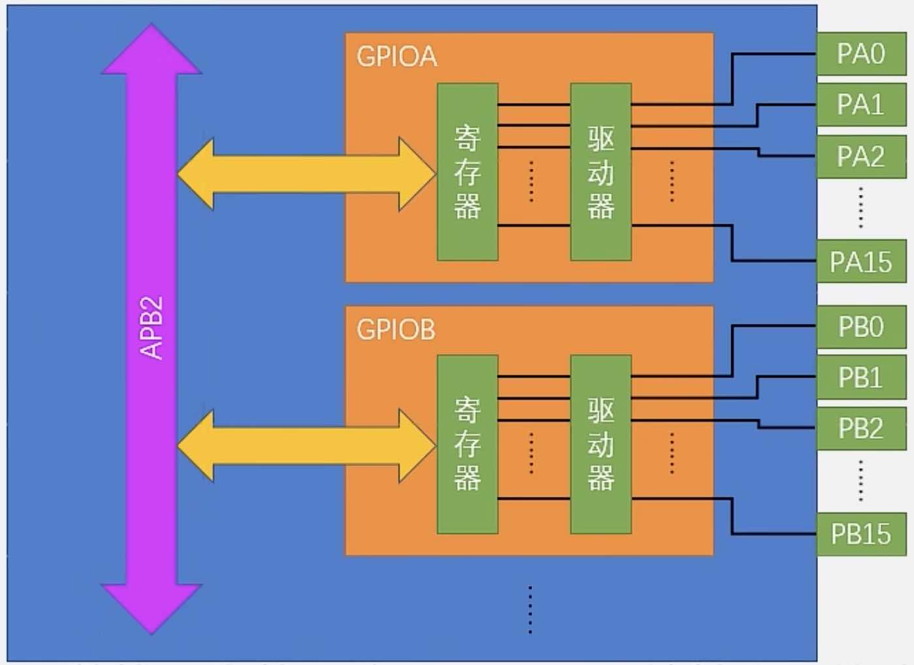

# GPIO 输出

## GPIO 简介

- General Purpose Input Output
- 8 种输入输出模式
- 引脚电平：0V - 3.3V，部分引脚可容忍 5V（可输入 5V，但是输出就 3.3V）（FT: Five Tolerate）
- 输出模式：控制端口输出高低电平
    - 驱动 LED
    - 控制蜂鸣器
    - 模拟通信协议输出时序
- 输入模式：读取端口的高低电平
    - 读取按键输入
    - 外接模块电平信号输入（光敏电阻、热敏电阻...）
    - ADC 电压采集
    - 模拟通信协议接收数据

## GPIO 基本结构

- 所有 GPIO 挂载在 APB2 外设总线上
- 每个 GPIO 有 16 个引脚
    - e.g. GPIOA: PA0 - PA15
- 