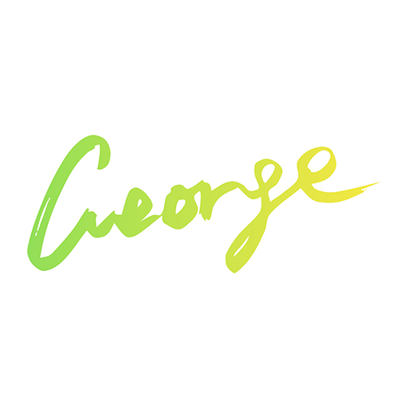

# 🔗 **友情链接**

<div class="grid cards" markdown>

-   {.logo-img} $\,$ [**Ponyboy的个人博客**](https://ponyboy2005.github.io/){target=_blank}

    ---

    Stay alive.

-   {.logo-img} $\,$ [**LH的资源小站**](https://lh-0124.github.io/LHstudy){target=_blank}

    ---

    LH的课程资源、笔记与一些分享.

-   {.logo-img} $\,$ [**Slowist's Notebook**](https://slowist-lee.github.io/notebook/){target=_blank}

    ---

    Follow My Heart!( ง `ω´ )۶

-   {.logo-img} $\,$ [**JimmyEastBrook's Notebook**](https://iiiiling.github.io/notebook/){target=_blank}

    ---

    是吟游者~ :material-star:{.star}

-   {.logo-img} $\,$ [**memset0**](https://mem.ac){target=_blank}

    ---

    在海月的虚空中，纵身飞过秋凉的时鸟。

-   {.logo-img} $\,$ [**嘎嘎's Notebook**](https://jybestow.github.io){target=_blank}

    ---

    是嘎嘎sama！

-   {.logo-img} $\,$ [**CC98 个人主页**](https://www.cc98.org/user/id/733259){target=_blank}

    ---

    小水怪一只 [ac06] 

</div>

!!! info "交换友链"
    欢迎在评论区留下你的博客/笔记网站链接！🎉

    我的友链信息：

    ```markdown
    title: George 的知识库
    description: 一名力学僧的笔记站点~
    url: https://note.gorco.me
    avatar: https://note.gorco.me/images/GeorgeSig.jpeg
    ```
