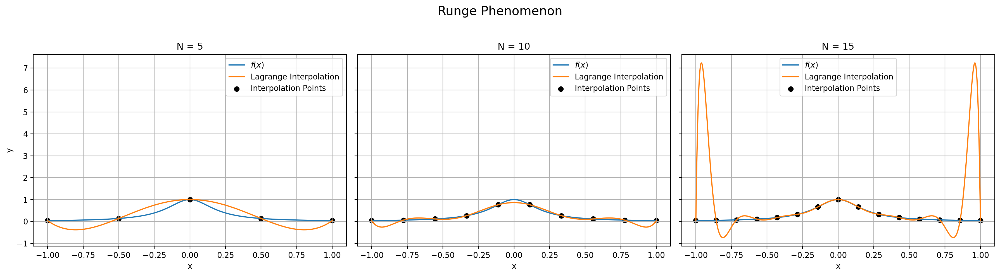

# 插值法

知道 $x_i, f(x_i), \, i = 0, 1, \ldots, n$，求指定形式函数 $P(x)$（多项式或三角函数），要求

$$
P(x_i) = f(x_i) = y_i, \quad i = 0, 1, \ldots, n.
$$

## 多项式插值

定义：一个 $n$ 次多项式：

$$
\varphi_n(x) = a_0 + a_1 x + a_2 x^2 + \cdots + a_n x^n,
$$

s.t. $\varphi_n(x_i) = y_i$，$a_0, a_1, \ldots, a_n$ 是待定系数。

$$
\left \{
\begin{aligned}
\varphi_n(x_0) &= a_0 + a_1 x_0 + a_2 x_0^2 + \cdots + a_n x_0^n = y_0 \\
\varphi_n(x_1) &= a_0 + a_1 x_1 + a_2 x_1^2 + \cdots + a_n x_1^n = y_1 \\
\ldots \\
\varphi_n(x_n) &= a_0 + a_1 x_n + a_2 x_n^2 + \cdots + a_n x_n^n = y_n
\end{aligned}
\right.
$$

即

$$
\underset{\text{Vandermonde 矩阵}}{\underbrace{\begin{bmatrix}
1 & x_0 & x_0^2 & \cdots & x_0^n \\
1 & x_1 & x_1^2 & \cdots & x_1^n \\
\vdots & \vdots & \vdots & \ddots & \vdots \\
1 & x_n & x_n^2 & \cdots & x_n^n
\end{bmatrix}}}
\begin{bmatrix}
a_0 \\
a_1 \\
\vdots \\
a_n
\end{bmatrix}
= \begin{bmatrix}
y_0 \\
y_1 \\
\vdots \\
y_n
\end{bmatrix}
$$

由 Cramer 法则理论上证明了 $a_i$ **存在且唯一**。而且 Vandermonde 矩阵条件数极大，在实际计算中不可用！

### Lagrange 插值

!!! question "求 $\varphi_n(x)$"
    求 $n$ 次多项式，使得其过 $(x_0, \textcolor{red}{1}), (x_1, 0), \ldots, (x_n, 0)$。

    设

    $$
    l_0(x) = C(x - x_1)(x - x_2) \cdots (x - x_n)
    $$

    代入 $(x_0, 1)$，得 $C = \frac{1}{(x_0 - x_1)(x_0 - x_2) \cdots (x_0 - x_n)}$。

    故

    $$
    l_0(x) = \frac{(x - x_1)(x - x_2) \cdots (x - x_n)}{(x_0 - x_1)(x_0 - x_2) \cdots (x_0 - x_n)}
    $$

    类似地，可以得到，对于满足

    $$
    l_i(x_j) = \begin{cases}
    1, & i = j \\
    0, & i \neq j
    \end{cases}
    $$
    
    的 $l_i(x)$，可以求出其形式为

    $$
    \begin{equation} \tag{5-1}
        l_i(x) = \frac{(x - x_0)(x - x_1) \cdots (x - x_{i-1})(x - x_{i+1}) \cdots (x - x_n)}{(x_i - x_0)(x_i - x_1) \cdots (x_i - x_{i-1})(x_i - x_{i+1}) \cdots (x_i - x_n)}
    \end{equation}
    $$

    分子分母都跳过 $x_i$。

    把 $l_i(x)$ 拼起来，

    $$
    \varphi_n(x) = y_0 l_0(x) + y_1 l_1(x) + \cdots + y_n l_n(x)
    $$

    此即为 **{==Lagrange 插值法==}**。

事实上，$\{l_i(x)\}$ 是多项式函数空间 $\mathbb{P}^n(x)$ 的一组基，称为 Lagrange 插值多项式基函数。也就是说，

$$
\mathbb{P}^n(x) = \text{span}\{l_0(x), l_1(x), \ldots, l_n(x)\}.
$$

!!! tip "童年美好的回忆"
    过 $(x_0, y_0), (x_1, y_1)$ 做一条直线。

    用 Lagrange 插值法做？

    $$
    \varphi_1(x) = y_0 \frac{(x - x_1)}{(x_0 - x_1)} + y_1 \frac{(x - x_0)}{(x_1 - x_0)}
    $$

    过 $(x_0, y_0), (x_1, y_1), (x_2, y_2)$ 做一条抛物线？

    $$
    \varphi_2(x) = y_0 \frac{(x - x_1)(x - x_2)}{(x_0 - x_1)(x_0 - x_2)} + y_1 \frac{(x - x_0)(x - x_2)}{(x_1 - x_0)(x_1 - x_2)} + y_2 \frac{(x - x_0)(x - x_1)}{(x_2 - x_0)(x_2 - x_1)}
    $$

    可以看到，Lagrange 插值法给出了{++很漂亮的解析表达式++}（对不太大的 $n$，甚至能手写！），但计算性能不佳。

#### 插值误差

当 $x \in [a,b]$，但 $x \neq x_i$ 时，Lagrange 插值法的误差为

$$
R_n(x) = f(x) - \varphi_n(x) = \, ?
$$

记 $R_n(x) = K(x) \cdot \omega_{n+1}(x)$，

$$
\omega_{n+1}(x) = \prod_{j=0}^n (x - x_j) = (x - x_0)(x - x_1) \cdots (x - x_n),
$$

而 $K(x)$ 和 $f(x)$ 有关。

构造辅助函数：$\forall x \neq x_i \in [a,b]$，

$$
\psi(t) = f(t) - \varphi_n(t) - K(x) \cdot \omega_{n+1}(t),
$$

则

$$
\psi(x_i) = \underset{=0}{\underline{f(x_i) - \varphi_n(x_i)}} - K(x) \cdot \underset{=0}{\underline{\omega_{n+1}(x_i)}} = 0.
$$

故 $\psi(t)$ 在 $[a,b]$ 上有 $n+2$ 个零点 $x, x_0, x_1, \ldots, x_n$。

由 Rolle 定理，$\psi'(t)$ 在 $[a,b]$ 上有 $n+1$ 个零点。以此类推可知，$\psi^{(n+1)}(t)$ 有一个零点，记为 $\xi \in [a,b]$。

$\varphi_n(x)$ 是 $n$ 次多项式，$\omega_{n+1}(x)$ 是 $n+1$ 次多项式，求 $n+1$ 次导数后分别为 $0$ 和 $(n+1)!$，所以

$$
\psi^{(n+1)}(\xi) = f^{(n+1)}(\xi) - K(x) (n+1)!
$$

得到

$$
\begin{aligned}
    K(x) &= \frac{f^{(n+1)}(\xi)}{(n+1)!}, \\
    R_n(x) &= \frac{f^{(n+1)}(\xi)}{(n+1)!} \cdot \omega_{n+1}(x) \\
\end{aligned}
$$

!!! inline question end "如果新增一个数据点..."
    Lagrange 插值法的基函数要全部重新计算！

!!! tip ""
    $\omega_{n+1}(x)$ 代表高频部分，应滤波后进行插值。

### Newton 插值

#### 差商

$$
\begin{aligned}
    \text{0 阶：} & f[x_i] = f(x_i), \quad i = 0, 1, \ldots, n. \\
    \text{1 阶：} & f[x_i, x_j] = \frac{f(x_j) - f(x_i)}{x_j - x_i}, \quad i, j \in \{0, 1, \ldots, n\}, i \neq j. \\
    \text{2 阶：} & f[x_i, x_j, x_k] = \frac{f[x_i, x_j] - f[x_j, x_k]}{x_i - x_k} \\
    \vdots & \\
    k\text{ 阶：} & f[x_0, x_1, \ldots, x_{k-1}, x_k] = \frac{f[x_0, x_1, \ldots, x_{k-1}] - f[x_1, x_2, \ldots, x_k]}{x_0 - x_k}.
\end{aligned}
$$

- 手算：列表

| $x_i$ | $f_i$ | $\,$ | $\,$ |
| :---: | :---: | :---: | :---: |
| $x_0$ | $f[x_0]$ | $\,$ | $\,$ |
| $x_1$ | $f[x_1]$ | $f[x_0, x_1]$ | $\,$ |
| $x_2$ | $f[x_2]$ | $f[x_1, x_2]$ | $f[x_0, x_1, x_2]$ |

!!! note "基的角度"
    - Cramer 法则

    $$
    1, \quad x, \quad x^2, \quad \cdots, \quad x^n
    $$

    - Lagrange 插值法

    $$
    l_0(x), \quad l_1(x), \quad l_2(x), \quad \cdots, \quad l_n(x)
    $$

    - Newton 插值法

    $$
    1, \quad x - x_0, \quad (x - x_0)(x - x_1), \quad \cdots, \quad (x - x_0)(x - x_1) \cdots (x - x_n)
    $$

设

$$
\varphi_n(x) = C_0 + C_1 (x - x_0) + C_2 (x - x_0)(x - x_1) + \cdots + C_n (x - x_0)(x - x_1) \cdots (x - x_n)
$$

且过 $(x_0, y_0), (x_1, y_1), \ldots, (x_n, y_n)$。

$$
\begin{aligned}
    \varphi_n(x_0) &= C_0 = f(x_0) \implies C_0 = f[x_0] \\
    \varphi_n(x_1) &= C_0 + C_1 (x_1 - x_0) = f(x_1) \\
    \implies C_1 &= \frac{f(x_1) - f[x_0]}{x_1 - x_0} = f[x_0, x_1] \\
    \varphi_n(x_2) &= C_0 + C_1 (x_2 - x_0) + C_2 (x_2 - x_0)(x_2 - x_1) = f(x_2) \\
    \implies C_2 &= \frac{f(x_2) - C_0 - C_1 (x_2 - x_0)}{(x_2 - x_0)(x_2 - x_1)} = \frac{f[x_0, x_1] - f[x_1, x_2]}{x_0 - x_2} = f[x_0, x_1, x_2]
\end{aligned}
$$

故 $C_k$ 就是 $f$ 的 $k$ 阶差商。

Newton 插值法能更好地控制舍入误差。

#### 插值误差

$$
R_n(x) = (x - x_0)(x - x_1) \cdots (x - x_n) f[x, x_0, x_1, \ldots, x_n]
$$

看着只有一项，但不如 Lagrange 插值的余项好用。

#### 差分

$$
\begin{array}{c}
    & x_0 & x_1 & x_2 & \ldots & x_n \\
    & f(x_0) & f(x_1) & f(x_2) & \ldots & f(x_n)
\end{array}
$$

!!! tip ""
    **查表** + **多项式插值**（零阶插值就是取最近的点，一阶插值就是取最近的两点，二阶插值就是取最近的三点，依次类推）：快速计算函数的方法。很重要的技术！

记 $x_{i+1} - x_i = h$，

$$
\frac{f(x_{i+1}) - f(x_i)}{x_{i+1} - x_i} = f[x_i, x_{i+1}] = \frac{\Delta f_i}{h}
$$

$$
f[x_0, x_1, x_2] = \frac{f[x_0, x_1] - f[x_1, x_2]}{x_0 - x_2} = \frac{\Delta f_0 - \Delta f_1}{2h \cdot h} = \frac{\Delta^2 f_0}{2h^2}
$$

### Runge 现象

> 多项式是有刚性的

!!! question "能否无限增加阶数 $n$ 来减小余项 $R_n$？"
    例：$f(x) = \sin x, \, x \in [0, \pi]$.

    $$
    R_n(x) = \frac{f^{(n+1)}(\xi)}{(n+1)!} \cdot \omega_{n+1}(x)
    $$

    $|f^{(n+1)}(\xi)| < 1$，增加 $n$ 确实能减小 $R_n$. 对任何 $f$ 都如此吗？

Runge 函数：

$$
f(x) = \frac{1}{1 + 25 x^2}
$$

> 在一个点 $f(x) \approx P_n(x)$，在一个区间上有 $f(x) \approx P_n(x)$ 吗？
>
> Runge 现象说明，一定没有！
>
> 插值多项式不能一致逼近（某些）函数。

### Hermite 插值

!!! question "其它没有尖点的插值方式？"
    作多项式 $P_m(x)$，使得
    
    $$
    \left \{
    \begin{array}{l}
        P_n(x_i) = f(x_i) \\[1ex]
        P_m'(x_i) = f'(x_i)    
    \end{array}
    \right.,
    \quad i = 0, 1, \ldots, n.
    $$

    一共有 $2n + 2$ 个条件，可以确定 $m = 2n + 1$ 次多项式。

构造基函数满足：

$$
\left \{
\begin{array}{l}
    h_i(x_j) = \begin{cases}
        0, & i \neq j \\
        1, & i = j
    \end{cases}, \quad i = 0, 1, \ldots, n \\[2em]
    h_i'(x_j) = 0, \quad j = 0, 1, \ldots, n
\end{array}
\right.
$$

$$
\left \{
\begin{array}{l}
    H_i(x_j) = 0, \quad j = 0, 1, \ldots, n \\[2em]
    H_i'(x_j) = \begin{cases}
        0, & i \neq j \\
        1, & i = j
    \end{cases}, \quad i = 0, 1, \ldots, n
\end{array}
\right.
$$

得到

$$
P_{2n+1}(x) = \sum_{i=0}^n h_i(x) f(x_i) + \sum_{i=0}^n H_i(x) f'(x_i)
$$

有点像 Lagrange 插值法。那牛顿会怎么做？

当 $x_1 \to x_0, f[x_0, x_1] = \frac{f(x_1) - f(x_0)}{x_1 - x_0} \to f'(x_0)$，所以

| $x_0$ | $f_0$ | $\,$ | $\,$ |
| :---: | :---: | :---: | :---: |
| $x_0$ | $f[x_0]$ | $f'(x_0) = f[x_0, x_0]$ | $\,$ |
| $x_1$ | $f[x_1]$ | $f[x_0, x_1]$ | $f[x_0, x_0, x_1]$ |
| $x_1$ | $f[x_1]$ | $f'(x_1) = f[x_1, x_1]$ | $f[x_0, x_0, x_1, x_1]$ |

写出

$$
H_3(x) = f(x_0) + f[x_0, x_0](x - x_0) + f[x_0, x_0, x_1](x - x_0)^2 + f[x_0, x_0, x_1, x_1](x - x_0)^2(x - x_1) = f(x_0) + f'(x_0)(x - x_0) + \frac{f'(x_0) - f[x_0, x_1]}{x_0 - x_1}(x - x_0)^2
$$

!!! question "导数信息很麻烦..."
    实际生产中，数据点的导数信息很难获取/很不稳定！能否不借助导数信息给出光滑的插值？？

    让左右两段的插值函数在节点处的导数相等 $H^{(i)}(x_i) = H^{(i+1)}(x_i)$，$i

!!! tip "分段三次 Hermite 插值"
    已知：

    $$
    \begin{array}{c}
        & x_0 & x_1 & x_2 & x_3 \\
        & f'(x_0) & \, & \, & f'(x_3)
    \end{array}
    $$

    要求：

    $$

    $$

### 三次样条插值

在 $[a,b]$ 上有 $n+1$ 个节点 $a = x_0 < x_1 < \cdots < x_n = b$，已知 $y = f(x)$ 在这些点上的取值 $y_i = f(x_i), \, i = 0, 1, \ldots, n$，求 $S(x)$ 满足：

1. $S(x_i) = y_i, \quad i = 0, 1, \ldots, n$
2. $S(x)|_{[x_j, x_{j+1}]}, \quad j = 0, 1, \ldots, n-1$ 是三次多项式
3. $S(x)$ 在 $[a,b]$ 上二次连续可微

$S(x)$ 是分段三次多项式，称为三次样条插值函数。

在每个小区间：$[x_j, x_{j+1}]$，$S_j(x)$ 是三次多项式

$$
\left.
\left \{
\begin{aligned}
S_j(x_j) &= f(x_j) = y_j \\
S_j(x_{j+1}) &= f(x_{j+1}) = y_{j+1}
\end{aligned}
\right.
\quad \right| \quad \small{\text{补充条件：}}
\left\{
\begin{aligned}
S_j''(x_j) &= M_j \\
S_j''(x_{j+1}) &= M_{j+1}
\end{aligned}
\right.
$$

在 $[x_j, x_{j+1}]$ 上，对 $S_j(x)$ 做关于 $x_j$ 点的 Taylor 展开，有

$$
\begin{align}
S_j(x) &= S_j(x_j) + S_j'(x_j)(x - x_j) + \frac{S_j''(x_j)}{2!}(x - x_j)^2 + \frac{S_j'''(x_j)}{3!}(x - x_j)^3 \tag{1.1}\\ 
S_j'(x) &= S_j'(x_j) + S_j''(x_j)(x - x_j) + \frac{S_j'''}{2!}(x - x_j)^2 \tag{1.2}\\
S_j''(x) &= S_j''(x_j) + S_j'''(x_j)(x - x_j) \tag{1.3}
\end{align}
$$

最后一个式子代入 $x = x_{j+1}$，得到 $S_j''(x_{j+1}) = M_{j+1} = M_j + S_j'''(x_j)(x_{j+1} - x_j)$，即

$$
S_j'''(x_j) = \frac{M_{j+1} - M_j}{x_{j+1} - x_j} := \frac{M_{j+1} - M_j}{h_j}, \quad h_j = x_{j+1} - x_j
$$

代回第二式

$$
S_j'(x) = S_j'(x_j) + M_j(x - x_j) + \frac{M_{j+1} - M_j}{2h_j}(x - x_j)^2
$$

再代回第一式

$$
S_j(x) = y_j + S_j'(x_j)(x - x_j) + \frac{M_j}{2}(x - x_j)^2 + \frac{M_{j+1} - M_j}{6h_j}(x - x_j)^3
$$

代入 $x = x_{j+1}$，

$$
\begin{aligned}
S_j(x_{j+1}) = y_{j+1} &= y_j + S_j'(x_j) h_j + \frac{M_j}{2}h_j^2 + \frac{M_{j+1} - M_j}{6}h_j^2 \\
&= y_j + S_j'(x_j) h_j + \left(\frac{M_{j+1}}{6} + \frac{M_j}{3}\right)h_j^2
\end{aligned}
$$

写成差商的形式

$$
\frac{y_{j+1} - y_j}{h_j} = f[x_j, x_{j+1}] = S_j'(x_j) h_j + \left(\frac{M_{j+1}}{6} + \frac{M_j}{3}\right)h_j^2
$$

即

$$
\begin{equation} \tag{5-1}
S_j'(x_j) = f[x_j, x_{j+1}] - \left(\frac{M_{j+1}}{6} + \frac{M_j}{3}\right)h_j^2
\end{equation}
$$

同理，对于 $S_{j-1}(x)$ 在 $x_j$ 处的展开，只需将 $h_j \mapsto -h_{j-1}$，可以得到

$$
\begin{equation}
S_{j-1}'(x_j) = f[x_{j-1}, x_j] + \left(\frac{M_{j}}{6} + \frac{M_{j-1}}{3}\right)h_{j-1}^2
\end{equation}
$$

由导数的连续性条件，$S_j'(x_j) = S_{j-1}'(x_j)$，有

$$
\begin{equation}
\frac{h_{j-1}}{6}M_{j-1} + \frac{h_j + h_{j-1}}{3}M_j + \frac{h_j}{6}M_{j+1} = f[x_j, x_{j+1}] - f[x_{j-1}, x_j]
\end{equation}
$$

此即书本 $(5.39)$ 式。

其中 $j = 1, 2, \ldots, n-1$，共 $n-1$ 个方程。而未知数有 $M_0, M_1, \ldots, M_{n-1}, M_n$，共 $n+1$ 个。缺的就是边界条件！

记

$$
\alpha_j = \frac{h_{j-1}}{h_{j-1} + h_j}, \quad \beta_j = 1 - \alpha_j = \frac{h_j}{h_{j-1} + h_j}, \quad c_j = \frac{6}{h_{j-1} + h_j} \left(f[x_j, x_{j+1}] - f[x_{j-1}, x_j]\right)
$$

得到**三弯矩方程**！

$$
\begin{equation}
    \boxed{\alpha_j M_{j-1} + 2 M_j + \beta_j M_{j+1} = c_j}, \quad j = 1, 2, \ldots, n-1.
\end{equation}
$$

> 为了更形象地理解，~~来偷个懒~~ 举个例子
>
> ~~绝对不是我抽象思维不行~~

!!! example "例"
    $j = 0,1,2,3,4$

    $$
    \left \{
    \begin{aligned}
        \alpha_1 M_0 + 2 M_1 + \beta_1 M_2 &= c_1 \\
        \alpha_2 M_1 + 2 M_2 + \beta_2 M_3 &= c_2 \\
        \alpha_3 M_2 + 2 M_3 + \beta_3 M_4 &= c_3
    \end{aligned}
    \right.
    $$

    1. 给定 $S''(a) = y_0'' = M_0, S''(b) = y_n'' = M_n$，即样条端点处的二阶导，称为 **$D_2$ 样条**。

    2. 若 $S''(a) = S''(b) = 0$，称为**自然样条**（端点不做力矩的约束）。

    3. 也可以给定 $S'(a) = y_0', S'(b) = y_n'$，即样条端点处的转角（一阶导）。端点处的 \eqref{5-1} 式变为

    $$
    \begin{aligned}
        S_1'(x_0) &= f[x_0, x_1] - \left(\frac{M_2}{6} + \frac{M_1}{3}\right)h_0^2 \\
        S_{n-1}'(x_n) &= f[x_{n-1}, x_n] + \left(\frac{M_n}{6} + \frac{M_{n-1}}{3}\right)h_{n-1}^2
    \end{aligned}
    $$

    > `CubicSpline(x,y, bc_type='clamped')`，`bc_type='natural'`，`bc_type='not-a-knot'`

    4. 周期边界条件：$S'(a + 0) = S'(b - 0), S''(a + 0) = S''(b - 0)$。此时 $S(x)$ 是周期函数，$S(a + 0) = S(b - 0)$。

    移项成稍微好看点的形式：

    $$
    \left \{
    \begin{aligned}
        2 M_1 + \beta_1 M_2 &= c_1 - \alpha_1 M_0 \\
        \alpha_2 M_1 + 2 M_2 + \beta_2 M_3 &= c_2 \\
        \alpha_3 M_2 + 2 M_3 &= c_3 - \beta_3 M_4
    \end{aligned}
    \right.
    $$

!!! question "边界条件丢了咋办？"
    非节点条件

    靠近边界的三个点用来拟合出一条抛物线！强行凑出了导数信息

    缺点是连续性会变差

> 高维插值会比较麻烦，插值点的位置有要求（插值曲面存在性都是个问题）！
>
> 逼近法 / 有限元
>
> 电脑上的汉字字体是用样条函数绘制的！