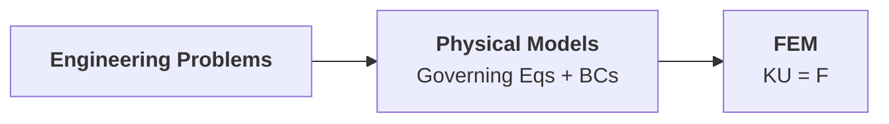

# Introduction

- FEM *discretizes* a physical domain into many elements
- then *reconnects* elements at nodes as if nodes were drops of glue
- results in a set of simultaneous algebraic equations
- :point_right: DOF: Finite!

## Basic Concepts

!!! example "Vertical machining center"
    -   {++Divide the domain++} into a number of small, simple elements
    -   Obtain the {++algebraic equations for each element++}
    -   Put all the element equations {++together++}

        $$
        \mathbf{KU} = \mathbf{F}
        $$

        - $\mathbf{K}$: property matrix
        - $\mathbf{U}$: nodal displacement vector
        - $\mathbf{F}$: action

## General Steps: Structural Problem

1.  Identify the geometry of the problem
2.  Select a displacement function
    
    !!! example "Axial Tension"
        -   choose $u(x) = a_0 + a_1 x$ for the displacement function
            
            > you can't choose $u(x) = a_0 + a_2 x^2$, because it doesn't satisfy the convergence condition 
        -   determine $a_0, a_1$ by BC: $u(0) = u_i, u(L) = u_j$
            
            $$
            \begin{aligned}
            a_0 &= u_i \\
            a_1 &= \frac{u_j - u_i}{L}
            \end{aligned}
            $$
        -   rewrite $u(x)$ in terms of nodal displacements $u_i, u_j$:  
        
            $$
            \begin{aligned}
            u(x) &= u_i + \frac{x}{L} (u_j - u_i) \\
            &= \Big(1 - \frac{x}{L}\Big) u_i + \frac{x}{L} u_j \\
            :&= N_i u_i + N_j u_j
            \end{aligned}
            $$

            - $N_i, N_j$: **shape functions**

3.  Define the strain/displacement and stress/strain relationships
    
    $$
    \boldsymbol{\varepsilon} = \nabla \mathbf{u}, \quad \boldsymbol{\sigma} = \mathbf{D} \boldsymbol{\varepsilon}
    $$

4.  Derive the element stiffness matrix and equations
    
    $$
    \mathbf{k}_e \mathbf{u}_e = \mathbf{f}_e
    $$

    - 直接平衡法
    - 能量法
        - 最小势能原理（弹性材料）
        - Castigliano 定理（弹性材料）
        - 虚功原理（任何材料）
    - 最小残差法（weighted residual method）
        - Galerkin method
5.  Assemble the element equations to obtain the global equations, introduce BCs
    
    $$
    \mathbf{k}_e \mathbf{u}_e = \mathbf{f}_e \xrightarrow{\text{Direct stiffness method}} \mathbf{KU} = \mathbf{F}
    $$

!!! info "Commercial FEM Software Packages"
    - ANSYS (General-purpose, widely used in industry)
    - Abaqus (General-purpose, widely used in academia)
    - COMSOL (Multiphysics)
    - NASTRAN (General-purpose)
    - HyperMesh (Pre-processing, no solver)
    - COSMOS

## Errors of FEM

FEM only obtains approximate solutions with **inherent errors**. The errors can be reduced by:

- Discretization error
- Modeling error
- Numerical error

!!! quote "History of FEM"
    - 1941, Hrenikoff (Lattice framework to model membrane and plates)
    - 1943, Courant (Shape functions for triangular subregions)
    - 1954, Argyris and Kelsey (Matrix structural analysis method)
    - 1956, Turner (Direct stiffness method)
    - 1960, Clough (Coined the term "finite element method", plane problems)
    - 1965, Zienkiewicz (First book on FEM)
    - 1965, 冯康 (Dicretization numerical method based on variational principles)

