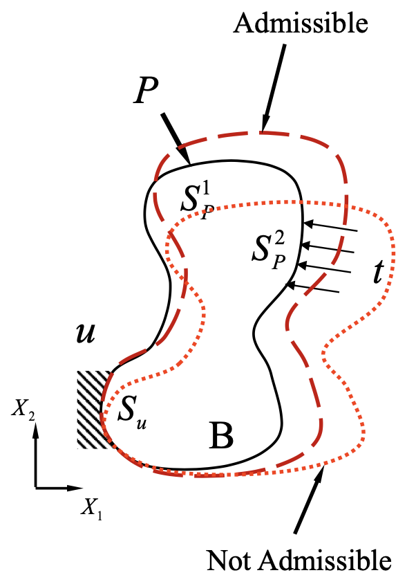

# Preknowledge

## Linear Algebra

Cofactor matrix $\mathbf{C}$ of a matrix $\mathbf{A}$ is defined as $C_{ij} = (-1)^{i+j} M_{ij}$, where $M_{ij}$ is the determinant of the submatrix obtained by deleting the $i$-th row and $j$-th column of $\mathbf{A}$.

## Linear Elasticity

- Displacements: $u, v, w$
- Stresses: $\sigma_x, \sigma_y, \sigma_z, \tau_{xy}, \tau_{yz}, \tau_{zx}$
- Strains: $\varepsilon_x, \varepsilon_y, \varepsilon_z, \gamma_{xy}, \gamma_{yz}, \gamma_{zx}$

$$
\text{Displacement} \xleftrightarrow{\varepsilon_{ij} = \frac{1}{2} (u_{i,j} + u_{j,i})} \text{Strains} \xleftrightarrow{\sigma_{ij} = C_{ijkl} \varepsilon_{kl}} \text{Stresses} \xleftarrow{\sigma_{ij,j} + f_i = 0}
$$

### Strain-Displacement Relation

$$
\boldsymbol{\varepsilon} = \underset{\text{Gradient Operator}}{\underbrace{\begin{bmatrix}
    \frac{\partial}{\partial x} & 0 & 0 \\
    0 & \frac{\partial}{\partial y} & 0 \\
    0 & 0 & \frac{\partial}{\partial z} \\
    \frac{\partial}{\partial y} & \frac{\partial}{\partial x} & 0 \\
    0 & \frac{\partial}{\partial z} & \frac{\partial}{\partial y} \\
    \frac{\partial}{\partial z} & 0 & \frac{\partial}{\partial x}
\end{bmatrix}}} \begin{bmatrix}
    u \\
    v \\
    w
\end{bmatrix} = \nabla \mathbf{u}
$$

### Stress-Strain Relation

Isotropic material:

$$
\sigma_{ij} = \lambda \varepsilon_{kk} \delta_{ij} + 2 \mu \varepsilon_{ij}
$$

where

$$
\lambda = \frac{E \nu}{(1 + \nu)(1 - 2 \nu)}, \quad \mu = \frac{E}{2 (1 + \nu)}
$$

$\boldsymbol{\sigma} = \mathbf{D} \boldsymbol{\varepsilon}$, where $\mathbf{D}$ is the {++Material stiffness matrix++}.

### Equilibrium Equations

$$
\begin{aligned}    
    \sigma_{ij,j} + f_i = 0 & \implies \begin{bmatrix}
        \frac{\partial}{\partial x} & 0 & 0 \\
        0 & \frac{\partial}{\partial y} & 0 \\
        0 & 0 & \frac{\partial}{\partial z} \\
        \frac{\partial}{\partial y} & \frac{\partial}{\partial x} & 0 \\
        0 & \frac{\partial}{\partial z} & \frac{\partial}{\partial y} \\
        \frac{\partial}{\partial z} & 0 & \frac{\partial}{\partial x}
    \end{bmatrix}^T \begin{bmatrix}
        \sigma_x \\
        \sigma_y \\
        \sigma_z \\
        \tau_{xy} \\
        \tau_{yz} \\
        \tau_{zx}
    \end{bmatrix} + \begin{bmatrix}
        f_x \\
        f_y \\
        f_z
    \end{bmatrix} = \mathbf{0} \\[2ex]
    & \implies \nabla^T \boldsymbol{\sigma} + \mathbf{f} = \mathbf{0}
\end{aligned}
$$

### Boundary Conditions (BCs)

- Displacement BCs: $\mathbf{u} = \bar{\mathbf{u}}$ on $\Gamma_u$
- Traction BCs: $\sigma_{ij} n_j = \bar{T}_i$ on $\Gamma_\sigma$

$$
\begin{bmatrix}
    n_x & 0 & 0 & n_y & 0 & n_z \\
    0 & n_y & 0 & n_x & n_z & 0 \\
    0 & 0 & n_z & 0 & n_y & n_x
\end{bmatrix}
\begin{bmatrix}
    \sigma_x \\
    \sigma_y \\
    \sigma_z \\
    \tau_{xy} \\
    \tau_{yz} \\
    \tau_{zx}    
\end{bmatrix} = 
\begin{bmatrix}
    \bar{T}_x \\
    \bar{T}_y \\
    \bar{T}_z
\end{bmatrix} \implies \mathbf{n} \boldsymbol{\sigma} = \overline{\mathbf{T}}
$$

## Energy Principles

### Principal of Virtual Work

!!! info inline end ""
    

- **Admissible displacements**: A set of displacements that satisfy the geometric constraints
- **Virtual displacements**: A set of small displacement variations upon which the geometric constraints are satisfied

$$
\underset{\text{Virtual strain energy of\\ the internal stresses}}{\underbrace{\int_B \sigma_{ij} \delta \varepsilon_{ij} \, \mathrm{d}V}} = \int_B f_i \delta u_i \, \mathrm{d}V + \int_{\partial B} \bar{T}_i \delta u_i \, \mathrm{d}S
$$

