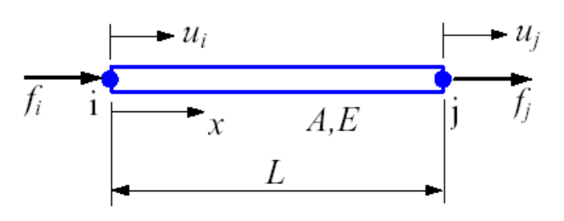

# Bar/Truss

## 4.1 Introduction

Bar: Axial load only, no bending or shearing.

| Local | Global |
| :---: | :---: |
| $x, y$ | $X, Y$ |
| $u_i', v_i' = 0$ | $u_i, v_i$ |
| 1 dof at node $i$ | 2 dof at node $i$ |

Firstly, we investigate a bar in the {++local coordinate system++}, then we perform coordinate transformation for a bar in the global system.

## 4.2 Bar Element in Local Coordinates

### Select a Displacement Function

$$
u(x) = a_0 + a_1 x
$$

BCs: $u(0) = u_i, u(L) = u_j$, so

$$
u(x) = u_i + \frac{u_j - u_i}{L} x
$$

Rewrite the above equation in terms of nodal displacements:

$$
u(x) = \left( 1 - \frac{x}{L} \right) u_i + \frac{x}{L} u_j = \begin{bmatrix}
    N_i & N_j
\end{bmatrix}
\begin{bmatrix}
    u_i \\
    u_j
\end{bmatrix}
$$

## 4.3 Selecting Approximation Functions for Displacements

In FEA, we use polynomials to approximate the displacement field within an element.

$$
\begin{aligned}
    u(x, y, z) &= a_0 + a_1 x + b_1 y + c_1 z + \cdots \\
    &= N_1(x, y, z) u_1 + N_2(x, y, z) u_2 + \cdots + N_n(x, y, z) u_n \\
    &= \sum_{i=1}^n N_i u_i
\end{aligned}
$$

$N_i(x, y, z)$ are shape functions. At node $i$, $u(x_i, y_i, z_i) = u_i$, so

$$
N_i(x_j, y_j, z_j) = \delta_{ij}
$$

Also note that shape functions allow rigid body motion, thus

$$
\sum_{i=1}^n N_i = 1
$$

### Convergence of a FEA

-   **Completeness**: Be able to represent the rigid body motion and constant strain states within the element.
    -  $u(x)$ contains constants and linear terms.
-   **Compatibility**: continuity between adjacent elements and within the element.
    -  $C^0$ continuity: displacement continuous across element boundaries, {++e.g. bar element++}
    -  $C^1$ continuity: displacement and its first derivative continuous, {++e.g. beam element++}

### Selection of Displacement Functions

$$
\begin{array}{c}
      &   &   & 1 &   &   &  \\
      &   & x & \vdots & y &   &  \\
      &   & x^2 & xy & y^2 &   &  \\
      & x^3 & x^2 y & \vdots & x y^2 & y^3 &  \\
      & x^4 & x^3 y & x^2 y^2 & x y^3 & y^4 &  \\
    x^5 & x^4 y & x^3 y^2 & \vdots & x^2 y^3 & x y^4 & y^5
\end{array}
$$

- [x] Completeness
- [x] Compatibility
- [x] No preference on any coordinates

