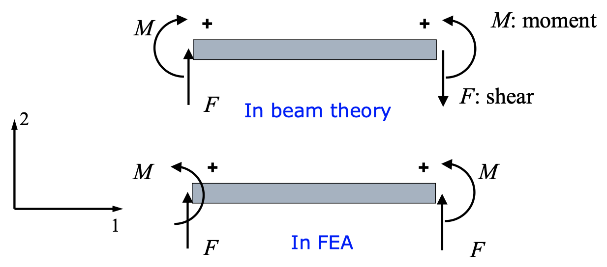
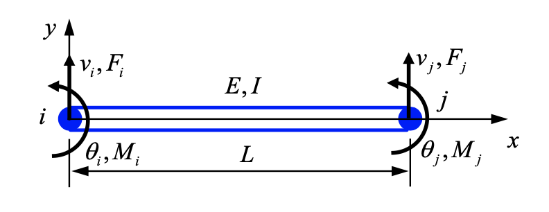

# Beam

## 5.1 Mechanics of a Beam

### Sign convention

- 力：沿轴正向为正
- 力矩：统一逆时针为正

### Elementary beam theory

挠度记为 $v$,

$$
\begin{aligned}
    & EI \frac{\mathrm{d}^2 v}{\mathrm{d} x^2} = M(x) \\
    & EI \frac{\mathrm{d}^3 v}{\mathrm{d} x^3} = F(x) \\
    & EI \frac{\mathrm{d}^4 v}{\mathrm{d} x^4} = q(x) \\
    & \sigma = -\frac{M(x) y}{I}.
\end{aligned}
$$

## 5.2 Beam Elements in Local Coordinates

### Select a Displacement Function

$$
\begin{aligned}
    & v(x) = a_0 + a_1 x + a_2 x^2 + a_3 x^3 \\[2ex]
    \text{BCs}: \quad & v(x = 0) = v_i, \quad v(x = L) = v_j, \\[1ex]
    & \frac{\mathrm{d} v}{\mathrm{d} x} (x = 0) = \theta_i, \quad \frac{\mathrm{d} v}{\mathrm{d} x} (x = L) = \theta_j
\end{aligned}
\implies
\left \{
    \begin{aligned}
        a_0 &= v_i \\
        a_1 &= \theta_i \\
        a_2 &= - \frac{3}{L^2}(v_i - v_j) - \frac{1}{L} (2 \theta_i + \theta_j) \\
        a_3 &= \frac{2}{L^3}(v_i - v_j) + \frac{1}{L^2} (\theta_i + \theta_j)
    \end{aligned}
\right.
$$

### Shape Functions

