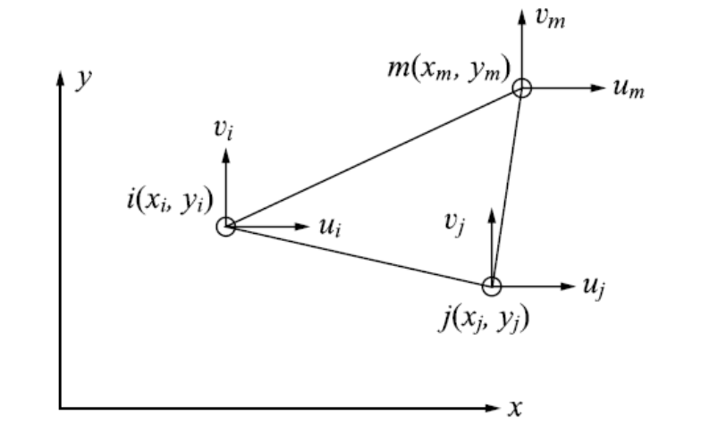

# 2D Problems

## 6.1 Review of the Basic Theory

Plane problems:

-   **Plane stress**: A thin planar structure with constant thickness and loading within the plane of the structure (xy-plane)
    -   $\sigma_z = \tau_{zx} = \tau_{zy} = 0, \, \varepsilon_z \neq 0$
-   **Plane strain**: A long or thick structure with a uniform cross section and transverse loading along its length (z-direction)
    -   $\varepsilon_z = \gamma_{zx} = \gamma_{zy} = 0, \, \sigma_z \neq 0$

### Stress-Strain Relations

#### Plane Stress

For linear elastic homogeneous and isotropic materials: 

$$
\begin{bmatrix}
    \varepsilon_x \\
    \varepsilon_y \\
    \gamma_{xy}
\end{bmatrix} = 
\begin{bmatrix}
    1/E & -\nu / E & 0 \\
    -\nu / E & 1/E & 0 \\
    0 & 0 & 1/G
\end{bmatrix}
\begin{bmatrix}
    \sigma_x \\
    \sigma_y \\
    \tau_{xy}
\end{bmatrix}
$$

where

$$
G = \frac{E}{2(1 + \nu)}.
$$

Only 2 independent material constants. The inverse relation:

$$
\begin{gather}
    \begin{bmatrix}
        \sigma_x \\
        \sigma_y \\
        \tau_{xy}
    \end{bmatrix} = 
    \frac{E}{1 - \nu^2}
    \begin{bmatrix}
        1 & \nu & 0 \\
        \nu & 1 & 0 \\
        0 & 0 & (1 - \nu) / 2
    \end{bmatrix}
    \begin{bmatrix}
        \varepsilon_x \\
        \varepsilon_y \\
        \gamma_{xy}
    \end{bmatrix} \\[2ex]
    \implies \boldsymbol{\sigma} = \mathbf{D} \boldsymbol{\varepsilon}, \quad \mathbf{D} = \frac{E}{1 - \nu^2}
    \begin{bmatrix}
        1 & \nu & 0 \\
        \nu & 1 & 0 \\
        0 & 0 & (1 - \nu) / 2
    \end{bmatrix} \tag{6.1} \label{eq:plane_stress-strain}
\end{gather}
$$

$\mathbf{D}$: **material stiffness matrix** for plane stress problems.

#### Plane Strain

$$
E \to \frac{E}{1 - \nu^2}, \quad \nu \to \frac{\nu}{1 - \nu}, \quad G \to G
$$

## 6.2 FE for 2D Problems

### Displacement Field

For 2D Problems, the displacement interpolation in general has the form:

$$
\begin{align}
    \left \{
        \begin{aligned}
            u(x, y) &= \sum N_i(x, y) u_i \\
            v(x, y) &= \sum N_i(x, y) v_i
        \end{aligned}
    \right. &\iff
    \begin{bmatrix}
        u \\
        v
    \end{bmatrix} = 
    \begin{bmatrix}
        N_1 & 0 & N_2 & 0 & \cdots & N_n & 0 \\
        0 & N_1 & 0 & N_2 & \cdots & 0 & N_n
    \end{bmatrix}
    \begin{bmatrix}
        u_1 \\
        v_1 \\
        u_2 \\
        v_2 \\
        \vdots \\
        u_n \\
        v_n
    \end{bmatrix} \\
    &\iff \mathbf{u} = \mathbf{N} \mathbf{d} \tag{6.2} \label{eq:displacement_interpolation}
\end{align}
$$

### Strain-Displacement Relations

$$
\begin{equation} \tag{6.3} \label{eq:strain-displacement}
    \boldsymbol{\varepsilon} = \nabla \mathbf{u} = (\nabla \mathbf{N}) \mathbf{d} = \mathbf{B} \mathbf{d}
\end{equation}
$$

where $\mathbf{B} = \nabla \mathbf{N}$ is the **strain matrix**. Therefore, $\boldsymbol{\sigma} = \mathbf{D} \mathbf{B} \mathbf{d}$.

### Strain Energy & Stiffness Matrix

$$
\begin{align}
    U &= \frac{1}{2} \int_V \boldsymbol{\sigma}^T \boldsymbol{\varepsilon} \, \mathrm{d} V \xlongequal{\eqref{eq:plane_stress-strain}} \frac{1}{2} \int_V (\mathbf{D} \boldsymbol{\varepsilon})^T \boldsymbol{\varepsilon} \, \mathrm{d} V = \frac{1}{2} \int_V \boldsymbol{\varepsilon}^T \mathbf{D} \boldsymbol{\varepsilon} \, \mathrm{d} V \\
    &\xlongequal{\eqref{eq:strain-displacement}} \frac{1}{2} \int_V (\mathbf{B} \mathbf{d})^T \mathbf{D} (\mathbf{B} \mathbf{d}) \, \mathrm{d} V = \frac{1}{2} \mathbf{d}^T \left( \int_V \mathbf{B}^T \mathbf{D} \mathbf{B} \, \mathrm{d} V \right) \mathbf{d} \\
    &= \frac{1}{2} \mathbf{d}^T \mathbf{k}_{\text{e}} \mathbf{d} \tag{6.4} \label{eq:strain_energy}
\end{align}
$$

where $\mathbf{k}_{\text{e}} = \int_V \mathbf{B}^T \mathbf{D} \mathbf{B} \, \mathrm{d} V$ is the element **stiffness matrix**.

## 6.3 Constant Strain Triangle (CST, T3)

The simplest 2D element, which is also called linear triangular element.

### Select Displacement Functions

$$
u(x, y) = a_1 + a_2 x + a_3 y, \quad v(x, y) = a_4 + a_5 x + a_6 y
$$

where $a_i$ are constants. The strains are also constants:

$$
\varepsilon_x = a_2, \quad \varepsilon_y = a_6, \quad \gamma_{xy} = a_3 + a_5
$$

Hence the name "constant strain triangle".

Displacements at the 3 nodes:

$$
\begin{aligned}
    u_i &= u(x_i, y_i) = a_1 + a_2 x_i + a_3 y_i && v_i = v(x_i, y_i) = a_4 + a_5 x_i + a_6 y_i \\
    u_j &= u(x_j, y_j) = a_1 + a_2 x_j + a_3 y_j && v_j = v(x_j, y_j) = a_4 + a_5 x_j + a_6 y_j \\
    u_m &= u(x_m, y_m) = a_1 + a_2 x_m + a_3 y_m && v_m = v(x_m, y_m) = a_4 + a_5 x_m + a_6 y_m
\end{aligned}
$$

---

## Create 2D Meshes in ABAQUS

-   Part
    -   Base Feature: Shell（面）
-   Property
    -   Create Section
    -   [ ] Plane stress/strain thickness：只看最大应力的话，可以不设置；如果要求支座反力（需要用到厚度的），则需要设置。
-   Assembly
    -   Create Instance
        - [x] Independent
-   Step
    -   Static, General
    -   `Nlgeoms`：非线性，大变形
-   Interaction
    -   多个 Part 之间的相互作用
-   Load
    -   Pressure（面载荷）
-   Mesh
    -   Element Type
        
        !!! info "Reduced Integration（简缩积分）"
            $\mathbf{B}$ 一般是 $x, y$ 的函数，会使用高斯数值积分方法。这个选项默认打开，会在单元内部使用较少的高斯积分点来减少计算量，同时尽可能保持良好的数值稳定性。但是简缩积分也可能引入数值问题，比如对 `quad` 元素会出现筛子效应。