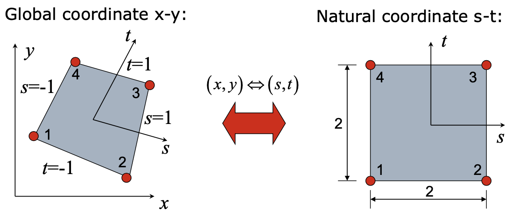

# Isoparametric Formulation

## Isoparametric Formula for 2D Elements

### Finite Element for Plane Problems

Element types:

-   Triangular
    -   Constant Strain Triangle (CST, T3)
    -   Linear Strain Triangle (LST, T6)
-   Rectangular
    -   Bilinear rectangle (Q4)
    -   Quadratic rectangle (Q8)

:warning: In reality, both cannot meet our needs (Triangular: low accuracy; Rectangular: simple geometry only). So we need to use **isoparametric elements**:

- high accuracy
- arbitrary geometry
- simple computer programming

We will first consider 4 node isoparametric 2D plane elements.

### Isoparametric Formula

$$
\mathbf{k}^e = \int_V \mathbf{B}^T \mathbf{D} \mathbf{B} \, \mathrm{d} V
$$

用全局坐标求解 $\mathbf{k}^e$ 的话，$\mathbf{B}$ 不是常数，积分非常麻烦！

全局坐标系 $(x, y)$ 与自然（局部）坐标系 $(s, t)$ 之间存在一一映射关系。设映射为

$$
\begin{aligned}
    x &= a_1 + a_2 s + a_3 t + a_4 s t \\
    y &= b_1 + b_2 s + b_3 t + b_4 s t
\end{aligned}
$$

代入四个节点的坐标，当然可以得到各个系数。不过更简单的做法是从形函数出发。因为形函数仅在节点处取值为 $1$，所以可以直接构造

$$
\begin{aligned}
    N_1 &= \frac{1}{4} (1 - s) (1 - t), \quad N_2 = \frac{1}{4} (1 + s) (1 - t) \\
    N_3 &= \frac{1}{4} (1 + s) (1 + t), \quad N_4 = \frac{1}{4} (1 - s) (1 + t)
\end{aligned}
$$

#### Shape and Displacement Interpolation

Shape:

$$
x = \sum_{i = 1}^4 N_i(s, t) x_i, \quad y = \sum_{i = 1}^4 N_i(s, t) y_i
$$

Displacement:

$$
u = \sum_{i = 1}^4 N_i(s, t) u_i, \quad v = \sum_{i = 1}^4 N_i(s, t) v_i
$$

Here, {++the shape and displacements are interpolated by the same shape functions++}, which is the reason why this formulation is called "isoparametric".

#### Strain matrix

$$
\boldsymbol{\varepsilon} = \begin{bmatrix}
    \frac{\partial}{\partial x} & 0 \\
    0 & \frac{\partial}{\partial y} \\
    \frac{\partial}{\partial y} & \frac{\partial}{\partial x}
\end{bmatrix}
\begin{bmatrix}
    u \\
    v
\end{bmatrix} =
\begin{bmatrix}
    \frac{\partial}{\partial x} & 0 \\
    0 & \frac{\partial}{\partial y} \\
    \frac{\partial}{\partial y} & \frac{\partial}{\partial x}
\end{bmatrix} \mathbf{N} \mathbf{d} = \mathbf{B} \mathbf{d}
$$

we need to solve the derivatives $\frac{\partial N_i}{\partial x}$ and $\frac{\partial N_i}{\partial y}$. By the chain rule,

$$
\begin{aligned}
    \frac{\partial N_i}{\partial s} &= \frac{\partial N_i}{\partial x} \frac{\partial x}{\partial s} + \frac{\partial N_i}{\partial y} \frac{\partial y}{\partial s} \\
    \frac{\partial N_i}{\partial t} &= \frac{\partial N_i}{\partial x} \frac{\partial x}{\partial t} + \frac{\partial N_i}{\partial y} \frac{\partial y}{\partial t}
\end{aligned}
$$