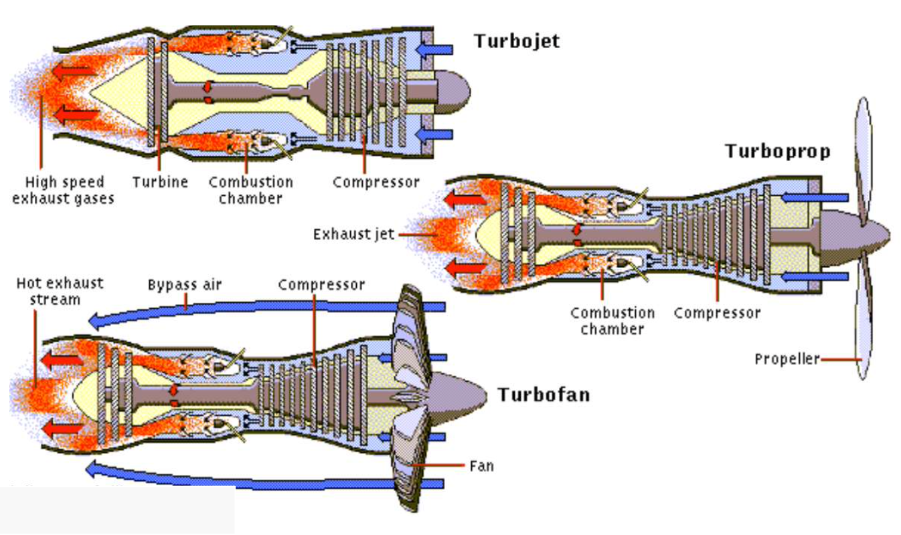
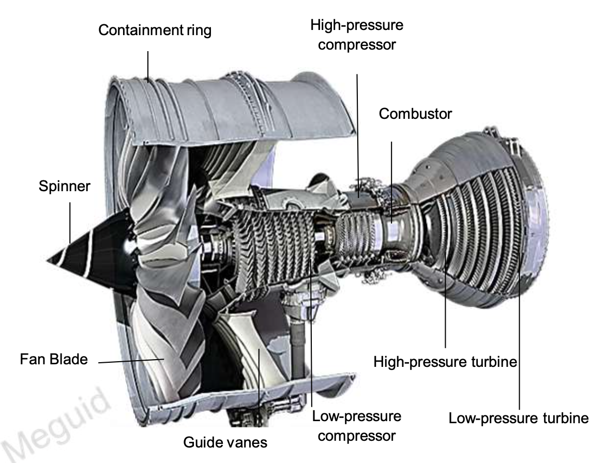

# Design with the Big D

**Gas Turbine Engines (GTEs)**

-   Turbojet
    -   燃烧室
-   Turboprop
    -   加速度比 turbojet 小
-   Turbofan
    -   长距离飞行
    -   大部分推力来自 bypass air
    -   为了使压缩机工作，还有部分空气

2000 $^\circ$C

## Structural Integrity of GTEs

**Constituents of GTEs**

**Blade attachment**

-   Compressor Disc
    -   Dove Tail
    -   Fatigue
-   Turbine Disc
    -   Fir-tree rim
    -   Creep + Corrosion

**Two alternative failures:**

-   Bursting of a disc
-   Blade shedding

Contact stress between blade and disc (Dovetail region)

## Blade shedding in Aviation GTEs

Rolls Royce 测试：使用爆炸物把叶片炸掉，发动机还能支撑十几秒

## Bird Strikes

:skull: Bird strikes represents 90% of FOD (Foreign Object Damage).

## Aerial Refueling

Hose instability

explosive decompression：类似于扎破气球，应力瞬间释放。解决方法：在气球上粘上一段胶带，应力传递到胶带上 $\implies$ Fuselage 的壳层有两层