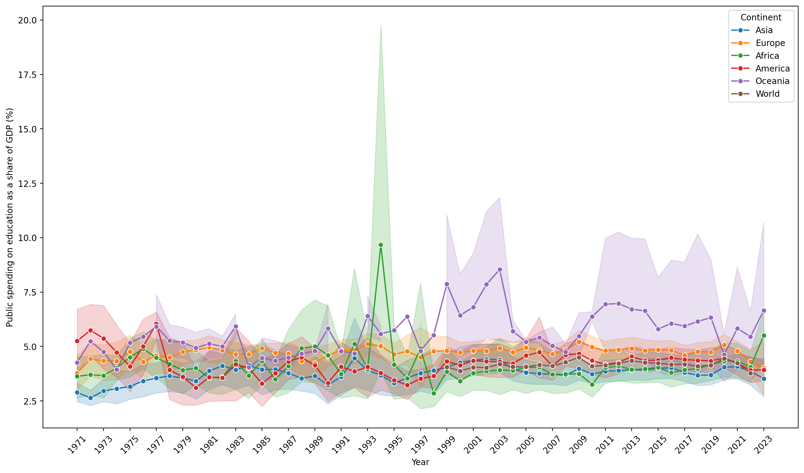
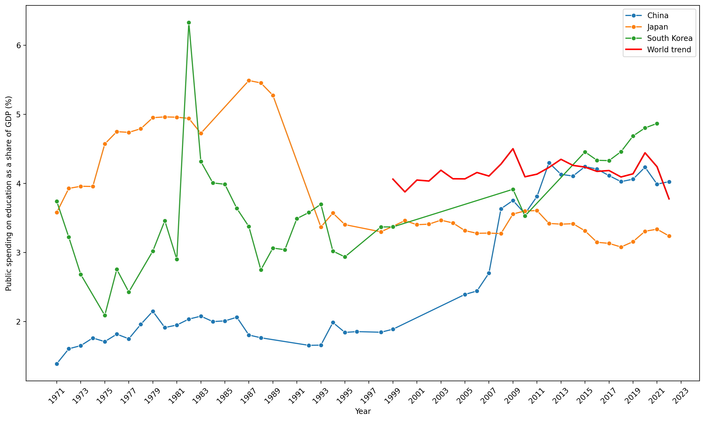
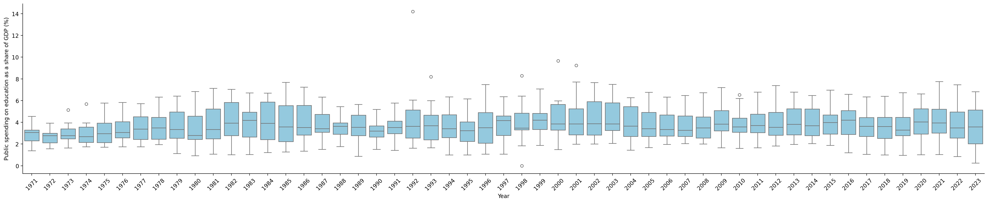
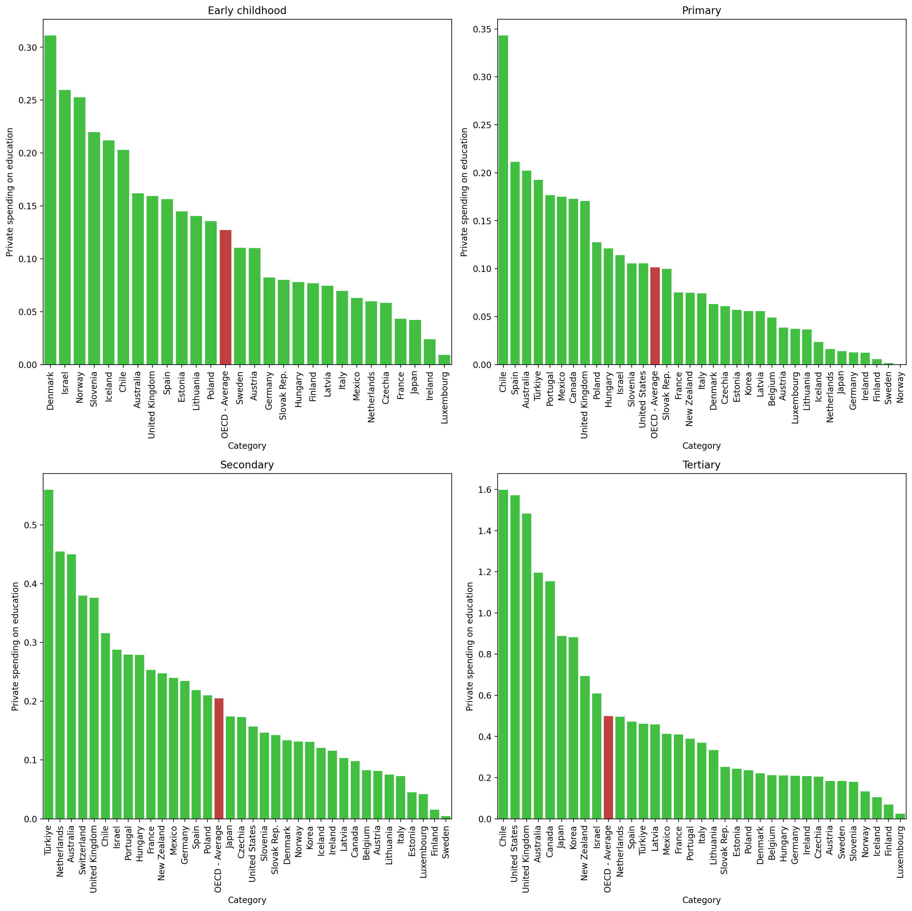
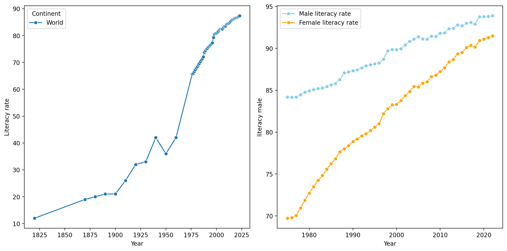
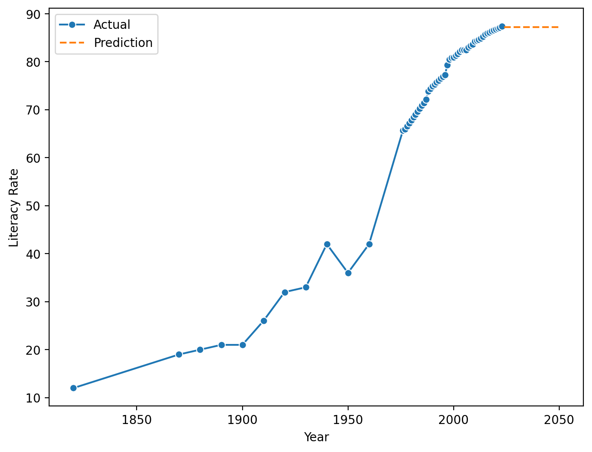
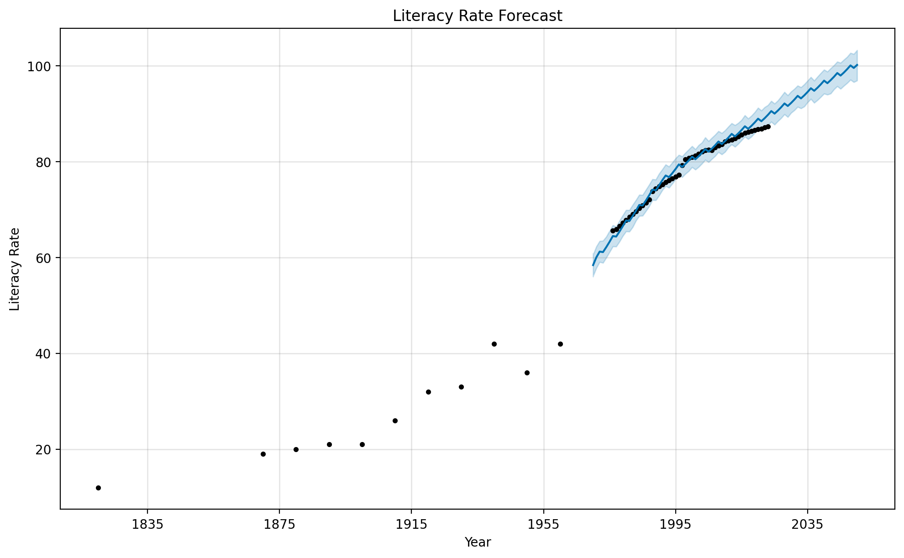
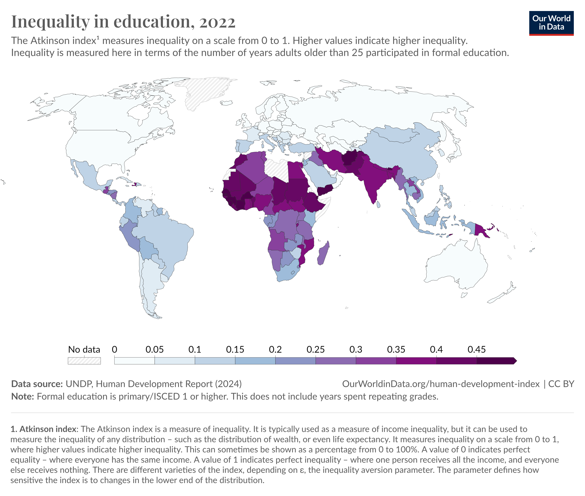
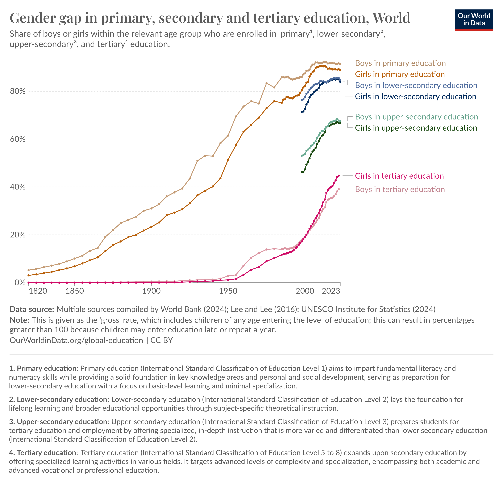

# <center> 大作业报告</center>

**<center><font size=6>浅析全球教育水平变化趋势</font></center>**

## 1 研究动机

做了好多年的学生，也经历了初等教育到高等教育的阶段，多多少少对教育问题有所关注。于是想借此次大作业的机会，通过数据分析的方式，简单地探究一下全球教育水平的变化趋势。

本文大致从三个角度展开讨论：国家和政府对教育的投入、学生的学习情况和教育结果的体现，主要论述了不同国家公共教育支出占国内生产总值的比例变化、学生学习时间的变化、文盲率和教育公平改善等话题及其之间的相关性。

## 2 教育投入

### 2.1 国家公共教育支出占国内生产总值的比例

这里讨论的是各级政府用于教育的总支出占国内生产总值的比例。参与分析国家共169个[^1]，时间跨度为1971年至2023年。

[^1]: 实际上下载到的原始数据中总共有205个国家，但是代码1中的 `country_dict` 只包含了169个国家的代码，所以这里只分析了这些国家。

#### 2.1.1 各大洲的平均投入变化趋势

???+ note "Code 1"
    ```python linenums="1"
    import numpy as np
    import matplotlib.pyplot as plt
    import pandas as pd
    import seaborn as sns

    %config InlineBackend.figure_format = "retina"

    # Import data
    gov_exp = pd.read_csv('data/total-government-expenditure-on-education-gdp/total-government-expenditure-on-education-gdp.csv')

    # 截取 Year > 1970 的数据
    gov_exp = gov_exp[gov_exp['Year'] > 1970]

    country_dict = {
        "Asia": [
            'AFG', 'ARM', 'AZE', 'BHR', 'BGD', 'BTN', 'CHN', 'CYP', 'GEO', 'IND', 'IDN', 'IRN', 'IRQ', 'ISR',
            'JPN', 'JOR', 'KAZ', 'KWT', 'KGZ', 'LAO', 'LBN', 'MAC', 'MDV', 'MYS', 'MNG', 'PAK', 'PSE', 'PHL',
            'QAT', 'SAU', 'SGP', 'SYR', 'TJK', 'THA', 'KOR', 'TUR', 'TKM', 'ARE', 'UZB', 'YEM'
        ],
        "Europe": [
            'ALB', 'AND', 'AUT', 'BGR', 'BIH', 'BLR', 'BEL', 'BLZ', 'HRV', 'CZE', 'DNK', 'EST', 'FIN', 'FRA', 
            'GEO', 'DEU', 'GRC', 'GRD', 'GTM', 'HUN', 'ISL', 'IRL', 'ITA', 'LIE', 'LTU', 'LUX', 'MDA', 'MCO',
            'MKD', 'MNE', 'NLD', 'NOR', 'POL', 'PRT', 'ROU', 'RUS', 'SVK', 'SVN', 'ESP', 'SWE', 'CHE', 'GBR'
        ],
        "Africa": [
            'DZA', 'AGO', 'BEN', 'BWA', 'CAF', 'TCD', 'CMR', 'CPV', 'COD', 'EGY', 'GNQ', 'ERI', 'ETH', 'GAB',
            'GHA', 'GIN', 'GMB', 'KEN', 'LSO', 'LBR', 'LBY', 'MDG', 'MWI', 'MLI', 'MOZ', 'NAM', 'NER', 'NGA',
            'RWA', 'SEN', 'SLE', 'SOM', 'ZAF', 'SSD', 'SDN', 'SUR', 'TGO', 'TUN', 'UGA', 'ZMB', 'ZWE'
        ],
        "America": [
            'ASM', 'ATG', 'BHS', 'BRB', 'BLZ', 'BOL', 'BRA', 'BRN', 'CHL', 'COL', 'COM', 'CUW', 'DOM', 'SLV',
            'GUY', 'HTI', 'HND', 'JAM', 'KIR', 'LCA', 'VCT', 'MEX', 'NIC', 'PAN', 'PRY', 'PER', 'PHL', 'PRT',
            'PRI', 'SUR', 'TTO', 'URY', 'VEN', 'USA', 'CAN', 'VGB'
        ],
        "Oceania": [
            'AUS', 'FJI', 'KIR', 'MHL', 'PLW', 'PNG', 'WSM', 'TUV', 'NRU', 'NZL'
        ],
        "World": [
            'OWID_WRL'
        ]
    } # (1)

    # 添加 Continent 列
    continent_dict = {country: continent for continent, countries in country_dict.items() for country in countries}
    gov_exp['Continent'] = gov_exp['Code'].map(continent_dict)

    # 各大洲的平均值
    plt.figure(figsize=(16, 9))
    sns.lineplot(data=gov_exp, x='Year', y='Public spending on education as a share of GDP', hue='Continent', marker='o')
    plt.ylabel('Public spending on education as a share of GDP (%)')
    plt.xticks(ticks=range(int(gov_exp['Year'].min()), int(gov_exp['Year'].max()) + 1, 2), rotation=45)
    ```

    1. 该分类字典由 ChatGPT 生成.



<center><font size=4>**图1.** 各大洲的公共教育支出占GDP比例变化趋势</font></center>

从图中可以看出，各大洲国家的公共教育支出占GDP比例基本稳定在 3% - 5% 之间，没有明显的变化趋势。其中欧洲、美洲和大洋洲略高于平均水平[^2]，非洲和亚洲则略低。然而，由于世界各地的收入（以人均国内生产总值衡量）普遍增长，这意味着全球用于教育的资源总额的绝对值也在增加。

[^2]: 世界平均水平的数据从1999年开始才有。

可以注意到，1994年非洲的数据有一个明显的峰值，检查数据时发现是津巴布韦的数据达到了 44.33%，远远高于其他国家。这可能是数据错误，暂时没有找到更多的信息。大洋洲的国家和数据较少，故波动较大，置信区间也较宽。

此外，从2020年起的三年，全球的数据都有明显的下降趋势，可能与新冠疫情有关。

???+ note "Code 2"
    ```python
    # 1994年非洲各国的数据
    df = gov_exp[gov_exp['Year'] == 1994]
    df = df[df['Continent'] == 'Africa']
    df = df.sort_values('Public spending on education as a share of GDP', ascending=False)
    df = df[['Entity', 'Public spending on education as a share of GDP']]
    df
    ```


|Entity|Public spending on education as a share of GDP|
| :---: | :---: |
|Zimbabwe|	44.33398
|Lesotho|	7.02543
|Tunisia|	6.17647
|Kenya|5.92402
|South Africa|	5.29777
|Egypt|	4.58376
|Niger|	2.26539
|Zambia|	1.79352

#### 2.1.2 中国及周边国家的投入情况

此部分着眼于中日韩三国的数据。

???+ note "Code 3"
    ```python
    east_asia = gov_exp[gov_exp['Code'].isin(['CHN', 'JPN', 'KOR'])]

    # Plot
    plt.figure(figsize=(16, 9))
    g = sns.lineplot(data=east_asia, x='Year', y='Public spending on education as a share of GDP', hue='Entity', marker='o')
    plt.xticks(rotation=45)
    plt.ylabel('Public spending on education as a share of GDP (%)')
    # 图上添加世界总体趋势折线
    sns.lineplot(data=gov_exp[gov_exp['Continent'] == 'World'], x='Year', y='Public spending on education as a share of GDP', color='red', linewidth=2, ax=g, label='World trend')
    plt.xticks(ticks=range(int(gov_exp['Year'].min()), int(gov_exp['Year'].max()) + 1, 2), rotation=45)
    ```



<center><font size=4>**图2.** 中日韩的公共教育支出占GDP比例变化趋势</font></center>

中国在21世纪之前在公共教育方面的投入明显偏少，而在2000 - 2010 年间有了很明显的增长，之后基本稳定在 4% 左右，与世界平均水平和大部分发达国家相当。日本在 1990 年代前的教育支出比重较大，之后下降并稳定在 3.5% 左右。韩国的数据波动较大，但自从20世纪末以来一直在增长。

#### 2.1.3 亚洲整体变化趋势

???+ note "Code 4"
    ```python
    gov_exp_asia = gov_exp[gov_exp['Continent'] == 'Asia']
    plt.figure(figsize=(16, 9))
    sns.catplot(data=gov_exp_asia, x='Year', y='Public spending on education as a share of GDP', kind="box", aspect=5, color='skyblue')
    plt.ylabel('Public spending on education as a share of GDP (%)')
    plt.xticks(rotation=45)
    ```



<center><font size=4>**图3.** 亚洲部分国家的公共教育支出占GDP比例变化箱型图</font></center>

图中给出了亚洲部分国家（40个）的数据箱型图，可以看作各国家公共教育支出的区间估计。由图可以得出亚洲国家公共教育支出占比的平均值在 3% 左右涨落，无明显的变化趋势，且不同国家间的差异较大。

### 2.2 家庭教育支出

与 2.1 节的公共教育支出不同，这里讨论的是由私人来源（家庭和其他私人实体）资助的教育支出。本节数据仅涉及了OECD国家，且由于数据下载不便，只粗浅地展示2020年的数据。图中数据单位均为占GDP的百分比。

???+ note "Code 5"
    ```python linenums="1"
    # Import data
    early = pd.read_csv('data/OECD-private-spending/early-childhood.csv')
    primary = pd.read_csv('data/OECD-private-spending/primary.csv')
    secondary = pd.read_csv('data/OECD-private-spending/secondary.csv')
    tertiary = pd.read_csv('data/OECD-private-spending/tertiary.csv')

    # 2 x 2 subplot
    fig, axs = plt.subplots(2, 2, figsize=(15, 15))

    # Early childhood
    colors = ['lime' if category != 'OECD - Average' else 'red' for category in early['Category']]
    sns.barplot(data=early, x='Category', y='Private spending on education', ax=axs[0, 0], palette=colors, saturation=0.5)
    axs[0, 0].set_title('Early childhood')
    for label in axs[0, 0].get_xticklabels():
        label.set_rotation(90)

    # Primary
    colors = ['lime' if category != 'OECD - Average' else 'red' for category in primary['Category']]
    sns.barplot(data=primary, x='Category', y='Private spending on education', ax=axs[0, 1], palette=colors, saturation=0.5)
    plt.xticks(rotation=45)
    axs[0, 1].set_title('Primary')
    for label in axs[0, 1].get_xticklabels():
        label.set_rotation(90)


    # Secondary
    colors = ['lime' if category != 'OECD - Average' else 'red' for category in secondary['Category']]
    sns.barplot(data=secondary, x='Category', y='Private spending on education', ax=axs[1, 0], palette=colors, saturation=0.5)
    axs[1, 0].set_title('Secondary')
    for label in axs[1, 0].get_xticklabels():
        label.set_rotation(90)


    # Tertiary
    colors = ['lime' if category != 'OECD - Average' else 'red' for category in tertiary['Category']]
    sns.barplot(data=tertiary, x='Category', y='Private spending on education', ax=axs[1, 1], palette=colors, saturation=0.5)
    axs[1, 1].set_title('Tertiary')
    for label in axs[1, 1].get_xticklabels():
        label.set_rotation(90)


    plt.tight_layout()
    ```



<center><font size=4>**图4.** 部分OECD国家的私人教育支出占GDP比例柱状图</font></center>

图中可见，小学的私人教育支出整体来说最少，与学前教育相当，中学和高等教育的支出则明显增加，后者最高。这很可能是因为高等教育的学费较高，而且学生需要额外的生活费用。前几个高等教育支出最高的国家是智利、美国和英国，都有学费较高的特点。

## 3 学生学习情况

### 3.1 学生学习时间

从 [https://ourworldindata.org/grapher/daily-time-students-spent-studying](https://ourworldindata.org/grapher/daily-time-students-spent-studying){target="blank"} 可以直观地看出，各国家学生的学习时间都在增加。由于数据比较陈旧，数据量也较少，这里不详细展开。

### 3.2 中国学生学习情况

[澎湃新闻2019年的一篇评论](https://www.thepaper.cn/newsDetail_forward_5142467){target="blank"}，对国际学生评估项目PISA 2018的结果进行了分析，指出“我国四省市（北京、上海、江苏、浙江）学生的学习时间过多但效率低，且学生对学校归属感为负数，满意度偏低”。虽然中国学生在阅读、数学、科学能力素养排名第一，但学习的方式还存在问题和商讨的空间。

## 4 教育结果

### 4.1 识字率（Literacy rate）

世界范围内，文盲率在逐年下降。而年轻一代的文盲率更低，这说明教育水平在逐渐提高。

???+ note "Code 6"
    ```python linenums="1"
    # import data
    literacy = pd.read_csv('data/cross-country-literacy-rates/cross-country-literacy-rates.csv')
    literacy_younggen = pd.read_csv('data/literacy-rate-of-young-men-and-women/literacy-rate-of-young-men-and-women.csv')

    # 截取 Year > 1800 的数据
    literacy = literacy[literacy['Year'] > 1800]
    literacy_younggen = literacy_younggen[literacy_younggen['Year'] > 1800]

    # 添加 Continent 列
    literacy['Continent'] = literacy['Code'].map(continent_dict)
    literacy_younggen['Continent'] = literacy_younggen['Code'].map(continent_dict)

    fig, axs = plt.subplots(1, 2, figsize=(12, 6))

    sns.lineplot(data=literacy[literacy['Continent'].isin(['World'])], x='Year', y='Literacy rate', hue='Continent', marker='o', errorbar=None, ax=axs[0])

    sns.lineplot(data=literacy_younggen[literacy_younggen['Continent'].isin(['World'])], x='Year', y='literacy male', marker='o', errorbar=None, color='skyblue', ax=axs[1])
    sns.lineplot(data=literacy_younggen[literacy_younggen['Continent'].isin(['World'])], x='Year', y='literacy female', marker='o', errorbar=None, color='orange', ax=axs[1])
    plt.legend(labels=['Male literacy rate', 'Female literacy rate'])

    plt.tight_layout()
    ```



<center><font size=4>**图5.** 左图为全球范围内识字率变化趋势，右图为全球15-24岁年轻人识字率的变化。</font></center>

自从20世纪后半叶以来，全球范围内的文盲率快速下降，体现出教育扩张开始成为一种全球现象，这是好的趋势。遗憾的是，男女识字率的差异虽然在逐步减小，但仍然存在。

#### 4.1.1 识字率的多因素方差分析

接下来选取1990年，15-24岁年轻群体的数据，讨论识字率与国家人均GDP和性别差异的关系。

假设 $H_{0,\text{GDP}}:$ 识字率与人均GDP之间没有显著关系，$H_{0,\text{SEX}}:$ 识字率与性别差异之间没有显著关系，取显著性水平为 $\alpha = 0.05$。

???+ note "Code 7"
    ```python linenums="1"
    outcome = pd.read_csv('data/learning-outcomes-vs-gdp-per-capita/learning-outcomes-vs-gdp-per-capita.csv')

    # 截取 Year = 2010 的数据
    outcome = outcome[outcome['Year'] == 2010]

    high_income = outcome[outcome['GDP per capita'] > 20000]
    low_income = outcome[outcome['GDP per capita'] < 5000]

    # 提取对应的国家代码
    high_income_code = high_income['Code']
    low_income_code = low_income['Code']
    # 去除代码中的NaN
    high_income_code = high_income_code.dropna()
    low_income_code = low_income_code.dropna()

    # 查找对应的识字率
    literacy_high_income = literacy_younggen[(literacy_younggen['Code'].isin(high_income_code)) & (literacy_younggen['Year'] == 2010)]
    literacy_low_income = literacy_younggen[(literacy_younggen['Code'].isin(low_income_code)) & (literacy_younggen['Year'] == 2010)]
    # 去除NaN
    literacy_high_income = literacy_high_income.dropna(subset=['literacy male'])
    literacy_low_income = literacy_low_income.dropna(subset=['literacy male'])

    # 合成新表格，仅保留 'Entity', 'Code', 'GDP', 'Gender', 'Literacy'
    # 创建一个空的 DataFrame
    columns = ['Entity', 'Code', 'GDP', 'Gender', 'Literacy']
    new_df = pd.DataFrame(columns=columns)

    # 定义一个函数来处理每一行
    def process_row(row, gdp_value):
        return pd.DataFrame({
            'Entity': [row['Entity'], row['Entity']],
            'Code': [row['Code'], row['Code']],
            'GDP': [gdp_value, gdp_value],
            'Gender': ['M', 'F'],
            'Literacy': [row['literacy male'], row['literacy female']]
        })

    # 处理 high_income 数据
    for _, row in literacy_high_income.iterrows():
        new_df = pd.concat([new_df, process_row(row, 'H')], ignore_index=True)

    # 处理 low_income 数据
    for _, row in literacy_low_income.iterrows():
        new_df = pd.concat([new_df, process_row(row, 'L')], ignore_index=True)
    
    from statsmodels.stats.anova import anova_lm
    from statsmodels.formula.api import ols

    # ANOVA
    # 线性拟合
    model = ols('Literacy ~ C(GDP) + C(Gender)', data=new_df).fit()

    # 方差分析
    anova = anova_lm(model)
    print(anova)
    ```

| | df | sum_sq | mean_sq | F | PR(>F)|
|:---:|:---:|:---:|:---:|:---:|:---:|
|C(GDP)| 1.0 | 10839.264992 | 10839.264992 | 40.525980 | 3.593177e-08 |
|C(Gender) | 1.0 | 305.126445 | 305.126445 | 1.140811 | 2.899838e-01|
|Residual| 57.0 | 15245.482121 | 267.464599 | NaN | NaN |

由上表的 $F$ 检验结果可知，识字率与人均GDP之间的关系显著，而与性别差异之间的关系不显著。即有理由拒绝 $H_{0,\text{GDP}}$，而不能拒绝 $H_{0,\text{SEX}}$。

然而，上述分析存在不足的点是：

1. 找到的识字率数据中含性别分类的只有15-24岁年轻人的识字率，而没有全年龄段的数据。而年轻一代识字率较整体高很多，所以可能体现不出差异。
2. 上面的代码对两个数据表格（一个是男女年轻人识字率，一个是国家人均GDP）进行了整合，本来想选取1990年甚至更早的数据，但是早些年的识字率数据缺失很多，所以最终选择了2010年的数据。然而2010年男女文盲率差距已经下降了很多，所以数据的差异性可能不够明显。

#### 4.1.2 识字率趋势预测

使用机器学习的方法预测全球范围内的识字率变化趋势。因为识字率的变化趋势显然不是线性的，所以这里采用了 `sklearn` 包中的随机森林回归模型，以1820 - 2023年的数据为训练集，预测2024 - 2050年的识字率。

???+ note "Code 8"
    ```python linenums="1"
    from sklearn.ensemble import RandomForestRegressor

    literacy_world = literacy[literacy['Continent'] == 'World']
    # 截取年份和识字率
    literacy_train = pd.DataFrame({
        'Year': literacy_world['Year'],
        'Literacy rate': literacy_world['Literacy rate']
    }).sort_values('Year', ascending=True)

    # train set
    X = literacy_train['Year'].values.reshape(-1, 1)
    y = literacy_train['Literacy rate'].values

    # fit
    model = RandomForestRegressor(n_estimators=200, random_state=24)
    model.fit(X, y)

    # predict
    X_pred = np.arange(2024, 2051).reshape(-1, 1)
    y_pred = model.predict(X_pred)

    # Plot
    plt.figure(figsize=(8, 6))
    sns.lineplot(data=literacy_world, x='Year', y='Literacy rate', marker='o', label='Actual')
    plt.plot(X_pred, y_pred, linestyle='--', label='Prediction')
    plt.xlabel('Year')
    plt.ylabel('Literacy Rate')
    plt.legend()
    ```



<center><font size=4>**图6.** 使用随机森林回归预测全球识字率</font></center>

拟合效果不是很好。下面尝试用 `Prophet` 库进行预测。

???+ note "Code 9"
    ```python linenums="1"
    from prophet import Prophet
    # 转换为 Prophet 需要的格式
    data = literacy_train.rename(columns={'Year': 'ds', 'Literacy rate': 'y'})
    model = Prophet()
    model.fit(data)

    future = model.make_future_dataframe(periods=80, freq='Y')
    forecast = model.predict(future)

    fig = model.plot(forecast)
    plt.xlabel('Year')
    plt.ylabel('Literacy Rate')
    plt.title('Literacy Rate Forecast')
    ```



<center><font size=4>**图7.** 使用Prophet预测全球识字率</font></center>

早期年份的数据比较稀疏，`Prophet` 模型在拟合时没有采用这部分数据。但可以大致看出，到2035年，全球识字率将达到 90% 以上。

### 4.2 教育公平

#### 4.2.1 Atkinson 指数

Atkinson 指数是衡量不平等程度的指标。它通常用于衡量收入不平等，但也可用于衡量任何分配的不平等，如财富分配，甚至预期寿命。它以 0 到 1 的范围来衡量不平等程度，数值越高表示不平等程度越高。[Inequality in education - Our World in Data](https://ourworldindata.org/grapher/inequality-in-education){target="blank"} 这里的不平等的衡量标准是 25 岁以上成年人参加正规教育的年数。



<center><font size=4>**图8.** 教育不平等情况示意图</font></center>

从图中可以看出，全球范围内的教育不平等程度在非洲和南亚地区较高，其次是南美洲。而北美洲、欧洲和大洋洲的教育不平等程度较低。

#### 4.2.2 性别差距

男女教育机会的平等一直是现代社会追求的目标。下图展示了不同教育阶段男女比例的变化。



<center><font size=4>**图9.** 不同教育阶段男女比例变化</font></center>

可以发现，男女比例在不同教育阶段的差距在逐渐缩小，且在高等教育阶段女性比例已经略高于男性。这在 [我国教育部网站](http://www.moe.gov.cn/jyb_sjzl/moe_560/2022/gedi/202401/t20240110_1099503.html){target="blank"} 公开的数据中也有体现。可以说，性别差距在教育领域改观明显。

## 5 总结

本文从教育投入、学生学习情况和教育结果三个角度展开讨论，主要论述了不同国家公共教育支出占国内生产总值的比例变化、学生学习时间的变化、文盲率和教育公平改善等话题及其之间的相关性。总体来说，全球范围内的教育水平在逐渐提高，教育公平也在变得越来越好，但不同地区的差异非常多，教育资源的分配不均衡，学生的学习质量和幸福感问题也值得关注。

## 6 文中主要数据来源与参考资料

文章：

- [Education Spending - Our World in Data](https://ourworldindata.org/financing-education){target="blank"}
- [国际学生评估最新结果：我国学生学习时间长但效率低 - 澎湃新闻](https://www.thepaper.cn/newsDetail_forward_5142467){target="blank"}

数据：

- [Public spending on education as a share of GDP](https://ourworldindata.org/grapher/total-government-expenditure-on-education-gdp){target="blank"}
- [Private spending on education - OECD](https://www.oecd.org/en/data/indicators/private-spending-on-education.html){target="blank"}
- [Average learning outcomes vs. GDP per capita](https://ourworldindata.org/grapher/learning-outcomes-vs-gdp-per-capita){target="blank"}
- [Literacy rate](https://ourworldindata.org/grapher/cross-country-literacy-rates){target="blank"}
- [Literacy rate of young men vs. women](https://ourworldindata.org/grapher/literacy-rate-of-young-men-and-women){target="blank"}