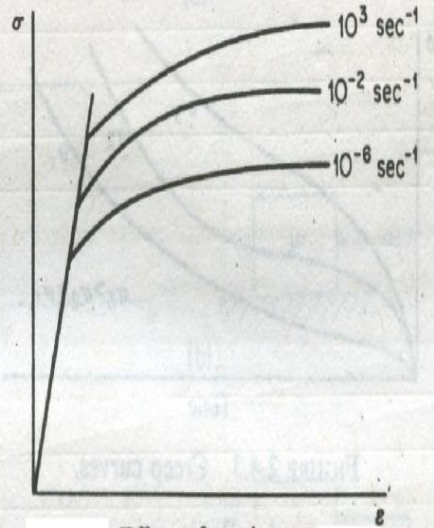
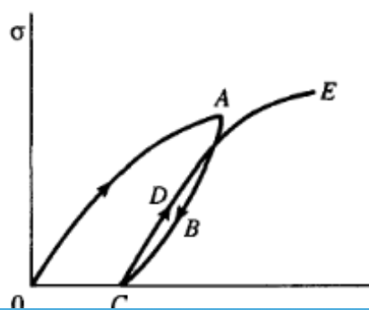

# 绪论

## 塑性力学概述

!!! question "什么时候考虑塑性力学？"
    - 不允许进入塑性变形的情况，只考虑弹性力学
        - 托卡马克装置，力电热耦合
    - 塑性力学研究举例
        - GaN基半导体，层之间的热应力导致塑性变形
        - 高强高韧纳米结构金属研究 $\implies$ 基于变形机理包含微结构信息的塑性力学模型
            - 仿真理论模型，考虑温度导致的微结构变化    
    
    极端力学！

!!! quote "History of Plasticity"
    - 1678, Hooke's law
    - 1773, Coulomb 屈服准则
    - 1820 - 1830, Navier, Cauchy, Saint-Venant, 弹性力学的发展
    - **1864**, Tresca 屈服准则
    - 1871, Lévy 三维塑性本构
    - 1913, von Mises 形变能屈服准则
    - 1930, Prandtl & Reuß, 增量理论
    - 1943, Hencky, Nadai, Iliushin, 形变理论
    - 1950, 有限单元法
    - 1970 - , 塑性本构关系

!!! quote "我国应用力学发展简史"
    ```mermaid
    graph LR
        A[克莱因（1849 - 1925）<br>哥廷根学派创始人<br>普朗特（1875 - 1953）<br>近代力学奠基人]
        A --> B[铁木辛柯]
        A --> C[冯·卡门]
        C --> D[郭永怀]
        C --> E[钱学森]
        C --> F[钱伟长]
        F --> G[叶开沅]
        G --> H[老师的导师]
    ```

    实则偏冯·卡门“家系”的

## 塑性力学的任务

### 弹性与塑性

- 弹性：外力除去后变形可以全部恢复
- 塑性：外力超过一定限度后，物体产生不可恢复的变形

!!! tip "弹性与塑性的差别"
    :point_right: 不在于是否线性/大变形或小变形，而在于**是否可恢复**

    - 塑性应变和应力之间**不再一一对应**，和加载的历史有关
    - 应力与应变（或应变率）之间呈非线性关系

### 塑性理论

- 物理（微观）塑性理论：位错
    - 晶体塑性理论
    - 位错理论
      > 孪晶面、位错核心
- 分子动力学方法
- 实验
- 数学（宏观/现象学）塑性理论
    - 基于连续介质力学方法发展
    - 和弹性理论的差别：本构关系不同

### 工程应用

- 分析结构的变形过程和承载能力
    - 塑性好：好成型、好加工、吸能好（e.g. 车骨架）
    - 强度好：承载能力强
- 金属压力加工和材料成型
- 结构的弹塑性断裂和失效
- 土木工程与地震学中的岩土与岩石分析

!!! quote "塑性力学的研究内容"
    研究物体受外力作用进入塑性状态后产生的应力和变形，包括研究在加载过程中的每一时刻，物体内各点的应力和变形以及确定物体上已进入塑性状态区域的范围（即弹性区和塑性区的界限）

    - 根据试验结果，建立塑性本构关系及有关基本理论
    - 寻求数学计算方法来求解给定的边值问题

!!! note "塑性力学的基本假设"
    - 材料是**均匀连续**的
    - 在进入塑性状态前为各向同性
    - 物体承受载荷之前处于**没有初应力**的自然状态
      > 焊接就肯定有初应力了

    通常{++不考虑时间因素对变形的影响++}（如弹性后效、蠕变等），而且只限于考虑在常温下和缓慢变形的情形，所以也忽略温度和应变速度对材料性质的影响。

## 金属材料的塑性性质

比例极限到弹性极限：非线性弹性阶段，但在微观层面上局部会有塑性变形行为

延展性：

$$
EL\% = \frac{l_{\text{f}} - l_0}{l_0} \times 100\%, \quad EA\% = \frac{A_0 - A_{\text{f}}}{A_0} \times 100\%
$$

硬度：抵抗更硬物体压入的能力，即金属表面对局部塑性变形的抵抗能力

- 静压法
    - 布氏硬度、洛氏硬度、维氏硬度
- 划痕法
    - 莫氏硬度
- 回跳法
    - 肖氏硬度

### 应力和应变

名义应变（nominal strain）或工程应变（engineering strain）：

$$
\varepsilon = \frac{l - l_0}{l_0} = \frac{\Delta l}{l_0} \implies d\varepsilon = \frac{d l}{l_0}
$$

名义应力（nominal stress）或工程应力（engineering stress）：

$$
\sigma = \frac{F}{A_0}
$$

其中 $A_0$ 是变形前的有效横截面积。而真实应力应该除以变形后的横截面积 $A$. 假设材料不可压缩，则 $A l = A_0 l_0$，从而真实应力为

$$
\begin{equation} \tag{1.1} \label{eq:true_stress}
    \tilde{\sigma} = \frac{F}{A} = \frac{F l}{A_0 l_0} = \sigma (1 + \varepsilon)
\end{equation}
$$

定义真实应变的增量为

$$
d \tilde{\varepsilon} = \frac{d l}{l}
$$

两边积分得

$$
\begin{equation} \tag{1.2} \label{eq:real_strain}
    \tilde{\varepsilon} = \ln (1 + \varepsilon)
\end{equation}
$$

此也称为自然应变（natural strain）或对数应变（logarithmic strain）。

!!! note "Remarks"
    1.  工程应变不能相加，但对数应变可以。
        设某物体原长为 $l_0$，经历了 $l_1$ 和 $l_2$ 两段变形后变为 $l_3$，则各阶段的工程应变为

        $$
        \varepsilon_1 = \frac{l_1 - l_0}{l_0}, \quad \varepsilon_2 = \frac{l_2 - l_1}{l_1}, \quad \varepsilon = \frac{l_3 - l_2}{l_2}
        $$

        总的工程应变 $\varepsilon = \frac{l_3 - l_0}{l_0} \neq \varepsilon_1 + \varepsilon_2 + \varepsilon_3$. 而各阶段的对数应变为

        $$
        \tilde{\varepsilon}_1 = \ln \frac{l_1}{l_0}, \quad \tilde{\varepsilon}_2 = \ln \frac{l_2}{l_1}, \quad \tilde{\varepsilon}_3 = \ln \frac{l_3}{l_2}
        $$

        总的对数应变 $\tilde{\varepsilon} = \ln \frac{l_3}{l_0} = \tilde{\varepsilon}_1 + \tilde{\varepsilon}_2 + \tilde{\varepsilon}_3$.
    2.  体积不可压缩条件 $(1 + \varepsilon_1)(1 + \varepsilon_2)(1 + \varepsilon_3) = 1 \iff \tilde{\varepsilon}_1 + \tilde{\varepsilon}_2 + \tilde{\varepsilon}_3 = 0$.

### 塑性失稳

材料拉伸试验中，颈缩效应与强化效应相互抵消时，外载达到最大值。之后，虽然外力和名义应力继续减小，但由于颈缩效应所导致的截面积减少得更加厉害，{++真实应力并没有减小++}。

受拉伸的金属材料的应力达到 $\sigma_{\text{b}}$（极限强度）时，拉力为最大值的平衡状态是不稳定的，称为**塑性拉伸失稳**。它由材料**几何形状变化**引起，而不是材料本身的失稳。

$F = \tilde{\sigma} A \implies d F = A d \tilde{\sigma} + \tilde{\sigma} d A$，失稳条件为 $d F = 0$. 代入 $Al = A_0 l_0 \implies A dl + l d A = 0$，得

$$
\frac{d \tilde{\sigma}}{\tilde{\sigma}} = - \frac{d A}{A} = \frac{d l}{l} = d \tilde{\varepsilon} \implies \boxed{\frac{d \tilde{\sigma}}{d \tilde{\varepsilon}} = \tilde{\sigma}}
$$

因此可以从真实应力与应变关系 $\tilde{\sigma}$-$\tilde{\varepsilon}$ 找到拉伸失稳点。

### 其他效应

!!! info inline end ""
    

-   应变率效应
    
    $$
    \frac{d \varepsilon}{d t} = \frac{1}{l_0} \frac{d l}{d t} = \frac{v}{l_0}
    $$

    - 增加屈服强度
    - 降低塑性
    - 当应变率为 $10^{-4} \sim 10^{-1} \, \text{s}^{-1}$ 时，可以不用考虑该效应

!!! info inline end ""
    

-   滞后效应
    - 循环加载