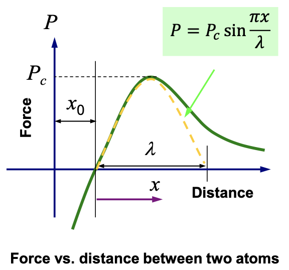

# Griffith 理论

!!! quote "材料失效的传统观点"
    1.  失效形态
        - 脆性材料：脆断
        - 塑性材料：塑性屈服
    2.  失效机制：应力

    传统强度理论：

    -   第一强度理论：最大拉应力理论（Galileo, 1638）
        $$
        \sigma_1 \leq [\sigma]
        $$
    -   第二强度理论：最大伸长线应变理论（Mariotte, 1682）
        $$
        \sigma_1 - \nu (\sigma_2 + \sigma_3) \leq [\sigma]
        $$
    -   第三强度理论：最大切应力理论（Tresca 准则，1868）
        $$
        \sigma_1 - \sigma_3 \leq [\sigma]
        $$
    -   第四强度理论：形状改变比能密度理论（von Mises 准则，1913）
        $$
        \sqrt{\frac{1}{2} \Big[ (\sigma_1 - \sigma_2)^2 + (\sigma_2 - \sigma_3)^2 + (\sigma_3 - \sigma_1)^2 \Big]} \leq [\sigma]
        $$ 

    这些对于材料强度的观点，本质上都是二元论

    ```mermaid
    graph LR
        A[Applied Stress] <--> B[Yield/Tensile Strength]
    ```

    断裂力学的观点：

    ```mermaid
    graph LR
        A[Applied Stress] <--> B[Fracture Toughness]
        B <--> C[Flaw Size]
        A <--> C
    ```

## 引入

问题起源：发动机叶片上的裂纹扩展是发动机失效的最主要原因

实验探索：裂纹长度 $2a$，裂纹扩展应力 $\sigma$ 的关系：

$$
\sigma \sqrt{a} = \text{const.}
$$

> A.A. Griffith, Phenomena of rupture and flow in solids, Philosophical Transactions of the Royal Society of London, A221, 163-198 (1921). 但由于他研究的是脆性材料（玻璃），发表之初没有引起足够的重视。

### 材料的理论强度

