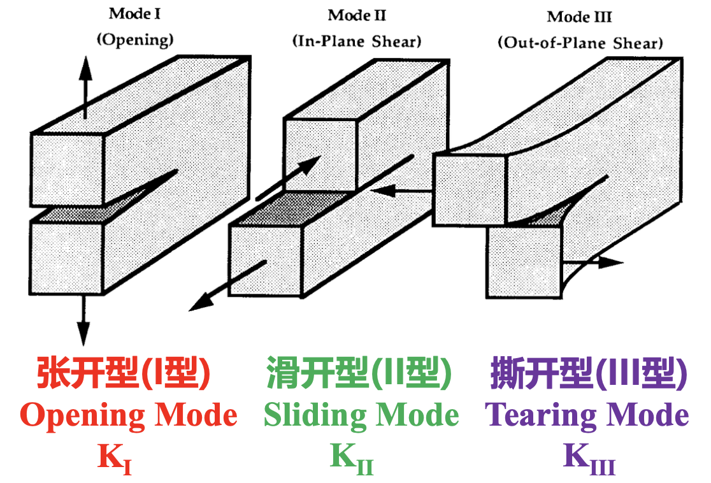

# 断裂模式与尖端裂纹场

I, II 型为平面问题，III 型为反平面问题。利用对称性减少未知数个数简化问题。

## Analysis of mode I & II cracks

平面应变状态：

Irwin G-K relation：

$$
G = \frac{1 - \nu^2}{E} K_{\text{I}}^2 + \frac{1 - \nu^2}{E} K_{\text{II}}^2 + \frac{1 + \nu}{E} K_{\text{III}}^2
$$

把局部的应力强度因子和宏观的能量释放率联系起来。