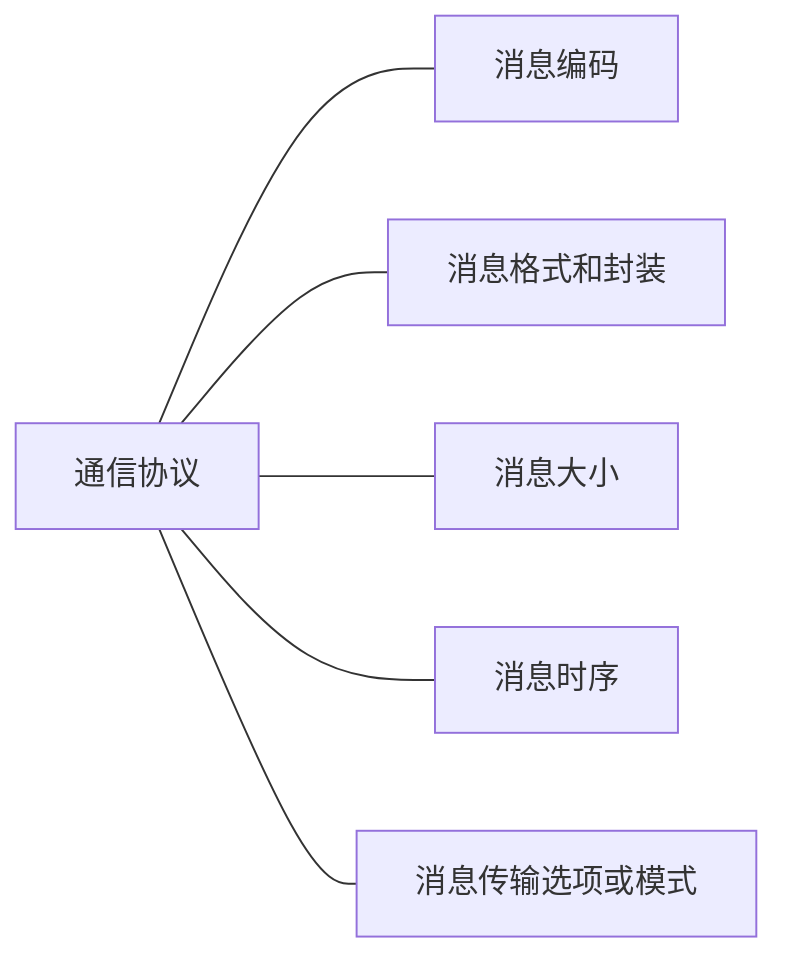

!!! abstract "课程概述"
    教室局域网访问同步桌面：[Netop Vision](http://192.168.3.3)

    5G: WWAN
    WiFi: WLAN

    - FLOPS: Floating Point Operations Per Second
        - 1 EFLOPS = $10^{18}$ FLOPS

    本实验室网络设备：

    - WiFi 6 无线网卡（11AX）
    - 无线路由器
    - 无线 AP（Access Point）
    - WiFi 7: 11BE
    - WiFi 8: 11BN

    [Cisco NetSpace《网络简介》](http://netacad.cn)

    - 教学班名称：`itn_24_4_3`

    **学习目标**：

    - 配置交换机和终端设备，以实现对本地和远程网络资源的访问
    - 配置路由器，以实现远程设备之间的端到端连通性
    - 使用路由器和交换机构建中小规模的网络
    - 根据单位或公司的实际需求，规划、设计、实施IPv4和IPv6地址方案
    - 根据单位或公司的实际需求，规划、设计、实施IP地址的子网划分方案
    - 使用安全最佳实践配置网络，保护网络安全
    - 利用实用工具，监测网络性能、分析网络流量、进行网络故障排除

C/S架构

对等网络 P2P

1. 网络设备
      - 终端设备
      - 中间设备
2. 网络介质
3. 网络服务
4. 网络表示方式
    - 网卡（网络接口卡，NIC）
    - 端口（Port）
    - 接口（Interface）
    - 拓扑图
    - 逻辑图
        - 逻辑拓扑图（IP地址等，可人为修改）
        - 物理拓扑图

### 网络类型

- 局域网（LAN）
    - 高速
- 广域网（WAN）
    - 通常提供 LAN 之间的较慢链路
- 互联网

SOHO 互联网连接

- 同轴电缆
- DSL（数字用户线路），电话线路
    - ADSL：非对称数字用户线路，上行速度小于下行速度
- 卫星

### 可靠网络

#### 容错能力

备份，冗余

#### 可扩展性

增加用户不降低性能，兼容性

#### 服务质量（QoS）

为不同类型的服务提供不同的优先级

#### 安全性

- 网络基础设施安全性
- 信息安全性
    - 机密性
    - 完整性
    - 可用性

### 网络安全

SOHO：

- 防病毒和反间谍软件
- 防火墙过滤

大型网络和企业网络：

- 专用防火墙系统
- 访问控制列表(ACL)
- 入侵防御系统(IPS)
- 虚拟专用网络(VPN)

### 网络趋势

- 自带设备（BYOD）
- 在线协作
- 视频通信
- 云计算

电力线通信（Power Line Communication，PLC）
无线宽带

## 3 协议和模型

### 3.1 规则

通信三要素：

- 源
- 通道
- 目的（接收方）

规则：

- ID
- 双方一致同意的介质或通道
- 适当的沟通模式（口头、书面、图示、互动或单向）
- 公共语言和语法结构
- 传递的速度和时间
- 证实或确认要求（Ack）

#### 消息编码

- 发送主机转换成比特位
- 根据用来传输的网络介质，将每一位编码成电子脉冲、光波或电磁波的样式
- 目的主机接收并解码信号

#### 消息格式和封装

每条计算机消息在通过网络发送之前都以特定的格式封装，称为**帧（Frame）**

- 提供目的地址和源地址等必要信息
    - 源 MAC 地址
    - 目的 MAC 地址
    - 源 IP 地址
    - 目的 IP 地址

#### 消息大小

**源主机**：分割长消息为多个片段或帧。帧太长或太短都无法传送
**目的主机**：将消息的各个片段重新组合为原始消息

#### 消息时序

- 访问方法
- 流量控制
- 响应超时

#### 消息传输选项或模式

单播：一对一
组播或多播：一对多
广播：一对全体

### 3.2 协议

- HTTP
- FTP
- TCP
- IP

### 3.3 协议簇

### 3.4 标准组织

### 3.5 OSI 模型