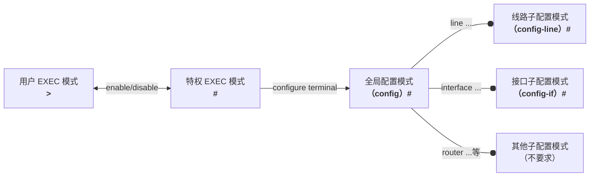

# Lec 4

## Cisco IOS 简介

- GUI（Graphical User Interface）：图形用户界面
- CLI（Command Line Interface）：命令行界面

### 访问方法：

- Console
- SSH（安全，带内访问推荐）
- Telnet（不安全）

> 带内：通过网络；带外：不通过网络

### 配置命令模式

1. 用户 EXEC 模式
   - 提示符：`>`
   - 输入`enable`进入特权模式
   - 输入`exit`退出
2. 特权 EXEC 模式
   - 提示符：`#`
   - 输入`disable`回到用户模式
   - 输入`configure terminal`进入全局配置模式
3. 全局配置模式
   - 需进入特权模式
   - 提示符：`(config)#` 结尾
   - **输入密码时不回显，直接回车**

    两个子模式：

   1. 线路子配置模式
      - 提示符：`(config-line)#` 结尾
   2. 接口子配置模式
      - 提示符：`(config-if)#` 结尾



VTY: Virtual Teletype Terminal 虚拟远程终端
SSH与Telnet访问均纳入VTY线路进行管理


查看接口状态命令：

```bash
show ip interface brief
```

!!! tip "浙大古早的 BBS 论坛"

    浙江大学海纳百川 BBS

    ```bash
    telnet bbs.zju.edu.cn
    ```

    飘渺水云间 BBS

    ```bash
    telnet 10.13.21.88
    ```

    

> TCP是可靠的，UDP是不可靠的
> PDU：报文-数据段-数据包-数据帧-比特流

不同服务不能用同一端口，否则会冲突
停用默认

- 套接字：源IP地址和源端口号的组合

### DNS 服务

#### 测试 DNS 服务效果

##### `ping`

```bash
ping www.zju.edu.cn
```

##### `nslookup`

```bash
nslookup www.zju.edu.cn
```

!!! warning "不要忘了www."
    `ping` 和 `nslookup` 都要写全域名

### HTTP/HTTPS

HTTPS 的安全基础是 SSL（Secure Socket Layer）

### FTP

传输数据默认20端口
建立连接及发送控制命令默认21端口
FTPS：990（安全）

### SMTP/POP3/IMAP

---

## **<center>实验</center>**

!!! info "实验心得"
    前人的建议：**此次实验和上次实验是之后实验的基础，最好所有组员都搞懂，不然很心累！**
    - PC1 与 PC2 的 IP 和 DNS 按部就班设置好（{++有可能出现没保存的情况！++}）
    - PC1 搞好之后可能要等一会 PC2 才能连上