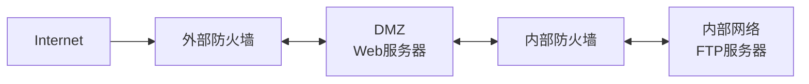
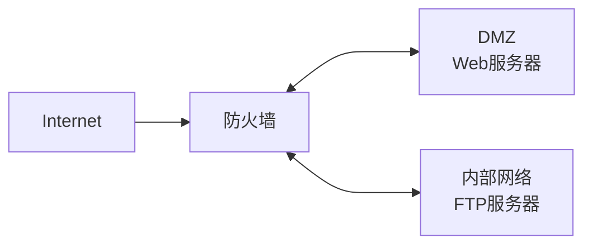

# Lec 5 网络安全

!!! tip "一些攻击参与者的术语"
    - Hacker
    - 历史上指计算机编程专家
    - Cracker（骇客）
    - 非法访问网络资源的恶意群体
    - White Hat
    - Black Hat
    - Phisher
    - Phreaker
    - Spammer

## 网络威胁

### 入侵来源

#### 外部

#### 内部

**大多数威胁其实来自内部**

内部访问和计算机系统账户使用不当

### “社会工程”

“社会工程”中最常用的三种“技术”是：

- 假托
- 网络钓鱼
- 语音网络钓鱼

## 攻击方式

### 病毒

- 通过修改并附加到其它程序或文件上来运行和传播的一种程序
- 无法自行启动，而需受到激活（人为启动其所附着的程序）
- 迅速占用所有可用内存和CPU，导致系统死机

### 蠕虫

- 无需将自身附加到其他程序或文件中
- 使用网络将自己的副本发送到任何连接的主机中
    - 冲击波
    - 震荡波
    - 熊猫烧香
- 可独立运行并迅速传播

### 特洛伊木马

- 没有自身复制能力的程序
- 可为系统创建后门从而使黑客获得访问权
    - 服务器程序（植入主机端）
    - 控制器程序（黑客端）

### 拒绝服务攻击（DoS）

> DoS = Denial of Service

使服务器拒绝为特定用户提供服务

#### SYN（并发）泛洪攻击

向服务器发送大量请求客户端连接的数据包，其中包含无效的源IP地址。服务器会因试图响应这些**虚假请求**而变得极为**忙碌**，导致无法响应合法请求。

#### 死亡之 Ping

向设备发送超过IP协议所允许的最大大小（65,535字节）的数据包,导致接收设备系统崩溃。

#### 分布式拒绝服务攻击（DDoS）

成百上千个攻击点试图同时淹没目标

- 攻击点
    - 感染了DDoS代码的没有设防的计算机
    - “肉鸡”或“僵尸计算机”

### 暴力攻击

- 短时间内尝试大量可能的密码
- 引起针对特定资源的通信量过大或用户账户锁定（重试出错次数太多），导致合法用户被拒绝服务

### 间谍软件（Spyware）

- 收集个人信息，泄露隐私
- 降低计算机速度，更改计算机内部设置
- 难以删除（“流氓软件”）

#### Cookie

记录用户的网站访问信息

#### 广告软件（Adware）

- 弹出广告
- 背投广告

### 垃圾邮件（Spam）

## 安全策略

- 更新和补丁
- 防病毒软件
- 反垃圾邮件
- 反间谍软件

## 防火墙

- **数据包过滤**
    - 根据IP地址或MAC地址来阻止或允许访问
- **应用程序/网站过滤**
    - 根据应用程序（即对应不同端口号的不同服务）来阻止或允许访问；网站过滤则通过指定要过滤的网站URL地址或关键字来实现
- **状态包侦测**（SPI，也叫状态防火墙）
    - 传入数据包必须是对内部主机所发出请求的合法响应才会被允许传入，否则未经请求的传入数据包会被阻隔
- **网络地址转换**（NAT）
    - 防火墙将内部网络的私有IP地址转换为公共IP地址，以便在Internet上进行通信。**对外部用户隐藏内部私有IP地址**

### 使用防火墙

- 一般情况下，**外部不能 ping 通内部**
- 有时需允许外访问内
    - **非军事区**（**DMZ** = DeMilitarizedZone）
    - 内部和外部用户都可访问的网络区域

#### 双防火墙配置

- 适合处理通信量较大的大型复杂网络

#### 单防火墙配置

- 适合规模较小、通信量较少的网络

!!! warning ""
    单防火墙配置存在单一故障点，可能发生过载

另外，利用**端口转发**即**虚拟服务器**功能还可设置更具限制性的非军事区，服务器上的那些可访问端口均经特别指定。

## 设备安全

### 密码

- 强密码只有在保持其机密性时才是有用的
- 启用 SSH

---

!!! info "以下不属于考试内容"

## WLAN 的安全

### 基本安全措施

- 改变默认设置（例如 SSID、密码和 IP 地址）
- 禁用 SSID 广播功能
- 配置 MAC 地址过滤
    - 精确控制哪些设备可以访问无线网络
    - “哄骗 spoofing”：伪造 MAC 地址

### 身份验证

- Open Authentication（开放式身份验证）
- PSK（预共享密钥）
- EAP（可扩展身份验证协议）

### 加密

- WEP（Wired Equivalent Privacy，有线等效协议）
    - TKIP/AES加密协议、802.1XEAP(Radius) 身份验证
    - 预配置的密钥
    - 必须为每台无线设备设置相同的 WEP 密钥
    - 缺点：静态密钥，易被破解
- WPA（Wi-Fi Protected Access，Wi-Fi 保护访问）
    - TKIP/AES加密协议、PSK/SAE身份验证
    - WPA/WPA2：四次握手（4-Way Handshake）过程
    - 破解：KRACK，Key Reinstallation Attacks，即“密钥重安装攻击”
    - WPA3：Dragonfly-Handshake

    !!! tip inline end ""
        AES优于TKIP！SAE优于PSK！

- WAPI
    - 中国人自己提出的WLAN安全标准，具有完全的自主知识产权及核心技术，采用的加密算法也是我国具有自主知识产权的国密算法

### 通信过滤

- 删除来自或发往特定IP地址或MAC地址
- 通过端口号拦截特定应用程序或服务

---

## 基础网络性能

---

## **
实验
**

!!! warning "注意"
    本次实验不用连校网，也不用设置域名及 DNS 服务器！

- 内网PC3：连接LAN口
- 外网PC3：连接WAN口

!!! info "实验心得"
    - 网关的设置很重要！PC1/PC2 没设置好会导致外网的 PC3 无法访问内网的 PC1/PC2
    - IP、网关这些设置完了，点两个“确定”，还要去“**详细信息**”里检查一下有没有改好！（这里显示改了才算数）
    - **路由器的 WAN/LAN 口看清楚了**！！连着两次实验都是 PC1 那组拿了路由器在那里搞，ping 不通还以为是我的问题，结果两次实验插错两次了