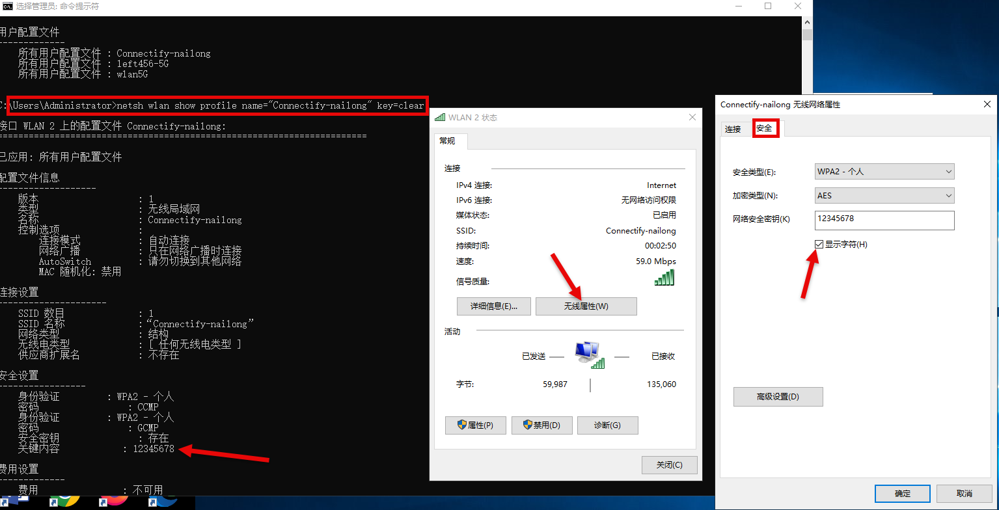

# 补充实验

上这门课很摆，只有第二个（最简单的）是我自己做的，其他都是另外两组主要完成。这里就写一些心得/注意点。

## 补充实验一：AP Router 模式共享 VPN 上网

- 改变路由器工作模式为 AP Router 模式
    - **必须在无线配置时改！**
    - 有线配置时改会无响应，不知道为什么
- L2TP
    - 服务器地址：`lns.zju.edu.cn`（不推荐 hard-coded IP 地址，没必要）
    - 自动获取/连接
- 有的 VPN 账号可能有限制，用两个 24 级的同学账号时都没法获取 IP 地址（`0.0.0.0` 即无法获取），但是用老师的账号（zangwill）就可以
- 有的 AP 的接口和网线水晶头卡的不是很牢（比如 AP23，记住你了），仔细甄别一下
- （不止这个实验）有时候出问题不是你的错，可能别人把你 AP 的线拔了
    - 如此素質，令人汗顏！
    - 已經到了無恥的地步！

## 补充实验二：查看无线密码

自己做的，甚至截了图（不愧是自己做的）

**图1.** 补充实验二

我就简单做了两种方法：

1. 命令行查看
    - `netsh wlan show profile name=“SSID” key=clear`
    - `SSID` 是你要查看的无线网络的名字
    - `key=clear` 是显示密码
2. 网络设置 - 网络和Internet - 更改适配器选项 - 无线属性 - 安全 - 显示字符
    - 可能有跳步，但应该很清楚了

## 补充实验三、四

全程未参与，完全不知道（

---

!!! success ""
    
**结课快乐！**🎉

p.s. 怎么思科线上期末考试成绩都这么高的，班里前 30% 的在 98.65 分以上...？