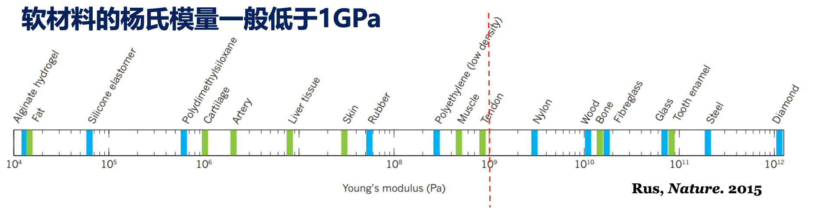
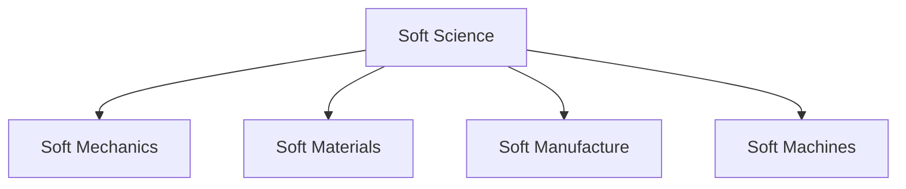

# Intro

!!! abstract "Grading"
    - 平时 70%
        - 出勤 10%
        - 作业 60%
    - 项目 30%

## 基础阶段：软物质力学

- 基本特征：小作用，大变化

> 杨氏模量 $E < 1 \, \text{GPa}$
>
> 

### 介电高弹体

> R. Pelrine, R. Kornbluh, Q.B. Pei, and J. Joseph, High-speed electrically actuated elastomers with strain
greater than 100%. Science, 287: 836-839 (2000).

- 大于 $100 \%$ 的变形
- 电能 & 机械能相互转化
- 缺点：需要高电压

### 水凝胶

**Hydrogels**: polymer networks infiltrated with a large amount of water

Soft, Smart, Structure-designable

- 双网络，力学性能很好的水凝胶
    - 只能用一次
    - J. Gong, Y. Katsuyama, T. Kurokawa, Y. Osada, Double-network hydrogels with extremely high mechanical strength, Advanced Materials, 15: 1155-1158 (2003).
- 离子键，可反复使用
    - J.Y. Sun, X. Zhao, W.R. Illeperuma, O. Chaudhuri, K.H. Oh, D.J. Mooney, J.J. Vlassak, Z. Suo, Highly stretchable and tough hydrogels. Nature, 489: 133-136 (2012).

## 软物质力学进展

