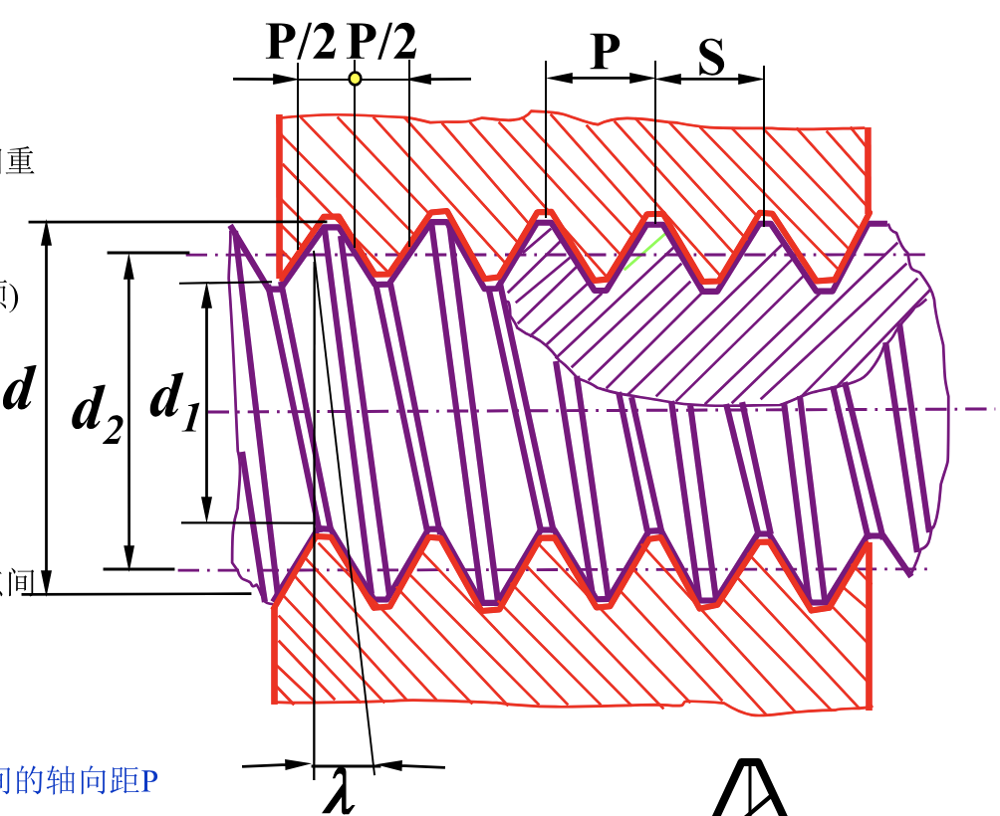
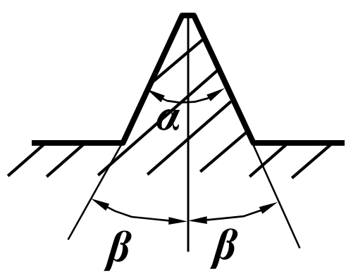
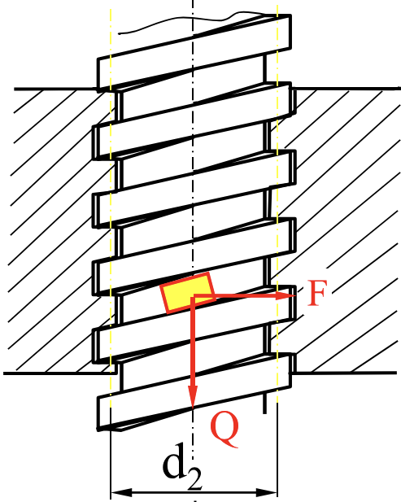
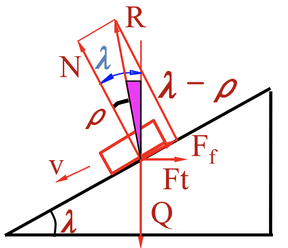

# 第二章 联接

## 2.1 螺纹联接

### 螺纹的分类

- 牙型
    - 矩形
    - 三角形
    - 梯形
    - 锯齿形
- 旋向
    - 右旋（╱）
    - 左旋（╲）
- 螺旋线的根数
    - 单线
    - 多线（$S = nP$, $P$ 为螺距, $S$ 为导程）
- 回转体内外表面
    - 内螺纹
    - 外螺纹
- 作用
    - 联接
    - 传动
- 母体形状
    - 圆柱
    - 圆锥
    - 管螺纹

### 螺纹的主要几何参数

!!! note inline end ""
    

- 大径 $d$
- 小径 $d_1$
- 中径 $d_2$，$d_2 = \frac{d + d_1}{2}$
- 螺距 $P$
    - 相邻两牙在中线上的距离
- 导程 $S$，$S = nP$
    - 转一周螺纹前进的距离

!!! note inline end ""
    

- 螺纹升角 $\lambda$
    - $tan \lambda = \frac{nP}{\pi d_2}$
- 牙型角 $\alpha$
- 牙侧角 $\beta$

### 螺旋副的受力分析、效率和自锁

- $F_t$: 水平推力
- $N$: 法向反力
- $Q$: 轴向载荷

!!! note inline end ""
    

- $F_f =f F_n$: 摩擦力
- $f$: 摩擦系数
- $ρ$: 摩擦角

螺旋副在轴向载荷作用下相对运动，可看作在中径的水平力 $F$ 推动滑块沿螺纹运动

#### 矩形螺纹（$\beta = 0$）

全反力 $\vec{R} = \vec{F}_f + \vec{N}$

$$\tan \rho = \frac{F_f}{N}$$

1. 螺丝拧紧（滑块上升）

    力平衡方程得到：

    $$F_t = Q \tan(\rho + \lambda)$$

    驱动力矩：

    $$T = F_t \cdot \frac{d_2}{2} = Q \frac{d_2}{2} \tan(\lambda + \rho)$$

2. 螺丝松开（滑块下降）

    !!! note inline end ""
        

    力平衡方程得到：

    $$F_t = Q \tan(\lambda - \rho)$$

    驱动力矩：

    $$T = Q \frac{d_2}{2} \tan(\lambda - \rho)$$

!!! tip "讨论"
    - 若 $\lambda > \rho$，则 $T > 0$，方向与螺母相反
    - 若 $\lambda < \rho$，则 $T < 0$，方向与螺母相同，成为放松螺母所需的力矩。若没有外力作用，螺母会**自锁**。

#### 非矩形螺纹（$\beta \neq 0$）

$$F_f = fN = \frac{f}{\cos \beta}Q = f_v Q$$