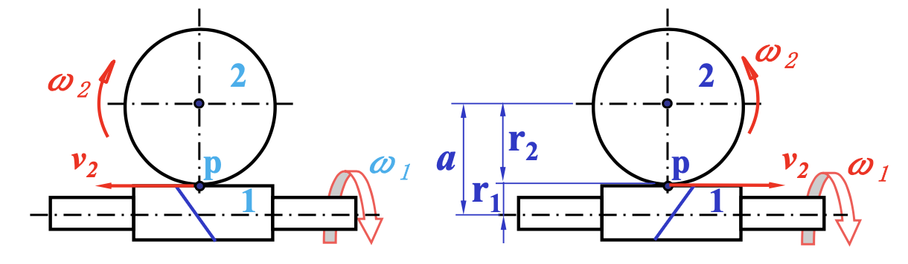

# 蜗杆传动

## 6.1 特点和类型

!!! info inline end ""
    

- 作用：传递交错轴（一般为 $90\degree$）之间的回转运动和动力。
- 形成：单个斜齿轮齿数很少（如 $z_1 = 1$），且 $\beta_1$ 很大。所得齿轮为蜗杆，啮合件为蜗轮。

### 传动特点

- 优点
    - 传动比大
    - 结构紧凑
    - 传动平稳
    - 噪声小
    - 自锁性好
- 缺点
    - 传动效率低
    - 蜗轮齿圈用青铜制造，成本高

### 类型

- 形状
    - 圆柱蜗杆
    - 环面蜗杆
- 螺旋面形状
    - 阿基米德蜗杆
    - 渐开线蜗杆

## 6.2 圆柱蜗杆传动主要参数

### 模数 $m$ 和压力角 $\alpha$

- $P_{a1}$：蜗杆的轴面齿距
- $P_{t2}$：蜗轮的端面齿距
- $m_1$：蜗杆的轴面模数
- $m_2$：蜗轮的端面模数
- $\alpha_{a1}$：蜗杆的轴面压力角
- $\alpha_{t2}$：蜗轮的端面压力角
- 正确啮合条件：$m_1 = m_2 = m$，$\alpha_{a1} = \alpha_{t2} = \alpha$，$P_{a1} = P_{t2}$

### 分度圆直径 $d_1$ 和螺旋升角 $\lambda$
  
$$
\tan \lambda = \frac{h}{\pi d_1} = \frac{z_1 P_{a1}}{\pi d_1} = \frac{m z_1}{d_1}
$$

- 蜗杆直径系数 $q$

### 传动比 $i$、蜗杆头数 $z_1$ 和蜗轮齿数 $z_2$

- 蜗杆头数 $z_1$：螺旋线的数目
- 转动比：

$$
i = \frac{n_1}{n_2} = \frac{z_2}{z_1}
$$

### 几何尺寸计算

$i \to z_1 \to z_2 \to$ 计算求得 $m, d_1 \to$ 计算几何尺寸

## 6.3 运动分析和受力分析

### 运动分析

$$
\vec{v}_2 = \vec{v}_1 + \vec{v}_{21}
$$

**手势确定蜗轮转向**：

右旋蜗杆：伸出左手，四指顺着蜗杆转向，则蜗轮的切向速度 $v_{p2}$ 方向为大拇指方向。

### 受力分析

类似于斜齿轮，法向力可分解为三个分力：

- 圆周力 $F_t$
- 轴向力 $F_a$
- 径向力 $F_r$

$$
\begin{aligned}
    F_{t1} &= F_{a2} = \frac{2T_1}{d_1} \\
    F_{a1} &= F_{t2} = \frac{2T_2}{d_2} \\
    F_{r1} &= F_{r2} = F_{t2} \tan \alpha
\end{aligned}
$$

- $T_1, T_2$：蜗杆和蜗轮的转矩
- $F_{t1}$ 与蜗杆在该点的速度方向相反
- $F_{t2}$ 与蜗轮在该点的速度方向相同

$$
T_2 = T_1 i \eta
$$

