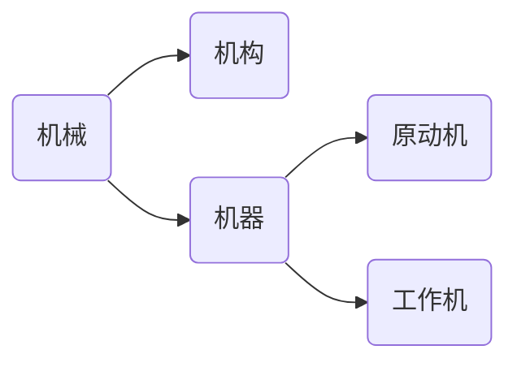

# 总论

## 机械的组成

机械：机器和机构的总称

- 机构：能够用来传递运动和力或改变运动形式的多件实物的组合体。
    - 连杆机构
    - 齿轮机构
    - 凸轮机构

- 机器：根据某种具体使用要求而设计的多件实物的组合体

工作机的组成：

- 原动部分：动力来源
- 工作部分：完成预定动作，在传动路线的终点
- 传动部分：连接原动机和工作部分
- 控制部分：启动、停止、协调

构件：独立的运动单元
零件：独立的制造单元

**运动副**

两个构件直接接触组成的仍能产生某些相对运动的联接

条件：

- 两个构件
- 直接接触
- 有相对运动

约束几个自由度，就叫几级副（I级副、II级副、...、V级副）

- 高副：点、线接触，应力高
    - 滚动副
    - 凸轮副
    - 齿轮副
- 低副：面接触，应力低
    - 转动副（回转副）
    - 移动副

**运动链**

两个以上的构件通过运动副的联接而构成的系统

- 闭式链
- 开式链（机械臂）

**机构**

具有确定运动的运动链

!!! info "Grading"
    - 期末 60%
    - 平时 40%

## 机械运动简图及平面机构的自由度

### 平面机构运动简图

应满足的条件：

1. 构件数目与实际相同
2. 运动副的性质、数目与实际相符
3. 运动副之间的相对位置以及构件尺寸与实际机构**成比例**。

### 自由度

机构自由度：确定各构件相对位置所需的独立参数数目