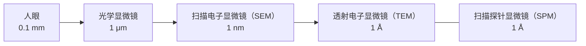

# 绪论

!!! question "金属材料塑性变形能力的微观机理？"
    为什么低碳钢是塑性材料，拉伸试验得到的应力应变曲线歪歪扭扭的，而铸铁作为脆性材料的应力应变曲线却简单很多？

    $\implies$ 原子缺陷：**位错（dislocation）**

    位错（线缺陷）
    : 晶体中已滑移部分与未滑移部分的分界线。这是影响金属材料塑性的主要因素。

    - 刃位错
    - 螺位错
    - 混合位错

    :microscope: 观测：**透射电子显微镜（TEM）**

!!! example "生物样品测试"
    红细胞弹性模量 $\sim \text{kPa}$（最软的细胞），直径 $\sim 10 \mu m$，如何测量？

    :microscope: 观测：**原子力显微镜（AFM）**

!!! example "二维材料"
    科学问题：
    
    - 如何跨尺度、跨维度测量
    - 连续介质力学对二维材料的适用性

    单层石墨烯的面内拉伸模量达到 $1.1 \, \text{TPa}$，相当于一只大象坐在铅笔上都戳不破一张膜！

## 显微技术

!!! quote ""
    *There's plenty of room at the bottom.*

    
——Richard Feymann (Caltech, 1959)

!!! info "瑞利判据"
    如果一个点光源的衍射图像的中央最亮处刚好与另一个点光源的衍射图像的第一个暗环重叠，那么认为这两个点光源恰好能够分辨。

显微镜分辨极限 $d \sim \frac{\lambda}{2 n \sin \theta}$. 可见光波长 $\lambda \approx 400 \sim 700 \, \text{nm}$，分辨极限约为 100 nm。而晶格大小 $\sim 0.1 \, \text{nm}$，因此需要使用电子显微镜。

## 扫描探针技术（SPM）

在扫描隧道显微镜的基础上发展起来的技术，原理是量子隧穿效应。

## 原子力显微镜（AFM）

压电陶瓷

- 悬臂梁弯曲：光斑垂直位移
- 悬臂梁扭转：光斑水平位移

接触式 AFM 工作在分子间作用力为斥力的区域

### 工作模式

- 恒高模式
- 恒力模式（常用）
    - 反馈系统：若发现光斑偏离，移动扫描器以保持恒力（光斑保持在中心）
- 轻敲模式（非接触式）
    - 防止损伤样品
    - 悬臂梁远离样品时，以共振频率振动。而探针与样品之间的范德华力会改变悬臂梁的共振频率，反馈系统通过调整扫描器以保持共振频率不变，从而实现成像。
- 横向力模式（摩擦学）
- 力曲线模式
- 接触共振模式

---

## 实验介绍

- 实验名称：悬置纳米压痕实验

### 实验背景

金属纳米材料的力学极限

### 实验步骤

1. 纳米金片的制备与转移（助教已完成，过于复杂）
2. 探针装载、样品装载和光路调节（研究生现场操作）
3. 接触模式下扫描形貌、测试厚度、选取加载点
4. 数据处理与数据拟合

!!! info "经典板壳理论"
    点载荷作用下的边界固定无支撑各向同性圆形薄膜，小挠度为（Kirchhoff-Love, Reissner, Timoshenko）：

    $$
    \frac{\delta(0)}{R} = \frac{3 (1 - \nu^2)}{4 \pi} \frac{F R}{E t^3}
    $$

拟合函数：$N_r, E$ 为拟合中的自变量，是一个双参数拟合