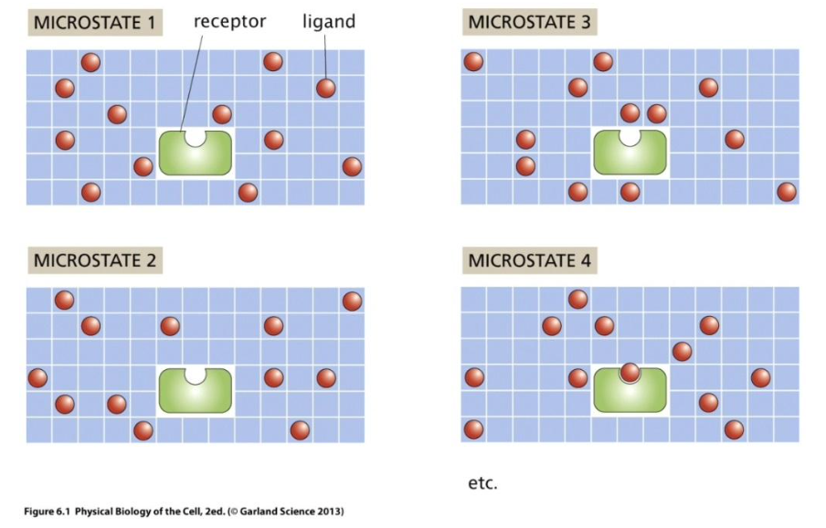
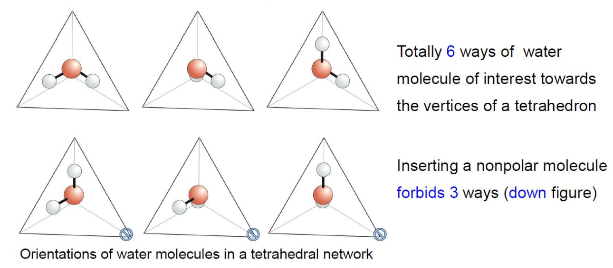

# 统计力学在生物体系的简单应用

!!! abstract "回顾（接上次）"
    -   微观态：各组分微观排列的一个特定实现
        -   溶液格子模型（a lattice model of solution）
        -   计算：组合数

    

!!! example "熵与疏水性质（hydrophobic）"
    -   氢键
        -   静电力（90%）
        -   共价键（10%）与电子云的交叠有关

    疏水性质来源于：水的某些构型不被允许

    

    单个水分子的熵改变：

    $$
    \Delta S = \underset{\text{有约束 }\mathrm{H_2O}}{\underbrace{k_B \ln 3}} - \underset{\text{无约束 }\mathrm{H_2O}}{\underbrace{k_B \ln 6}} = - k_B \ln 2
    $$

!!! example "Estimate: interfacial energy of a hydrophobic object in water"
    $\gamma$: free energy per unit area for a hydrophobic molecule

!!! tip "配分函数的物理意义"
    类似于分析力学里的哈密顿量，有了配分函数，就可以求出系统的各种热力学量，是统计力学的“分析机”（analytical engine）。

## Ligand-receptor binding

水合自由能 $\varepsilon_{\text{sol}}$：溶质分子与水的相互作用能量

忽略溶质分子与受体的相互作用能量，考虑溶液格子模型。未与受体位点结合的体系能量为 $L \varepsilon_{\text{sol}}$. 结合后能量为 $(L - 1) \varepsilon_{\text{sol}} + \varepsilon_{\text{bind}}$.

$$
\frac{\Omega!}{(\Omega - L)!} \approx \frac{\Omega^L}{L!}, \quad \text{for } L \ll \Omega
$$

### Binding Curve

$$
p_{\text{bound}} = \frac{(L/\Omega) e^{-\beta \Delta \varepsilon}}{1 + (L/\Omega) e^{-\beta \Delta \varepsilon}} \xrightarrow[c_0 \equiv \Omega/V_{\text{tot}}]{c \equiv L/V_{\text{tot}}} \frac{c e^{-\beta \Delta \varepsilon}}{1 + c e^{-\beta \Delta \varepsilon}}
$$

## Osmotic pressure

细胞外液渗透压 90% 以上来自 $\mathrm{Na}^+, \mathrm{Cl}^-$

考虑一个有半透膜格挡的容器，膜两侧分别是纯水和溶解了大分子的溶液

平衡态：$\mu_{\mathrm{H_2O}}^L = \mu_{\mathrm{H_2O}}^R, T_L = T_R = T$

右侧隔室

$$
G_{\text{tot}}(T, p, N_{\mathrm{H_2O}}, N_s) = N_{\mathrm{H_2O}} \mu_{\mathrm{H_2O}}^0(T, p) + N_s \varepsilon_s (T, p) + k_B T \left( N_s \ln \frac{N_s}{N_{\mathrm{H_2O}}} - N_s \right)
$$

故

$$
\mu_{\mathrm{H_2O}}(T, p) = \left( \frac{\partial G_{\text{tot}}}{\partial N_{\mathrm{H_2O}}} \right)_{T, p} = \mu_{\mathrm{H_2O}}^0(T, p) - \frac{N_s}{N_{\mathrm{H_2O}}} k_B T
$$

左右隔间的水化学势：

$$
\left \{
    \begin{aligned}
        & \mu_{\mathrm{H_2O}}^L = \mu_{\mathrm{H_2O}}^0(T, p_L) \\
        & \mu_{\mathrm{H_2O}}^R = \mu_{\mathrm{H_2O}}^0(T, p_R) - \frac{N_s}{N_{\mathrm{H_2O}}} k_B T \approx \mu_{\mathrm{H_2O}}^0(T, p_L) + \frac{\partial \mu_{\mathrm{H_2O}}^0}{\partial p} (p_R - p_L) - \frac{N_s}{N_{\mathrm{H_2O}}} k_B T
    \end{aligned}
\right.
$$

由平衡条件 $\mu_{\mathrm{H_2O}}^L = \mu_{\mathrm{H_2O}}^R$ 可得

稀溶液渗透压是一种熵力，与溶质种类、大小无关

!!! example "Estimate: Osmotic pressure in an *E. coli*（大肠杆菌）cell"
    大肠杆菌内的典型无机盐浓度为 $100 \, \mathrm{mM}$[^1]
    
    [^1]: $\mathrm{mM}$ 相当于 $\mathrm{mmol/L}$，省略了“每升”

    $$
    \frac{N_s}{V} = \frac{100 \times 10^{-3} \times (6 \times 10^{23})}{10^{-3} \, \mathrm{m^3}} = 6 \times 10^{25} \, \mathrm{m^{-3}} = 6 \times 10^7 \, \underset{\text{细胞体积约 1 fL}}{\mathrm{ions}/\textit{E. coli}}
    $$

    则内外渗透压差

    $$
    \Delta p_{\text{ion}} = p_{\text{in}} - p_{\text{out}} = \frac{N_s}{V} k_B T = (6 \times 10^{25}) \times (4.1 \times 10^{-21}) \, \mathrm{Pa} = 2.46 \times 10^5 \, \mathrm{Pa} = 2.46 \, \mathrm{atm}
    $$

热力学角度看理想气体的压强：熵力

对于准静态等温过程，气体的内能不变，膨胀过程可视作熵增的后果

$$
\mathrm{d} U = T \mathrm{d} S - p \mathrm{d} V = 0 \implies p = T \left. \frac{\partial S}{\partial V} \right|_{T, N, \ldots}
$$

压强与 $\frac{\partial S}{\partial V}$ 成正比，{++熵有自发增加的趋势，也就自然产生了压强。++}

