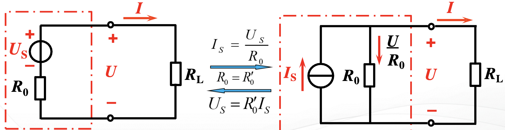
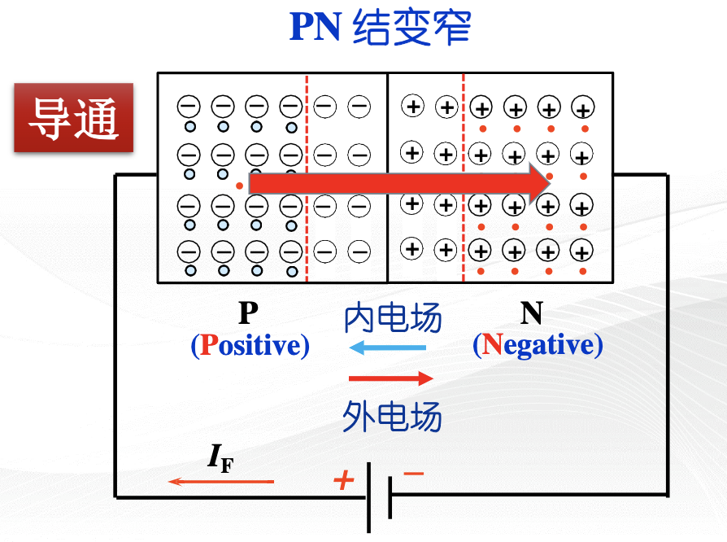
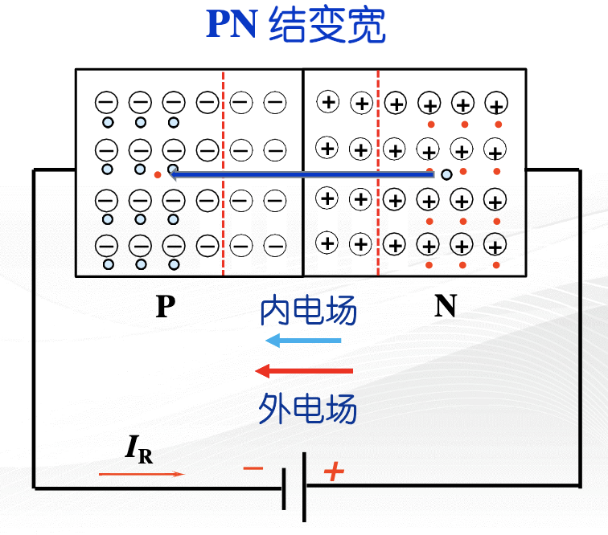

# 1 电路和电路元件

## 1.1 基本物理量

### 1.1.1 电路

- 强电电路：电能传输、分配、转换
- 弱电电路：信号传递、控制、处理

### 1.1.2 电路元件

一种物理模型

无源元件：电阻、电容、电感
理想电压源、理想电流源

!!! example "实际电路元件是理想电路元件的组合"
    实际电感线圈

    - 直流：电阻
    - 交流低频：电感串联电阻
    - 交流高频：再并上一个电容
    - 超高频：分布式参数

### 1.1.3 电流、电压及其参考方向

#### 实际方向

- 电流：正电荷运动方向
- 电压：高电位到低电位
- 电动势：低电位到高电位

对于复杂电路，实际方向未知，故先假设一个{++参考方向++}

#### 参考方向

分析电路时，对电量任意假定的方向。

#### 两者关系

+：一致
-：相反

#### 欧姆定律的应用

- $U$、$I$ 参考方向相同（**关联参考方向**）：$U = IR$
- $U$、$I$ 参考方向相反（非关联参考方向）：$U = -IR$

通常取关联参考方向。

#### 电位

- 电位：电路中某点到参考点的电压，记作 $V$
- 参考点：人为规定0电位的点

电压和电位的关系：$U_{AB} = V_A - V_B$

#### 电动势

非电场力将正电荷从电源的负极板移动到正极板所做的功，称为电源的电动势，记作 $E$

### 1.1.4 电路功率

$$P = \frac{dW}{dt} = \frac{dW}{dq} \cdot \frac{dq}{dt} = UI$$

关联参考方向：

- 负载：$P = UI > 0$
- 电源：$P = UI < 0$

## 1.2 R,L,C

### 1.2.1 电阻 $R$（Resistor）

$$U = IR$$

> 电导 $G = \frac{1}{R}$，单位：西门子（S）

伏安特性：

- 线性电阻
- 非线性电阻

!!! info inline end "线性"
    1. 比例性（齐次性）
    2. 可加性

电阻器：

- 膜电阻器
- 线绕电阻器（适合大电阻）
- 电位器
- 水泥电阻器
- 热敏电阻器

### 1.2.2 电感 $L$（Inductor， {==L==}enz's law）

磁通、磁链

$$N\Phi = LI$$

自感电动势：$e_L = -L\frac{di}{dt}$，$u = -e_L$

**电压电流关系**：

$$\boxed{u = L\frac{di}{dt}}$$

功率：$P = UI = Li\frac{di}{dt}$

能量：$W = \int Pdt = \frac{1}{2}LI^2$

电感器：

- 陶瓷电感器
- 贴片电感器
- 标准电感器

### 1.2.3 电容 $C$（Capacitor）

线性：$q = Cu$

**电压电荷关系**：

$$\boxed{i = C\frac{du}{dt}}$$

能量：$W = \frac{1}{2}CU^2$

电容器：

- 普通电容器
- 电解电容器
- 电力电容器
- 单相电动电容器

!!! tip "两个元件串并联"
    | 连接方式 | 等效电阻 | 等效电感 | 等效电容 |
    | --- | --- | --- | --- |
    | 串联 | $R_1 + R_2$ | $L_1 + L_2$ | $\frac{1}{\frac{1}{C_1} + \frac{1}{C_2}}$ |
    | 并联 | $\frac{1}{\frac{1}{R_1} + \frac{1}{R_2}}$ | $\frac{1}{\frac{1}{L_1} + \frac{1}{L_2}}$ | $C_1 + C_2$ |

### 1.2.4 实际元件的主要参数及电路模型

- 电阻器：标称电阻值、额定功率
- 电感器：标称电感值、额定电流
- 电容器：标称电容值、额定电压

运行状态：

- 额定工作状态 :star:
- 过载状态
- 欠载（轻载）状态

## 1.3 独立电源元件

### 1.3.1 电压源和电流源

#### 电压源

$$U = U_S - IR_0$$

理想电压源：$U = U_S$

!!! tip inline end ""
    $U_S = 0$ 时，退化为一根导线

特点：

1. 内阻 $R_0 = 0$
2. 输出电压恒定
3. 电流由外电路决定
4. 不允许短路

#### 电流源

$$I = I_S - \frac{U}{R_0}$$

理想电流源：$I = I_S$

!!! tip inline end ""
    $I_S = 0$ 时，即断路

特点：

1. 内阻 $R_0 = \infty$
2. 输出电流恒定
3. 电压由外电路决定
4. 不允许开路

#### 电压源和电流源的等效变换

电压源：$U = U_S - IR_0$

电流源：$I = I_S - \frac{U}{R_0}$，即 $U = I_S R_0 - IR_0$

$$
\boxed{
\begin{aligned}
    U_S &= I_S R_0 \\[1ex]
    I_S &= \frac{U_S}{R_0}
\end{aligned}
}
$$

!!! warning inline end "注意"
    1. 仅对外电路等效
    2. 等效后参考方向要一致

!!! info "说明"
    1. 与理想电压源并联，只考虑电压时，忽略并联的元件
    2. 与理想电流源串联，只考虑电流时，忽略串联的元件
    3. 两个电流数值不同的理想电流源不能串联（电压源同理）
    4. 和电压源串联的电阻/和电流源并联的电阻，可等效为电源内阻

## 1.4 二极管

!!! info "学习要求"
    - 关注应用，不追究机理
    - 工程观点计算，满足技术指标的估算即可

### 1.4.1 PN结及其单向导电性

半导体的导电特性：

- 热敏性
- 光敏性
- 掺杂性

Ge, Si: 四价元素

天然的硅和锗是不能制成半导体器件的，它们必须先经过高度提纯，形成晶格结构完全对称的{==本征半导体==}。

#### 本征半导体（Intrinsic Semiconductor）

{++完全纯净++}的、{++具有晶体结构++}的半导体称为本征半导体.

##### 本征半导体的导电机理

**本征激发**：价电子获得能量后成为**自由电子**，同时价电子对形成**空穴**

!!! tip inline end ""
    **载流子**：自由电子和空穴

加上电压：

- 电子电流：自由电子作定向运动
- 空穴电流：价电子填补空穴

自由电子和空穴成对产生，又不断复合。达到动态平衡后，载流子数目不再变化。

**注**：本征半导体的导电性很差，且受温度变化影响很大。

#### 杂质半导体（Extrinsic/Doped Semiconductor）

- N型半导体：掺入五价元素
    - 多数载流子：电子
- P型半导体：掺入三价元素
    - 多数载流子：空穴

!!! tip "少数载流子"
    少数载流子（少子）由本征激发产生！

半导体对外显中性

#### PN结的形成

!!! info "空间电荷区"

- **扩散运动**：多子（N的电子，P的空穴）存在浓度差
    - 使空间电荷区变宽
- **漂移运动**：原子核（N的正离子$\mathrm{P}^+$，P的负离子$\mathrm{B}^-$）间存在电场
    - 使空间电荷区变窄

#### PN结的单向导电性

1. 正向电压（正向偏置）：P接正

   - 内电场削弱，扩散加强，PN结变窄

    

2. 反向电压（反向偏置）：P接负

   - 内电场增强，漂移加强，PN结变宽
   - 少子数量很少，形成很小的反向电流

    

**单向导通：P $\to$ N**

### 1.4.4 稳压二极管（Zener Diode）

### 1.5.1 晶体管

#### 基本结构

- 三极管：发射极、基极、集电极

#### 简化小信号模型

动态输入电阻（$I_{\mathrm{E}} < 5\mathrm{mA}$）：

$$r_{\mathrm{be}} = \frac{\Delta U_{\mathrm{BE}}}{\Delta I_{\mathrm{B}}} = r_{\mathrm{b}} + (1+\beta)\frac{26\mathrm{mV}}{I_{\mathrm{E}}}$$

基极电阻 $r_{\mathrm{b}} = 200\,\Omega$