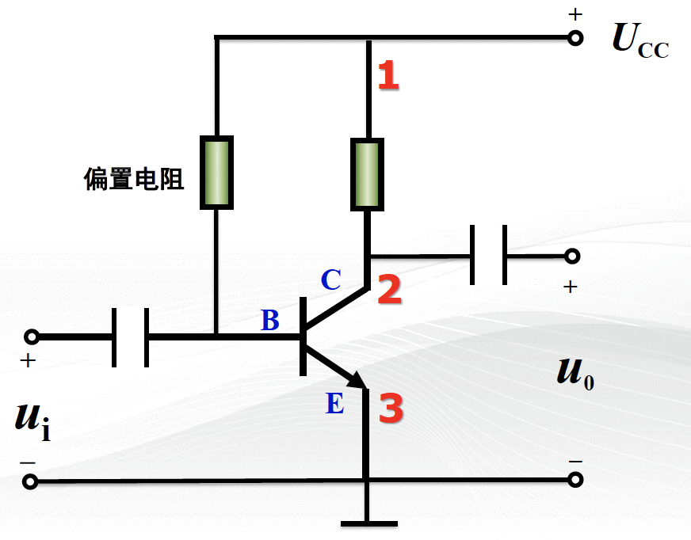
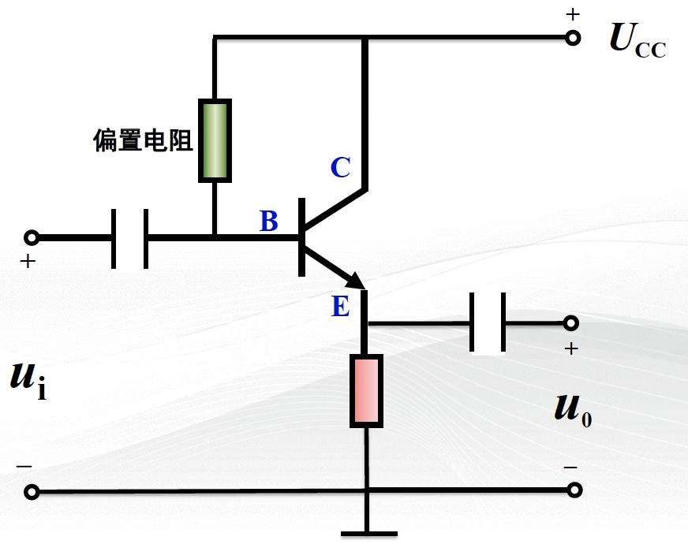
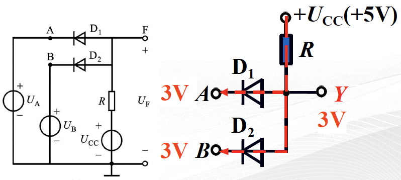
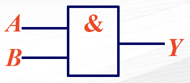
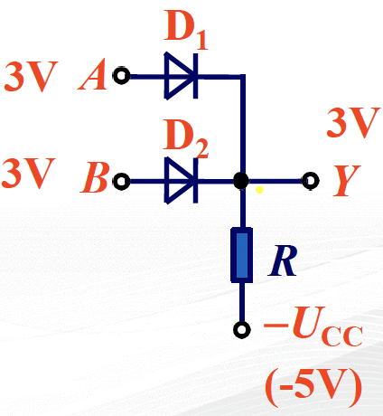
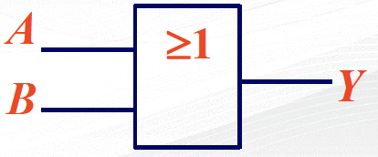
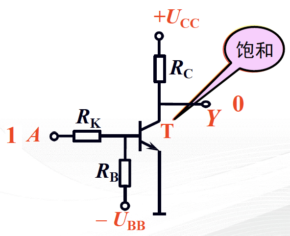
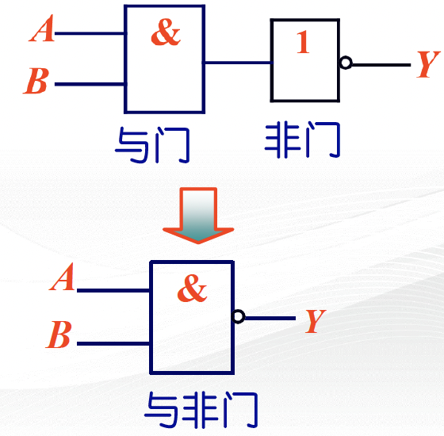
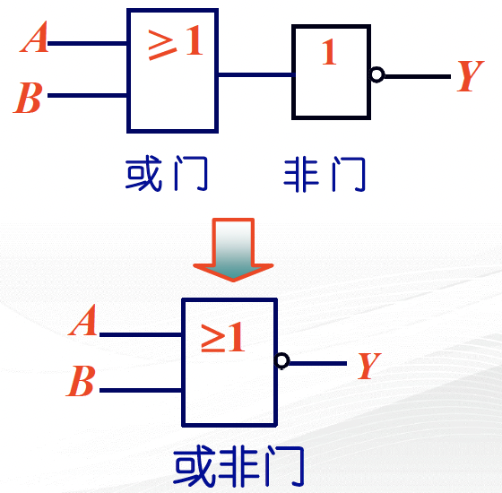

# 3 分立元件基本电路

## 3.1 共发射极放大电路

### 3.1.1 电路组成

> 共发射极 CE（Common Emitter）

- 晶体管：**电流放大** $i_{\mathrm{C}} = \beta i_{\mathrm{B}}$，发射结正偏，集电结反偏
- 直流电源 $U_{\mathrm{CC}}$：提供放大所需的能量，保证集电结反偏
- 偏置电阻 $R_{\mathrm{B}}$：提供合适的静态工作点，保证发射结正偏
- 负载电阻 $R_{\mathrm{C}}$：将输入端变化的电流转换为变化的电压，实现电压放大
- 耦合电容 $C_1$、$C_2$：隔直流通交流，不适用于低频电路

### 3.1.5 频率特性

> - 在信号频率较低时，耦合电容的阻抗无法忽略
> - 简化的晶体管小信号模型无法体现高频时晶体管结电容的分流作用
> - 电路分布参数的作用
> - 片面地假设负载为纯电阻性质

上述原因使电路的放大倍数随频率的变化而变化

$$
A_u = \frac{\dot{U}_{\mathrm{out}}}{\dot{U}_{\mathrm{in}}} = \frac{U_{\mathrm{out}}}{U_{\mathrm{in}}} \angle \varphi_{\mathrm{out}} - \varphi_{\mathrm{in}} = |A_u| \angle \varphi
$$

$A_u$ 随频率变化的曲线成为**频率特性**.

## 3.2 共集电极放大电路

> 共集电极 CC（Common Collector）

!!! summary "总结"
    共集电极放大电路（射极输出器）的特点：
    1. 电压放大倍数 $\lessapprox 1$
    2. 输出与输入同相
       - 电压跟随器
    3. 输入电阻高
       - 常被用在多级放大电路的第一级，提高输入电阻，减轻信号源负担
    4. 输出电阻低
       - 常被用在多级放大电路的末级，降低输入电阻，提高负载能力
    
    也可放在两级之间，起到阻抗匹配的作用，成为缓冲级/中间隔离级

多极放大器

## 3.3 共源极放大电路（略）

## 3.4 分立元件组成的基本门电路

!!! abstract "基本门电路概述"
    正逻辑：1 表示高电平，0 表示低电平
    负逻辑：1 表示低电平，0 表示高电平

    基本逻辑关系：

    - 与
    - 或
    - 非

### 3.4.1 与门电路

与门逻辑状态表

| A | B | Y |
|:---:|:---:|:---:|
| 0 | 0 | 0 |
| 0 | 1 | 0 |
| 1 | 0 | 0 |
| 1 | 1 | 1 |

> 有 0 出 0，全 1 出 1

- 逻辑函数：$Y = A \cdot B$

- 逻辑符号

  

### 3.4.2 或门电路

或门逻辑状态表

| A | B | Y |
|:---:|:---:|:---:|
| 0 | 0 | 0 |
| 0 | 1 | 1 |
| 1 | 0 | 1 |
| 1 | 1 | 1 |

> 有 1 出 1，全 0 出 0

- 逻辑函数：$Y = A + B$
- 逻辑符号
  
  

### 3.4.3 非门电路

非门逻辑状态表

| A | Y |
|:---:|:---:|
| 0 | 1 |
| 1 | 0 |

- 逻辑函数：$Y = \overline{A}$
- 逻辑符号

  

### 3.4.4 基本逻辑门电路的组合

#### 与非门电路

与非门逻辑状态表

| A | B | Y |
|:---:|:---:|:---:|
| 0 | 0 | 1 |
| 0 | 1 | 1 |
| 1 | 0 | 1 |
| 1 | 1 | 0 |

> 有 0 出 1，全 1 出 0

- 逻辑函数：$Y = \overline{A \cdot B}$

#### 或非门电路

或非门逻辑状态表

| A | B | Y |
|:---:|:---:|:---:|
| 0 | 0 | 1 |
| 0 | 1 | 0 |
| 1 | 0 | 0 |
| 1 | 1 | 0 |

> 有 1 出 0，全 0 出 1

- 逻辑函数：$Y = \overline{A + B}$

#### 异或门电路

- 逻辑函数：$Y = A \oplus B = \overline{A}B + A\overline{B}$

#### 同或门电路

- 逻辑函数：$Y = A \odot B = \overline{A \oplus B} = AB + \overline{A}\overline{B}$