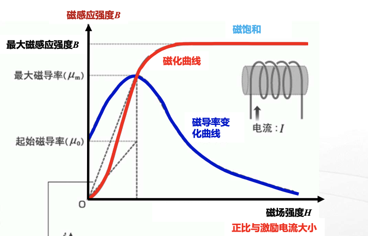
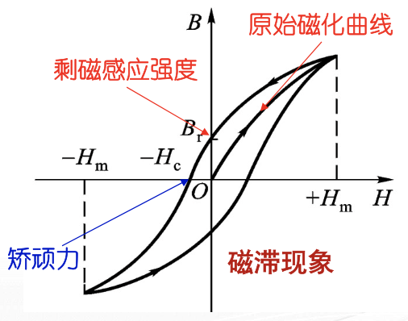

# 第九章 变压器和电动机

## 9.1 磁路

为了把磁场聚集在一定的空间范围内，以便加以控制和利用，就必须用高磁导率的铁磁材做成一定形状的铁心，使之形成一个磁通的路径使磁通的绝大部分通过这一路径闭合。把磁通经的闭合路径称为磁路。

### 9.1.1 铁磁材料的磁性能

**铁磁材料**：是指钢、铁、镍、钴及其合金等材料，是制造变压器、电机和电器铁心的主要材料。

铁磁材料被放入磁场内，会受到强烈的**磁化**，磁化是铁磁材料的基本特性之一。

#### 磁化曲线与磁滞回线

**磁化曲线**：从 $0$ 增加外加磁场强度 $H$，磁感应强度 $B$ 也随之变化的曲线。

1. 磁化具有磁饱和性
2. 磁性材料的 $B \sim H$ 呈非线性关系，其磁导率 $\mu = \frac{B}{H}$ 也是非线性的
3. 铁磁材料的磁导率很大，$\mu = 10^3 \sim 10^4$

**磁滞回线**：

### 9.1.2 简单磁路分析

#### 直流磁路

具有恒定磁通的磁路

!!! note "全电流定律（安培环路定律）"
    在磁场中，磁场强度 $H$ 沿任一闭合路径 $l$ 的线积分，等于穿过该闭合路径所围面积的电流 $I$ 的代数和。

    $$
    \oint_l \vec{H} \cdot \mathrm{d}\vec{l} = \sum I
    $$

    方向：符合右旋定则

!!! info "磁通连续性原理“
    铁心和空气中磁感应强度 $B = \Phi / A$ 是连续的