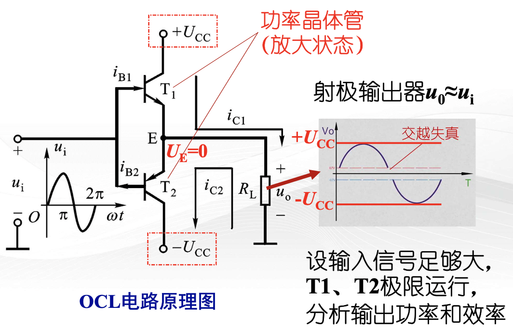
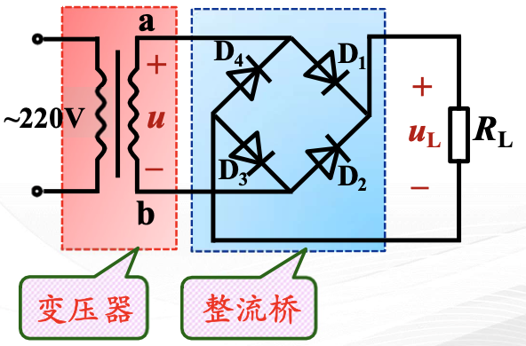
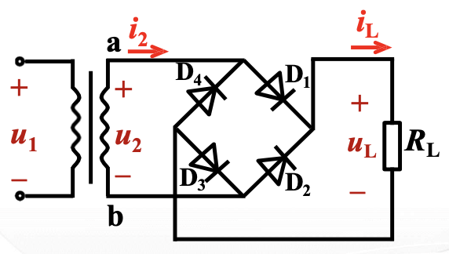
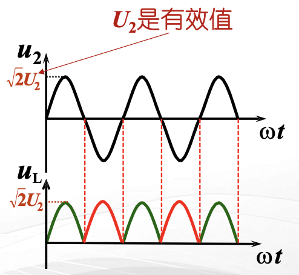
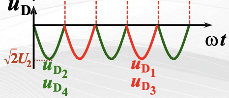

# 第八章 功率电子电路

!!! abstract "功率放大电路"
    作用：放大电路的输出级，推动负载工作。

## 8.1 低频功率放大电路

### 8.1.1 概述

对功放电路的要求：

1. 输出功率尽可能大，功率管通常工作在近于极限状态
2. 非线性失真尽可能小
3. 效率要高
4. 集电极功耗尽可能小

!!! tip "晶体管工作状态"
    - 甲类工作状态
        - 晶体管在输入信号的整个周期内都导通，静态 $I_{\text{C}}$ 较大，波形好，管耗大效率低
    - 乙类工作状态
    - 甲乙类工作状态

### 8.1.2 基本功率放大电路

- 无输出变压器 (Output Transformerless, **OTL**) 电路
    - 电容与负载耦合，省去了变压器
- 无输出电容 (Output Capacitorless, **OCL**) 电路
    - 再省去输出电容，直接与负载相连

#### OCL 电路

##### 输出功率和效率

负载（交流）

- 最大输出电压：$U_{\text{om}} = U_{\text{CC}} - U_{\text{CES}}$
- 最大输出功率：$P_{\text{o}\max} = \frac{(U_{\text{om}}/\sqrt{2})^2}{R_{\text{L}}} = \frac{(U_{\text{CC}} - U_{\text{CES}})^2}{2R_{\text{L}}}$

电源（直流）

- 流过电源 $U_{\text{CC}}$ 的电流：$i_{\text{C}1} = \begin{cases} I_{\text{cm}} \sin \omega t, & 0 \leq \omega t \leq \pi \\ 0, & \pi \leq \omega t \leq 2\pi \end{cases}$
- 最大输出电流：$I_{\text{cm}} = U_{\text{om}} / R_{\text{L}} = \frac{U_{\text{CC}} - U_{\text{CES}}}{R_{\text{L}}}$
- 平均功率：$P_{\text{S}} = P_{\text{S}+} + P_{\text{S}-} = 2 P_{\text{S}+} = 2 $

#### OTL 电路

### 8.1.3 集成功率放大器举例

## 8.2 直流稳压电路

### 8.2.1 单相桥式整流电路

#### 单相半波整流

一个二极管，只利用了电源的半个周期

#### 单相桥式整流电路

##### 参数计算

1. 整流电压平均值 $U_{\text{L}}$

$$
U_{\text{L}} = \frac{1}{\pi} \int_0^{\pi} \sqrt{2} U_2 \sin \omega t \, \mathrm{d}(\omega t) = \frac{2 \sqrt{2}}{\pi} U_2 \approx 0.9 U_2
$$

2. 整流电流平均值 $I_{\text{L}}$

$$
I_{\text{L}} = \frac{U_{\text{L}}}{R_{\text{L}}} = \frac{2 \sqrt{2}}{\pi} \frac{U_2}{R_{\text{L}}} \approx 0.9 \frac{U_2}{R_{\text{L}}}
$$

3. 流过每管电流平均值 $I_{\text{D}}$

$$
I_{\text{D}} = \frac{I_{\text{L}}}{2} \approx 0.45 \frac{U_2}{R_{\text{L}}}
$$

4. 每管承受的最高反压 $U_{\text{DRM}}$

$$
U_{\text{DRM}} = \sqrt{2} U_2
$$

选用二极管时，应满足：

- 最大整流电流：$I_{\text{OM}} > I_{\text{D}}$
- 最大反向电压：$U_{\text{RWM}} > U_{\text{DRM}}$

5. 变压器二次侧电流有效值 $I_2$

$$
I_2 = \frac{U_2}{R_{\text{L}}} = 
$$