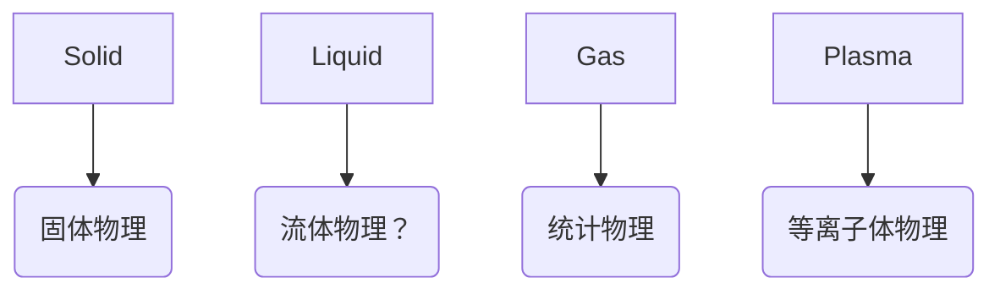

# 复杂系统的统计物理

## 软物质

- 没有长程有序
- 尺度：生命尺度

- 1905，Einstein 解释布朗运动
- Max Born
- Peter Debye
- Pierre-Gilles de Gennes
    - *Soft Matter* (1991 Nobel Prize speech)
        1. Flexibility（灵活性）
           - 数学：非线性效应显著
           - 物理：易受温度影响，熵效应显著

        !!! example "非牛顿流体"
            剪切响应 vs. 剪切力变化率

        2. Complexity（复杂性）
           - 结构：短程有序、长程无序
           - 热力学：亚稳态、非平衡态
           - 动力学：非均匀性、多重弛豫

### 玻璃态（非晶态）物质

什么是液体？什么是固体？

玻璃化转变

!!! example "沥青滴漏实验"
    Pitch Drop Experiment

    长程无序、高粘度液体

C. Austen Angell, Liquid viscosity $\eta = \eta(T)$

:star: **Angell Plot**: $\log \eta$ vs. $T_g / T$

- Strong liquids: Arrhenius law

$$
\eta = \eta_0 \exp\left(\frac{E_a}{k_B T}\right)
$$

- Fragile liquids: VFT law

$$
\eta = \eta_0 \exp\left(\frac{B}{T - T_0}\right)
$$

- 在玻璃态转变点附近，动力学行为随着温度的微小改变会发生数量级的变化！
- 结构没有显著改变

自旋玻璃

!!! quote
    玻璃态转化的机理：凝聚态最难、最重要的问题

    
—— Anderson

## 分子动力学模拟

!!! question "模拟方法"
    1. 量子化学计算
       - :thumbsup: 包含电子自由度，精度高
       - :thumbsdown: 计算量巨大，处理体系相对较小
    2. Monte Carlo 模拟
       - :thumbsup: 可以处理大体系
       - :thumbsdown: 不包含动力学信息
    3. 分子动力学模拟
       - :thumbsup: 可以处理大体系
       - :thumbsup: 真实动力学

1. 给定初始位置 $\vec{r}_0$ 和速度，时间间隔 $\Delta t$
2. 计算力 $\vec{F} = -\nabla V(\vec{r})$ 和加速度 $\vec{a} = \vec{F}/m$
3. 移动原子 $\vec{r}^{(i+1)} = \vec{r}^{(i)} + \vec{v}^{(i)} \Delta t + \frac{1}{2} \vec{a} \Delta t^2 + \ldots$
4. 更新速度 $\vec{v}^{(i+1)} = \vec{v}^{(i)} + \vec{a} \Delta t + \ldots$
5. 更新时间 $t = t + \Delta t$
6. 重复步骤 2-5

分子力场

- EAM 势：Embedded-Atom Model
- 人工智能构建力场

## 统计方法

!!! quote "“四大力学”"
    - 经典力学
        - Issac Newton
        - *Principia Mathematica* (1687)
    - 电动力学
        - Maxwell
    - 量子力学
    - 统计力学

- 经典力学、电动力学、量子力学：系统的**演化（轨迹）**
- 统计物理：**系综 Ensemble（分布）**
    - Boltzmann distribution

    $$
    P(E) = \frac{e^{-E/k_B T}}{Z}
    $$

    - Partition function

    $$
    Z = \sum_i e^{-E_i/k_B T}
    $$

    - Free energy

研究对象自由

## 人工智能

### Hopfield 网络

基于 Ising 模型

神经元的两个状态 $V_i = \begin{cases} 1 & \text{firing} \\ 0 & \text{not firing} \end{cases}$

能量函数
$$
E = -\frac{1}{2} \sum_{i,j} J_{ij} V_i V_j
$$

