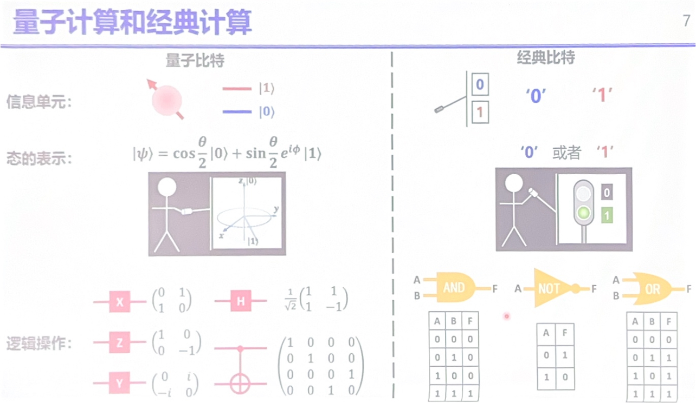
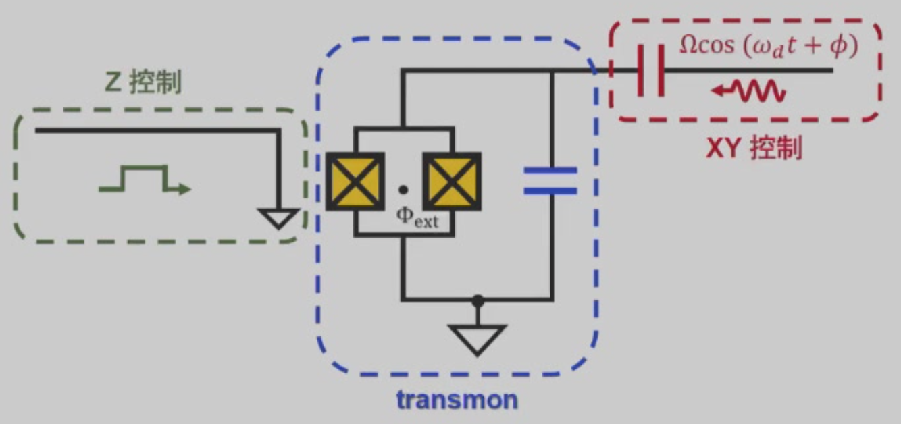

# 超导量子计算与量子模拟

- 大量：$N_A$ 量级
- 相互作用：非单粒子行为
- 宏观尺度：热力学极限
- 物理性质：可观测的物理量

!!! info "多粒子系统极其复杂"
    $$
    H \psi(r_1, r_2, \ldots, r_N) = E \psi(r_1, r_2, \ldots, r_N)
    $$

    - 经典模拟量子系统
    - Hilbert 空间指数大
    - 近似方法、算法

!!! quote "Simulating Physics with Computers"
    R. P. Feynman

## 量子比特与 Bloch 球

量子比特：服从量子力学规律的二能级系统

$\ket{0}$ 和 $\ket{1}$ 的叠加态：$\ket{\psi} = \alpha \ket{0} + \beta \ket{1}$，其中 $\alpha, \beta \in \mathbb{C}$，满足归一化条件 $|\alpha|^2 + |\beta|^2 = 1$。

$$
\ket{\psi} = \cos\left(\frac{\theta}{2}\right) \ket{0} + e^{\mathrm{i} \phi} \sin\left(\frac{\theta}{2}\right) \ket{1}
$$

!!! note "练习"
    计算 Pauli 矩阵 $\sigma_x, \sigma_y, \sigma_z$ 的均值，解释 $\theta/2$ 的来源。

## 量子计算和经典计算

## 构造量子比特

- 中性原子
- 离子阱
- 超导量子比特

!!! question "如何构造量子计算机？"
    **DiVincenzo 判据：**

    1. 可扩展的二能级系统
    2. 长的相干时间
    3. 量子态的读取
    4. 通用量子逻辑门集合
    5. 量子态初始化

## 电路量子化

- 定义参考结点和有效结点
- 引入结点的通量

$$
\phi_n(t) = \int_{-\infty}^t V_n(\tau) \, \mathrm{d}\tau
$$

- 动能 $T$：电容性元件能量
- 势能 $V$：电感性元件能量
- 定义拉格朗日量，得到正则动量和哈密顿量

### LC 谐振子的量子化

- 拉格朗日量：$L(\phi, \dot{\phi}) = \dfrac{C \dot{\phi}^2}{2} - \dfrac{\phi^2}{2L}$
- 正则动量：$q = C \dot{\phi}$
- 哈密顿量：$\widehat{H} = \dfrac{\hat{q}^2}{2C} + \dfrac{\hat{\phi}^2}{2L}$

能级等间距

!!! tip "宏观量子现象"
    - 经典电流：$\sim 10^{23}$ 个微观自由度，电流是平均的宏观结果
    - 超导电流：单个波函数表达

!!! tip "Josephson 效应"
    超导体之间夹着绝缘体

    - DC 约瑟夫森效应：$I = I_c \sin(\delta)$
    - AC 约瑟夫森效应：$V = \frac{\Phi_0}{2\pi} \frac{\partial \delta}{\partial t}$

    类比电感定义 $V = L \frac{\mathrm{d}I}{\mathrm{d}t}$，等效**非线性电感**：

    $$
    L_J = \frac{\Phi_0}{2\pi \sqrt{I_c^2 - I^2}}
    $$

$$
\hat{H} = 4E_C \hat{n}^2 - E_J \cos \hat{\delta}
$$

- $E_C = \frac{e^2}{2C}$
- $E_J = \frac{\Phi_0}{2\pi} I_c$
- $\hat{n} = \frac{1}{2e} \hat{q}$

## 通用量子门 - 单比特量子态操控

### Z 控制

并联两个 Josephson 结 SQUID

**改变能级间距，让态绕 $z$ 轴旋转**

### XY 控制

驱动微波 $\Omega \cos(\omega_d t + \phi)$

$$
\hat{H}(t) = -\frac{1}{2}\hbar \omega_{10} \hat{\sigma}_z + \hbar\frac{\Omega}{2} \left(\hat{b}^\dagger e^{-\mathrm{i} (\omega_d t + \phi)} + \hat{b} e^{\mathrm{i} (\omega_d t + \phi)}\right)
$$

在 $\omega_d$ 的旋转参考系下，旋波近似：

$$
\hat{H} = \frac{1}{2}\hbar \delta_q \hat{\sigma}_z + \frac{1}{2} \hbar \Omega \left(\hat{\sigma}_x \cos \phi + \hat{\sigma}_y \sin \phi \right)
$$

绕 $\phi$ 方向的水平轴旋转

控制作用时间

### 相干时间和初始化

环境干扰系统，退相干

- 能量驰豫 $T_1$（**100 μs**）
    - 与环境能量交换
- 退相位 $T_{\phi}$（**20 μs**, spin echo）
    - 频率波动

最简单的量子态初始化：**等待**

## 量子比特相互作用

- 电容耦合

$$
\widehat{H} = \hbar \underset{\text{Qubit}}{\boxed{\sum_{j = 1,2} -\frac{1}{2} \hbar \omega_j \hat{\sigma}_z^j}} + \underset{\text{coupling}}{\boxed{\hbar \textcolor{red}{g} (\sigma_1^+ \sigma_2^- + \sigma_1^- \sigma_2^+)}}
$$

- 谐振腔耦合

$$
\widehat{H} = \underset{\text{耦合腔}}{\boxed{\hbar \omega_R \hat{a}^\dagger \hat{a}}} + \hbar \sum_{j = 1,2} \left[\underset{\text{Qubit}}{\boxed{\sum_{j = 1,2} -\frac{1}{2} \hbar \omega_j \hat{\sigma}_z^j}} + \underset{\text{coupling}}{\boxed{\textcolor{red}{g_j} (\hat{a}^\dagger \sigma_j^- + \hat{a} \sigma_j^+)}}\right]
$$

- 耦合器耦合

$$
\widehat{H} = \underset{\text{耦合器}}{\boxed{-\frac{1}{2} \hbar \omega_c \hat{\sigma}_z^c}} + \hbar \sum_{j = 1,2} \left[\underset{\text{Qubit}}{\boxed{-\frac{1}{2} \hbar \omega_j \hat{\sigma}_z^j}} + \underset{\text{coupling：qubit - coupler}}{\boxed{\textcolor{red}{g_j} (\hat{\sigma}_j^+ \hat{\sigma}_c^- + \hat{\sigma}_j^- \hat{\sigma}_c^+)}}\right] + \underset{\text{coupling: qubit - qubit}}{\boxed{\hbar \textcolor{red}{g_{12}} (\hat{\sigma}_1^+ \hat{\sigma}_2^- + \hat{\sigma}_1^- \hat{\sigma}_2^+)}}
$$

## 量子比特集成

- 全联通架构
    - 任何两个量子比特都可以相互作用
    - 可拓展性差
- 二维网络架构（主流）
    - 可以在平面上铺开，拓展性好
    - 只有相邻的量子比特可以相互作用

## 量子比特读取

$$
\ket{\phi} = \alpha \ket{0} + \beta \ket{1} \overset{\text{观测后}}{=} \begin{cases}
    \ket{0}, & \text{with probability } |\alpha|^2 \\
    \ket{1}, & \text{with probability } |\beta|^2
\end{cases}
$$

- 探测释放的光子
    - $\ket{0}$：不能释放光子
    - $\ket{1}$：可以释放光子

问题：释放光子后的比特又会变成 $\ket{0}$

直接测量容易使系统受噪声影响

间接测量：引入辅助量子系统，退相干性好

$$
\widehat{H} = \widehat{H}_{\text{q}} + \widehat{H}_{\text{probe}} + \widehat{H}_{\text{int}}
$$

- $\widehat{H}_{\text{q}}$：量子比特哈密顿量
- $\widehat{H}_{\text{probe}}$：探测器哈密顿量
- $\widehat{H}_{\text{int}}$：相互作用
- 对易性：$\left[\widehat{H}_{\text{q}}, \widehat{H}_{\text{probe}}\right] = 0$

读取量子比特 $\to$ **探测读取腔的频率**

$$
\widehat{H}/\hbar = (\omega_r + \chi \hat{\sigma}_z) \hat{a}^\dagger \hat{a} - \frac{1}{2} \tilde{\omega}_q \hat{\sigma}_z
$$

- $\ket{0}$ 时，$\hat{\sigma}_z = -1$，腔频率 $\omega_r - \chi$
- $\ket{1}$ 时，$\hat{\sigma}_z = +1$，腔频率 $\omega_r + \chi$

!!! question "如果有 $n$ 个量子比特？"
    $$
    \ket{\psi} = a_1 \ket{000\ldots 000} + a_2 \ket{000\ldots 001} + \ldots + a_{2^n} \ket{111\ldots 111}
    $$

    - 构建出完整的波函数不可能！要进行 $2^n$ 次以上的测量

频率复用读取

## 单个超导量子比特的平面电路

电容和金属板之间的边缘抽真空，形成电容

- 操控芯片的温度要求
    - 超导
    - $kT \ll \hbar \omega$

## 多比特超导量子芯片

重要指标：

1. 操控比特数目
2. 相干时间
3. 操控门精度

## 量子模拟

### 热化

- 经典热化：冰化成水，形状信息丢失
- 量子热化：（封闭系统）幺正演化 $U$（是可逆的，但实操不可行），粒子的信息弥散到整个希尔伯特空间

#### 本征态热化假定

微正则系综

#### 避免热化

- 多体局域化（strong breaking of ergodicity）
    - 所有本征态非热化
    - 能谱统计呈现泊松分布
- 多体疤痕态（weak breaking of ergodicity）
