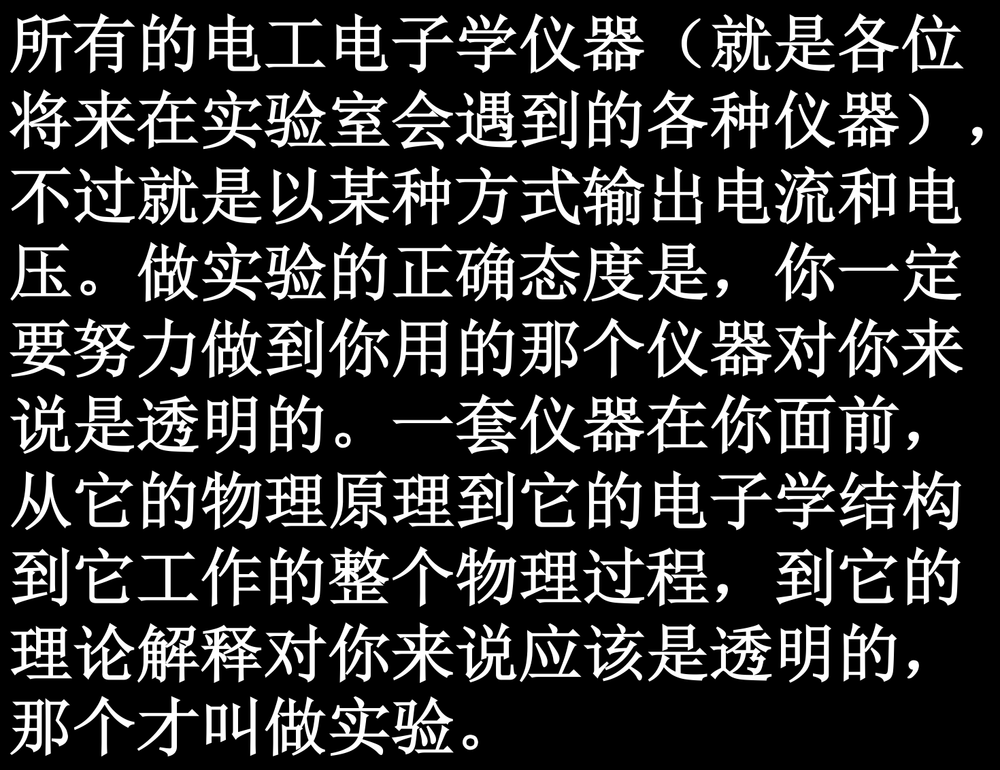

# 绪论

> 学的都是 1920s 的技术 
>
> 智子封锁地球 100 年哩（悲）
>
> 相对论只能观测，很难实验，比较容易出成果的是量子力学了

## 什么是凝聚态？

- **原子或分子之间有较强的相互作用力**（一般为固体或液体）
- 材料科学的基础（材料总得有分子间相互作用力吧，很难不是 
- 是以固体物理为基础的延伸

!!! tip "培养向外界表达的能力"
    学会吹牛 

> 目前比较有前途的就是凝聚态和核聚变了（）

- 高温氧化物超导材料和超导电性的研究
    - 正常态 -> **过渡态** -> 超导态
    - 强关联体系
- 表面与界面及薄膜物理
    - 老师都快退休了...
    - 开辟了液面沉积薄膜研究（叶高翔老师）
- 碳团簇物理研究
    - 纳米碳管、纳米碳丝、$\mathrm{C}_{60}$ 分子、$\mathrm{C}_{60}$ 单晶
    - 控制生长动力学
- 凝聚态物理理论
    - 低维材料

最小可重复单元（unit cell）

## 测量方法

- 凝聚态传统测量方法
    - 宏观性质测量（力学、电学、磁学、热学）
- 凝聚态现代测量方法
    - 微结构与{==**电子态**==}测量
    - 控制了电子态，就控制了一切！（也许是目前为止最靠谱的）

稳定的材料是不会向外持续放出信息的，“沉默不语”，所以要扇一巴掌（**激发**）！

!!! warning ""
    