# 真空物理与超高真空技术

> 真空、超高真空（ultra-high vacuum, UHV）是凝聚态测量的{++重要条件++}

单位时间打到单位面积是上的粒子数为 $n_1 = \frac{1}{4} n \bar{v}$，平均速率 $\bar{v} \approx (3kT/m)^{1/2}$. 假设容许的污染是 1 小时内不超过 $5\%$ 原子单层，即 $5 \times 10^{13}$ 个$/\mathrm{cm^2 \cdot h}$，估算出压强 $P \approx 5 \times 10^{-9} \mathrm{Pa}$.

真空的度量：Torr = 1 mmHg

## 真空的获得：真空泵

> 只要气体分子不污染样品，就认为达到了真空。

-   种类
    - **外排式**：把气体排出去
    - **吸附式**：把气体分子固定住，不到样品上面去
-   技术指标
    - 抽速、工作范围、极限真空、抽气选择（对气体分子的选择性）

### 机械真空泵

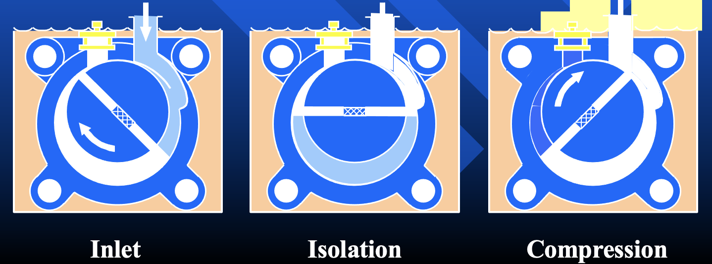

- 抽速：$0.5 \sim 12 \mathrm{L/s}$
- 工作范围：$1 \sim 10^{-3} \mathrm{Torr}$
- 极限真空：$10^{-3} \mathrm{Torr}$
- 抽气选择：可凝性气体除外（不然真的会喷水）

### 涡旋式干泵

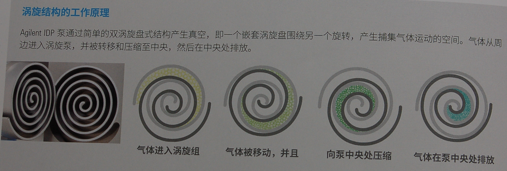

干泵的缺点是噪声大、磨损快（因为不用油），好处是没有油就没有油蒸汽污染

### 涡轮分子泵

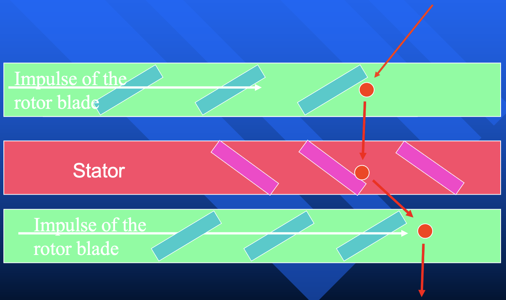

- 动叶片：类似于打气体分子巴掌，转子叶片边缘切向速度需要和分子热运动速率一个数量级（$\sim 10^4 \, \mathrm{rpm}$），给分子一个定向的速度
- 静叶片：减速，方便下一级动叶片继续打

为了达到良好动平衡，叶片轻（使用铝合金）；叶片边缘与壁面的距离需要很近，不然抽气效率低，但又不能太近，不然容易碰撞；转子需要有很好的轴承，比如磁悬浮轴承。

> 需要长期工作，不然振动频率会到共振频率区

缺点：对加工要求很高；要垂直安装（不然轴承受力了）

- 抽速：$100 \sim 450 \, \mathrm{L/s}$
- 工作范围：$10^{-3} \sim 10^{-10} \, \mathrm{torr}$
- 极限真空：$10^{-10} \, \mathrm{torr}$
- 抽气选择：轻的气体（比如氢气）抽速小，因为分子跑得快

### 真空扩散泵

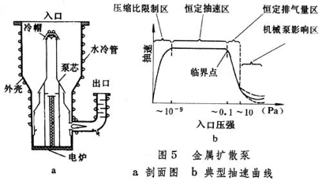

没有运动的机械部件，好加工，非常皮实！

-   使用饱和蒸气压低，且非常稳定的油
    -   饱和蒸气压低，防止反流到真空环境
    > 好的油已经很难买了，还是80年代的好用...不做差点厂商怎么活 
- 抽速：$10 \sim 150 \, \mathrm{L/s}$
- 工作范围：$10^{-3} \sim 10^{-10} \, \mathrm{torr}$
- 极限真空：$10^{-10} \, \mathrm{torr}$
- 抽气选择：轻原子气体抽速小

### 升华泵

Ti 升华泵：钛易被氧化，形成钛膜，可吸附氧气、一氧化碳

- 抽速：$100 \sim 500 \, \mathrm{L/s}$
- 工作范围：$10^{-3} \sim 10^{-10} \, \mathrm{torr}$
- 极限真空：$10^{-10} \, \mathrm{torr}$
- 抽气选择：惰性气体抽速为 0

### 离子泵

先用高速电子离化气体分子，再二次离化（原理类似于冷发电子枪），最后用电场定向迁移

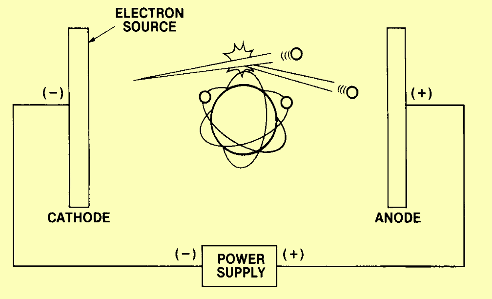

- 抽速：$100 \sim 500 \, \mathrm{L/s}$
- 工作范围：$10^{-3} \sim 10^{-10} \, \mathrm{torr}$
- 极限真空：$10^{-10} \, \mathrm{torr}$
- 抽气选择：惰性气体抽速小

吸附：

- 物理埋葬（Sputtering）
- 化学吸附（Chemisorption）

### 低温冷凝泵

液化

- 抽速：$> 500 \, \mathrm{L/s}$
- 工作范围：$10^{-7} \sim 10^{-10} \, \mathrm{torr}$
- 极限真空：$10^{-10} \, \mathrm{torr}$
- 抽气选择：无

### 分子筛

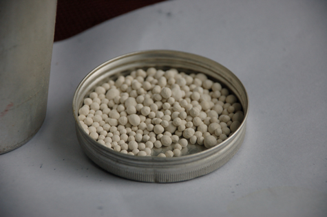

不用电，适合样品运输

### 真空泵的组合

-   机械真空泵 + 真空扩散泵
    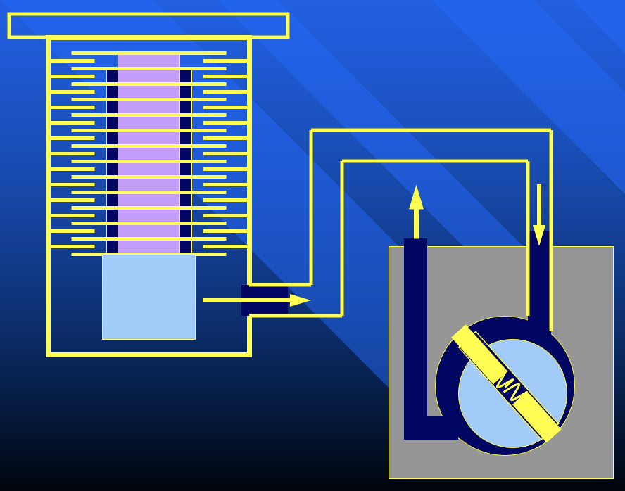
-   机械真空泵 + 涡轮分子泵
    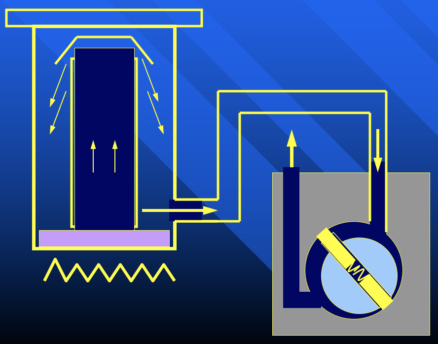
    -   在分子泵上面再加升华泵/离子泵，加阀

!!! info "提高真空的途径"
    -   提高抽气效率
    -   减少放气（Outgassing）、漏气（Leaks）、器壁放气、器壁渗透（Permeation）

    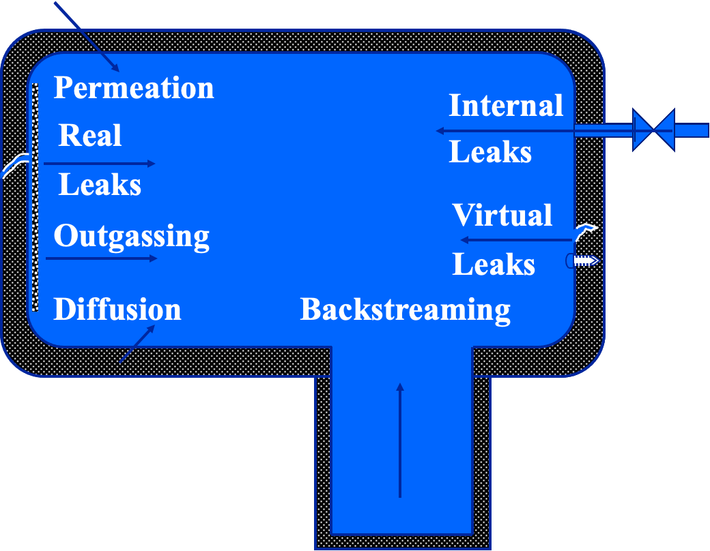

### 烘烤

去除吸附的水分子

### 密封

阀门、密封垫圈

### 样品的传递

焊接波纹管

### 真空电极

长长的陶瓷电极，热膨胀后释放应力；通过掺杂金属慢慢改变热膨胀系数

## 真空的测量

直接测量：水银气压计（精度低）

间接测量：

### 热偶规（Pirani 计）

气体分子越多，传热系数越大

-   测量范围：$1 \sim 10^{-3} \, \mathrm{Torr}$

### 电容规

### 电离规

将真空中的气体分子离化，收集到的离子越少说明真空越好

-   测量范围：$10^{-3} \sim 10^{-10} \, \mathrm{Torr}$

:point_right: 用稳定的热阴极规，效果更好。冷阴极规的便宜、简单、测量范围宽，但是误差很大（二次离化关系复杂）。

### 总压、分压的测量

使用质谱仪（Mass Spectrometer, MS）测量分压

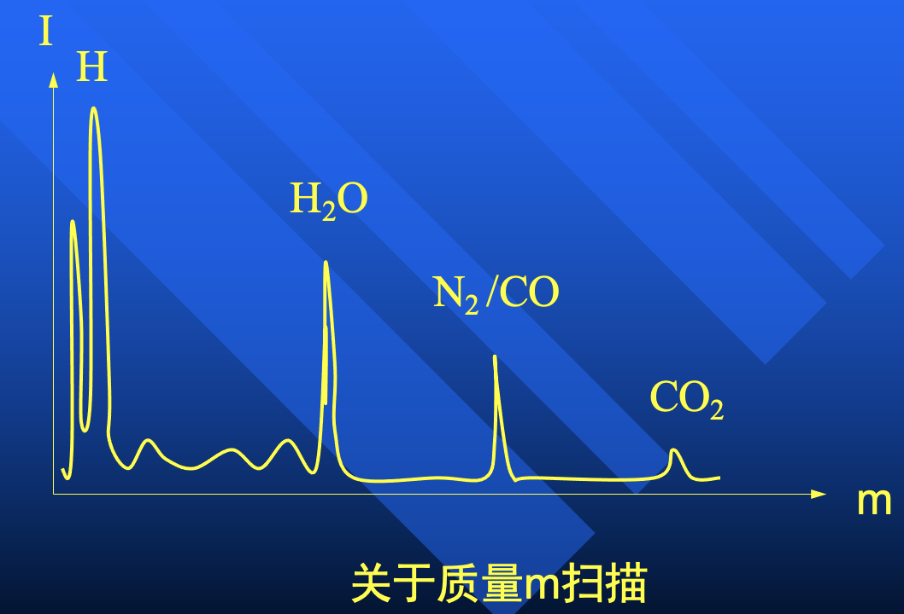

!!! info "氦质谱检漏"
    氦气注入，检测氦分压

    :bulb: 为什么用氦：氦气分子小，热运动速度快，容易渗透到真空系统中；氦气在空气中的含量很低，所以背景干净

    > 中国已基本摆脱氦气的进口依赖

!!! tip "真空相容性"
    -   低饱和蒸气压
    -   耐烘烤
    -   不锈钢全金属

    > 以前是用玻璃是，好处是透明直观，但是不耐烘烤...现在基本用的都是不锈钢的了

    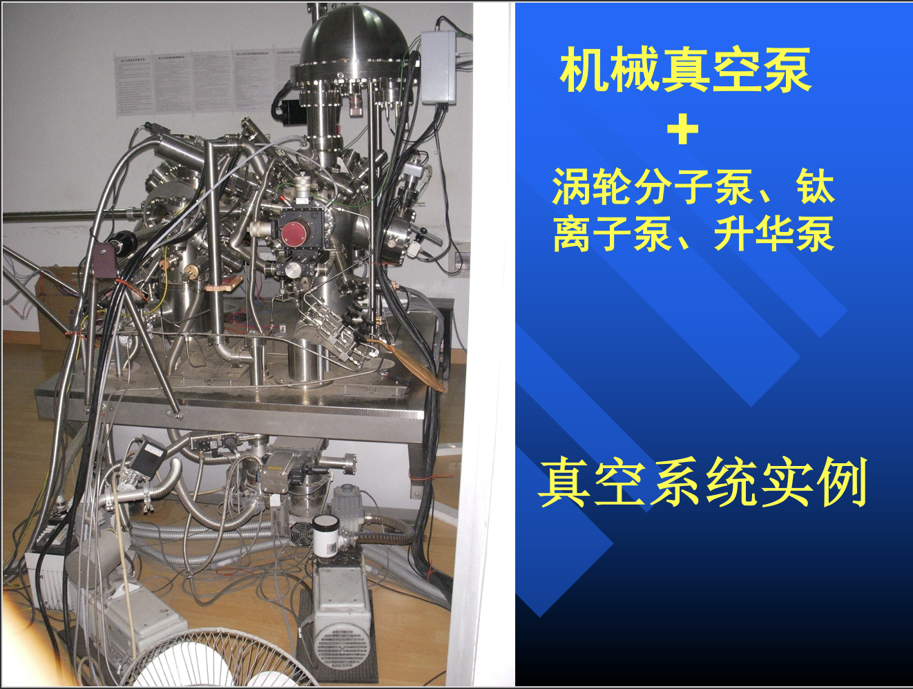