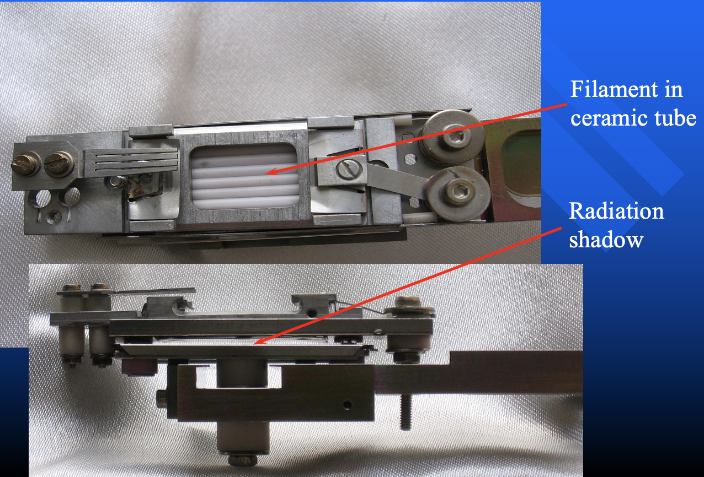
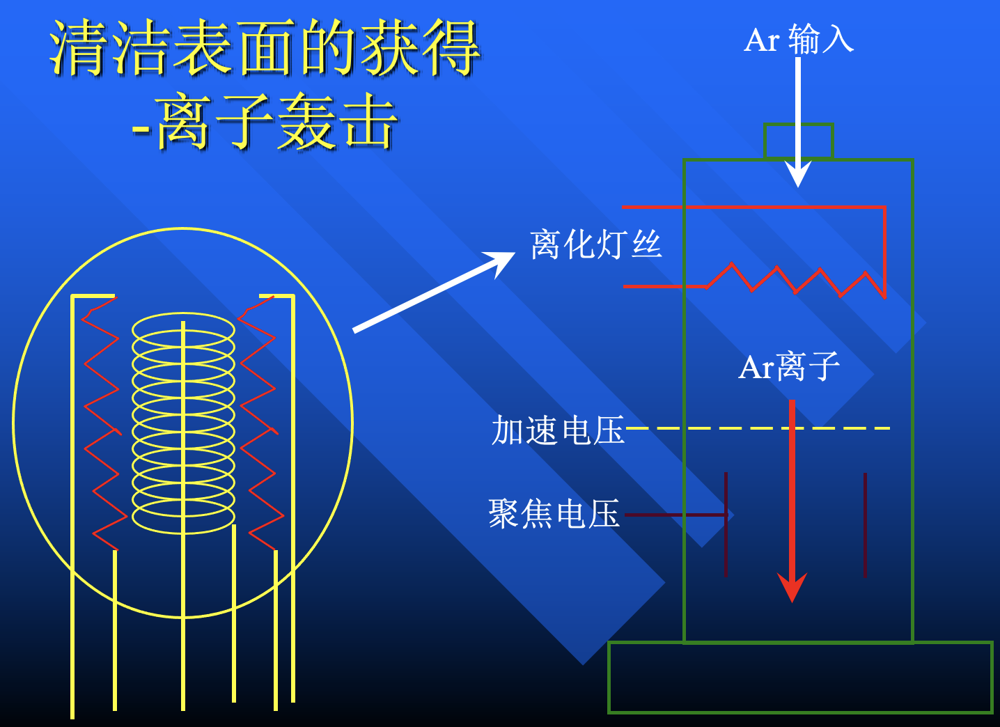
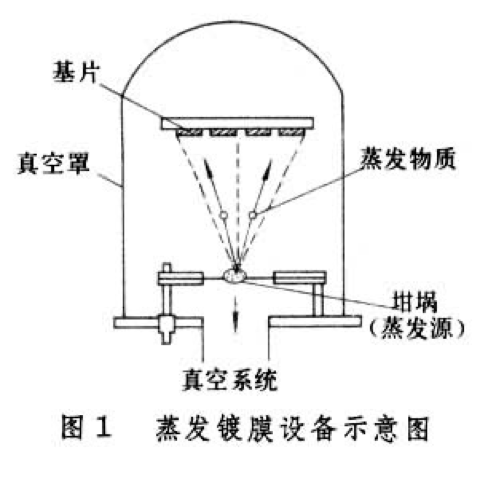
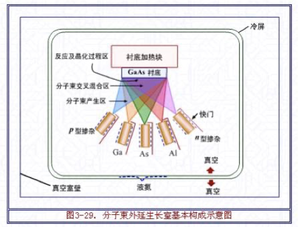

## 样品的清洁处理

:question: 样品为什么需要清洁处理？表⾯杂质微粒污染影响性质的探测

### Resistive Heating
    

-   用电流加热陶瓷管里的钨丝
-   对样品要求不高

### Direct Heating

- 适用于半导体，加热效率最高

### E-beam Heating

- 适用于难融化金属
- 温度控制精度低

### 离子轰击

- Ar 离子轰击（直接扒皮）

> 弹性正碰传递能量最好的情况是质量相当，Ar 的质量比较合适

:bulb: 产生电子就两种方法：**热发射**（热偶规）/**冷发射**（离子泵）

!!! tip "两种氩枪的优缺点"
    -   剥蚀效率
        - 热阴极 < 冷阴极
        - 热阴极离化效率有限，冷阴极产生的正离子数目更多
    -   能量范围
        - 冷阴极 > 热阴极
        - 热阴极产生的离子受电场加速，能量范围较窄；冷阴极存在二次离化，理论上能量从 0 开始都有
    -   剥蚀效果
        -   表面敏感的样品，热阴极更温和；对于不敏感的样品，冷阴极效率更高
    -   氩枪工作寿命
        -   热阴极 $\ll$ 冷阴极
    
### 其它方法

-   脆型单晶真空环境下的解理
-   化学反应
-   场脱附

## 样品的制备

-   蒸发源

    

-   分子束外延生长（Molecular Beam Epitaxy, MBE）

    

!!! info "量子调控"
    巨磁阻（Giant Magnetoresistance, GMR）

## 质谱仪（MS）

### 应用

-   热脱附谱（Thermal Desorption Spectroscopy, TDS）
    -   加热材料，分析脱附物质
    -   质谱固定质量数扫描

-   二次离子质谱（Secondary Ion Mass Spectrometry, SIMS）
    - 微量元素检测
    - 纵向横向三维分布
    - 有损检测
    - 有择优性（原子质量和 Ar 相近的）