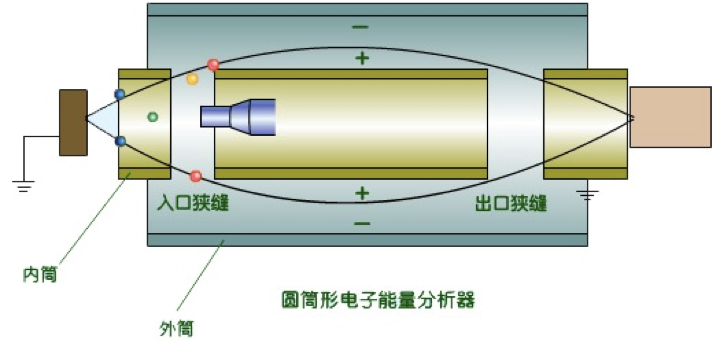
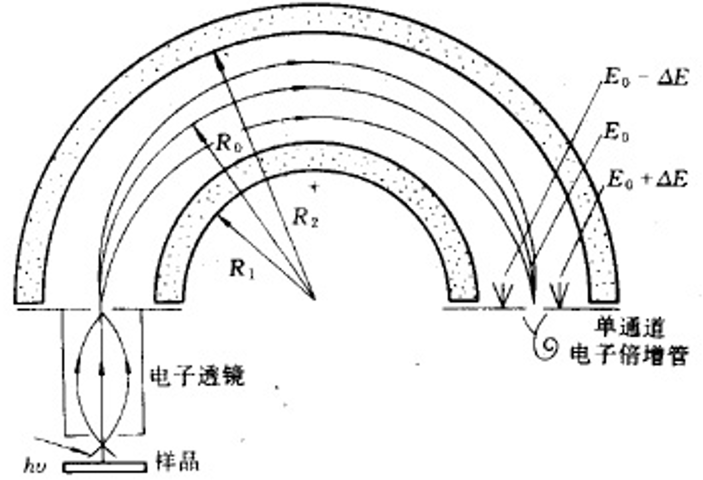
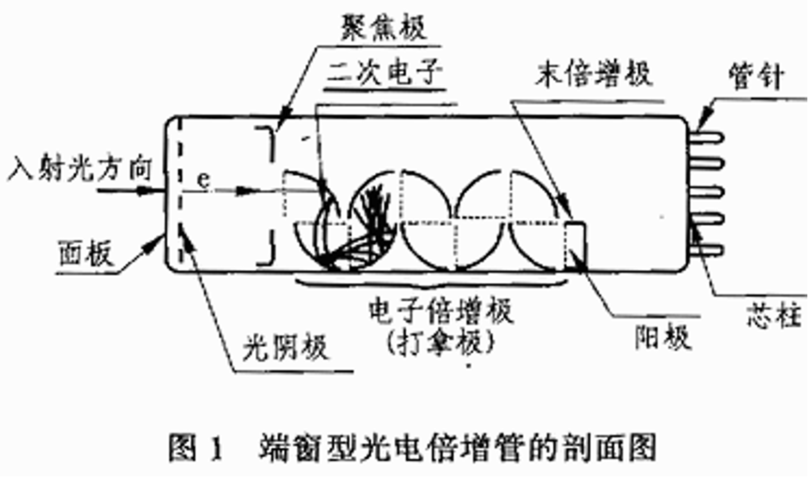
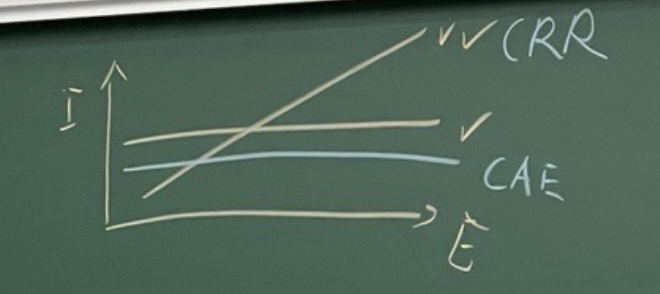
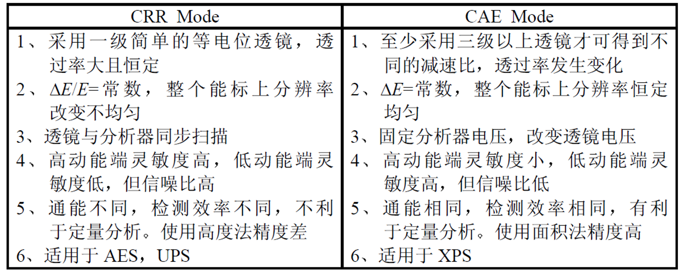

# 电子能量以及强度检测

$1 \, \mathrm{eV} = 1.6 \times 10^{-19} \, \mathrm{J}$，而一般能量检测的精度要求达到 $0.05 \, \mathrm{eV}$，这么小的能量该怎么测量？

:bulb: 用电场筛选！

## 电场分析器

平板电容器挖两个孔：平板电子能量分析器

对入射方向要求严格，通过的电子数量太少了，信号小！$\implies$ 绕一圈，一维升二维

筒镜电子能量分析器（Cylindrical Mirror Analyzer, CMA）

半球电子能量分析器（Spherical Deflector Analyzer, SDA）

:exclamation: **路径越长，精度越高**

!!! tip "CMA vs. SDA"
    -   结构、体积
        - 筒镜：简单，体积小
    -   性能
        - 半球：能量分辨率更高
    -   价格
        - 半球：价格更高

-   角分辨电子能量分析器
-   电子透镜
    > 这俩显然不能一起用，电子透镜抹除了入射角信息

### 分析器的要求

- 加工、安装要求高
- 耐真空、烘烤
- 隔绝外界电场、磁场，分析器和系统不能有磁性（使用 high-$\mu$ metal 作为磁屏蔽层）

## 电子倍增管（Channeltron）

打拿极

制作材料：铅玻璃

机场防爆检测：检测硝基根！荷质比

> 只要脉冲达到检测极限就行，不关心脉冲的绝对大小/电流大小（没法测）。

时间分辨率要求不高：微通道板（Microchannel Plate, MCP），用于光电检测仪

## 能量分析器的分辨率

- 相对分辨率 $R = \frac{\Delta E}{E_0}$
- 绝对分辨率 $\Delta E$
    - 提高绝对分辨率会降低信号强度！不必盲目追求绝对分辨率

一般来说分析器尺寸越大，分辨率越好（因为路径越长）。

改变探测器电压，不改变电子：**通能改变模式**（Constant Reduction Ratio, **CRR**）

仪器结构确定后，路径确定，**相对分辨率 $R$ 是固定的**！改变电压，$E_0$ 变了，$\Delta E$ 也会变！

检测的能量 $E \uparrow \implies$ 绝对分辨率 $\Delta E \uparrow$，变差，信号强度 $I \uparrow$

**通能固定模式**（Constant Analyzer Energy, **CAE**）

为了测不同能量的电子，需要前面加电场，保持入射 $E_0$ 不变，还原性好。

$E_0$ 不变，信号强度和绝对分辨率都不变

> 现在有钱任性，首选 CAE 